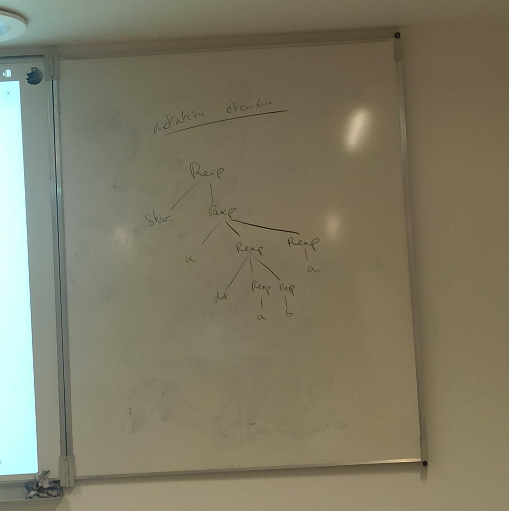

# 04 // sémantiques des BNFs et arbres d’analyse

[chap4_4up.pdf](ressources/04_semantiques_des_bnfs_et_arbres_d’analyse_chap4_4up.pdf)

## Exo 4.4

> [!question] ❓
>
> Pour chacun des mots suivants, dessiner l’ensemble de ses arbres d’analyse puis la propagation d’attributs sur ces arbres d’analyse.
>
> 1. `I-I-I`
> 2. `(I-I)-I`
> 3. `I-(I-I)`

## Exo 4.5

> [!question] ❓
>
> Donner tous les arbres d’analyse du mot `abbb` pour la BNF du langage $L$ suivante: `L ::= a L b | L b | ε`

## Exo 4.6

> [!question] ❓
>
> Donner tous les arbres d’analyse du mot `abbb` pour la BNF du langage $L$ suivante: `L ::= L b | A`, `A ::= a A b | ε`

## Exo 4.7

> [!question] ❓
>
> Même exercice que le précédent pour cette BNF alternative du langage $L$ :
> `L ::= a L b | B, B ::= b B | ε`

## Exo 4.8

> [!question] ❓
>
> Parenthésage explicite de “`− 1 | 2 & 3`” ?

Je l’ai pas je crois.

## Exo 4.9

> [!question] ❓
>
> Avec ce système d’attributs, quel arbre d’analyse associer a “`I--I-I`” pour que le résultat corresponde à la convention usuelle.
>
> 

## Exo 4.10

> [!question] ❓
>
> La BNF étant ambiguë, dessiner tous les arbres possibles du mot ‘`x # - x #`’, avec la propagation d’attributs.
>
> 

## Exo 4.11

> [!question] ❓
>
> On considère que ‘`#`’ est prioritaire sur ‘`-`’ (qui est associatif a gauche). Quel est le résultat du calcul ?

## Exo 4.12

> [!question] ❓
>
> Appliquer cette méthode sur les BNF suivantes. On se limitera à se convaincre “à la main” de la non-ambiguıté sur quelques exemples.
>
> 1. l’exemple de l’introduction.
> 2. la BNF de la section 6.1 du sujet de TP.

## Exo 4.13

> [!question] ❓
>
> Trouver une BNF pour le langage $A ∪ B$. Montrer que cette BNF est ambigue.
>
> 

