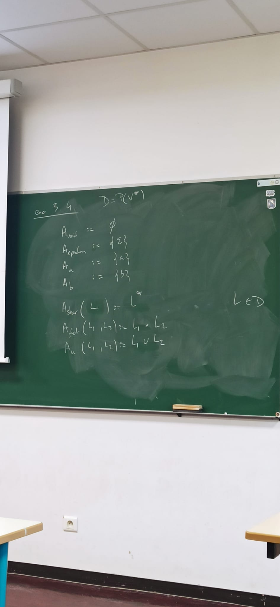
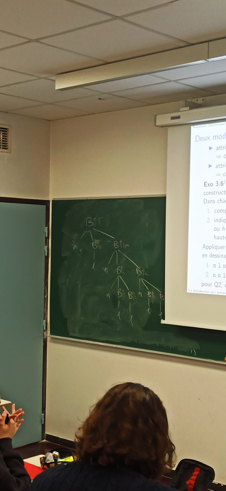
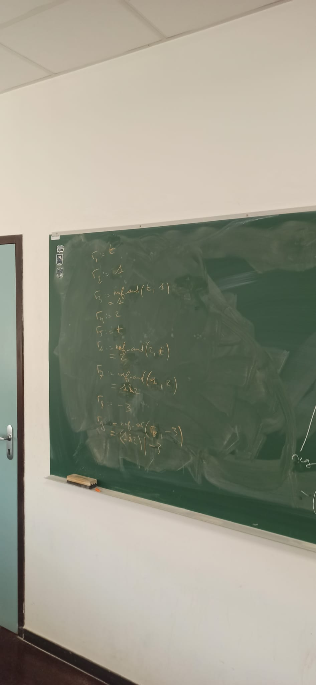
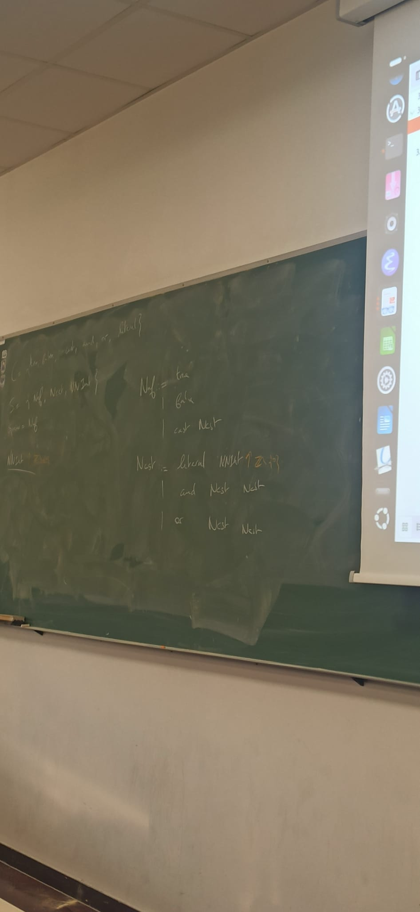
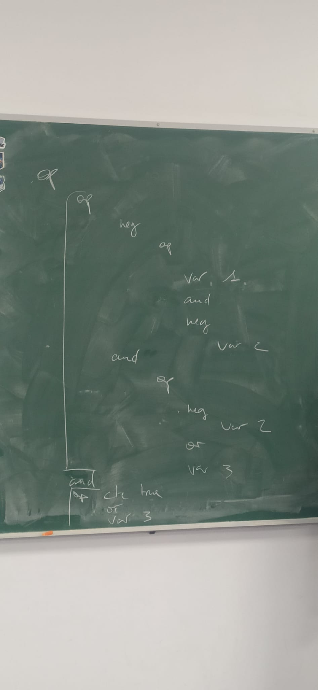

# 03 // théorie des syntaxes abstraites

[chap3_4up.pdf](ressources/03_theorie_des_syntaxes_abstraites_chap3_4up.pdf)

## Exo 3.1

> [!question] ❓
>
> Dessiner l’AST de l’expression régulière “$b + (a.a.(ϵ + a)^∗)$”. Coder cet AST en notation préfixe (suite d’appels des constructeurs sans parenthèse).

## Exo 3.2

> [!question] ❓
>
> Dessiner l’AST encodé par le mot “`star u dot a b a`”, en “notation naturelle”, puis en “notation étendue”, où chaque nœud est un type d’AST et a un enfant supplémentaire (a gauche) : le nom du constructeur.

En notation naturelle, pour chaque opération binaire, les deux mots suivants sont leurs arguments. Pareil pour les opérations unaires.

## Exo 3.3

> [!question] ❓
>
> Donner une BNF qui définit cette notation préfixe d’AST (la notation étendue de Rexp dans l’exo précédent).

`Rexp ::= void | epsilon | a | b | star.Rexp | u.Rexp.Rexp | dot.Rexp.Rexp` 

## Exo 3.4

> [!question] ❓
>
> Appliquer cette idée avec :
>
> - $D = \mathcal P(V^∗)$ pour la sémantique des $\mathbf{Rexp}$ (comme ensemble de mots)
> - $D =$ ensemble des automates finis (non-déterministes avec $ϵ$-transitions) pour générer l’automate associé à une $\mathbf{Rexp}$. Calculer l’automate de $A_\text{dot}(A_a, A_a)$ avec vos définitions

## Exo 3.5

> [!question] ❓
>
> Dessiner la propagation de l’attribut sur l’AST (en notation étendue) encodé par le mot “`star u dot a b a`”

.jpeg)

.jpeg)

.jpeg)

.jpeg)

## Exo 3.6

> [!question] ❓
>
> Soient les arbres binaires de sorte $B$ engendrés par constructeurs “$l : B$” et “$n : B × B → B$”.
>
> Dans chacun des cas ci-dessous, définir système d’attributs qui :
> — compte le nombre de feuilles (noeuds `l`) dans l’arbre.
> — indique si toutes les feuilles de l’arbre sont à une profondeur $h$ ou $h − 1$, avec $h$ paramètre donné (par convention, feuille est de hauteur $0$).
>
> Appliquer les algorithmes sous-jacents sur les exemples ci-dessous en dessinant la propagation d’attributs sur chaque nœuds (les exos en format String sont écrit en notation naturelle, et les résultats doivent être en arbre étendu) :
> — `n l n n l l n l l`
> — `n n l l n n l l n l l`
>
> pour Q2, on prendra $h$ valant à la racine $2$, puis ensuite $3$.

## Exo 3.7

> [!question] ❓
>
> On considère le système donné à la tâche 4 du TP.
>
> 1. Soit $p$ l’AST “`and var 1 neg var 2`”.
> Calculer le r retourné une dérivation de “`p↓1↑r` ”.
> 2. Calculer la NNF attendue pour “`-(((t&1)>(-2|f))&3)`”.

## Exo 3.9

> [!question] ❓
>
> Donner le système d’équations algébrique associé a cette signature $Σ_{TP}$ . Exprimer ce système en syntaxe BNF avec attributs : pour se ramener a un ensemble fini de constructeurs, on placera $\mathbb{N}\backslash{0}$ en attribut synthétisé du constructeur $var$.

## Exo 3.10

> [!question] ❓
>
> Définir une signature pour NNF avec sortes Nnf et Ncst, puis la BNF associée

## Exo 3.13

> [!question] ❓
>
> Pouvez-vous construire le terme sur $Σ_{AST}$ associé aux mots suivants en notation préfixe :
>
> 1. `& & - & 1 - 2 | - 2 3 | t - 3`
> 2. `& & - & 1 - 2 | - 2 3`

## Exo 3.14

> [!question] ❓
>
> Calculer la suite des tokens pour :
>
> 1. `123&27|-4_t_6_5_`
> 2. `___tx2`

(J’ai pas pris des photos ?)

## Exo 3.15 et 3.16

> [!question] ❓
>
> Donner la suite token attribuées `de “&_-_&_123_-_2|_-_2_3`” puis en construire l’arbre d’analyse Parse avec propagation d’attributs.
>
> Dessiner l’arbre des appels récursifs de `parse_rec` sur le mot “`& - & 123 - 2 | - 2 3`”.

