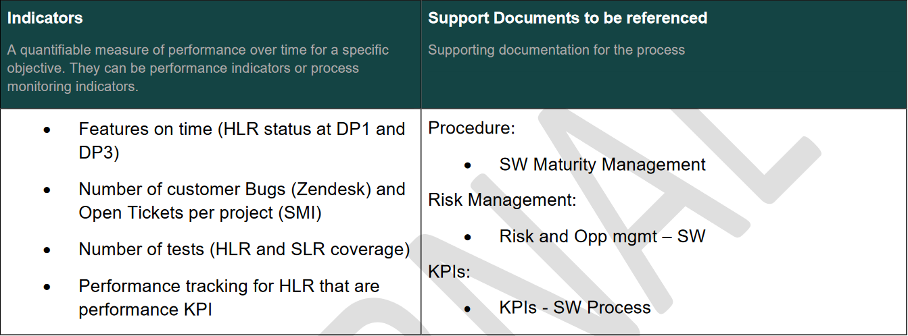

# Period #1 - Kalray University, All Employees

Date de création: October 31, 2024 4:25 PM
Modifié: October 31, 2024 4:33 PM

<aside>
💡

Une fois un dossier de “All employees” a été lit en entier, le marquer sur ce lien :

[https://kalrayinc.sharepoint.com/:x:/r/sites/KALRAY/_layouts/15/Doc.aspx?sourcedoc=%7B59F39E6D-45CB-4394-A2E5-8BF9DB430E05%7D&file=2024%20Self-learning%20tracking.xlsx&action=default&mobileredirect=true&wdOrigin=TEAMS-MAGLEV.p2p_ns.rwc&wdExp=TEAMS-TREATMENT&wdhostclicktime=1730280159940&web=1](https://kalrayinc.sharepoint.com/:x:/r/sites/KALRAY/_layouts/15/Doc.aspx?sourcedoc=%7B59F39E6D-45CB-4394-A2E5-8BF9DB430E05%7D&file=2024%20Self-learning%20tracking.xlsx&action=default&mobileredirect=true&wdOrigin=TEAMS-MAGLEV.p2p_ns.rwc&wdExp=TEAMS-TREATMENT&wdhostclicktime=1730280159940&web=1)

</aside>

# Compensation

[https://kalrayinc.sharepoint.com/sites/KALRAY/Shared%20Documents/Forms/AllItems.aspx?csf=1&web=1&e=xEJ6KQ&CID=eeda9868%2D7a13%2D49b1%2D8b1c%2Dcdf15f252ffb&FolderCTID=0x01200036A3007A2388314190E8A96E76235C37&OR=Teams%2DHL&CT=1730280214063&clickparams=eyJBcHBOYW1lIjoiVGVhbXMtRGVza3RvcCIsIkFwcFZlcnNpb24iOiI0OS8yNDA5MTIyMTMxOCIsIkhhc0ZlZGVyYXRlZFVzZXIiOmZhbHNlfQ%3D%3D&id=%2Fsites%2FKALRAY%2FShared%20Documents%2FGeneral%2FKALRAY%20UNIVERSITY%2FLearning%20Material%2FAll%20employees&viewid=53d3044c%2Dd08b%2D4c86%2Db2dc%2D1a88300aaf9b](https://kalrayinc.sharepoint.com/sites/KALRAY/Shared%20Documents/Forms/AllItems.aspx?csf=1&web=1&e=xEJ6KQ&CID=eeda9868%2D7a13%2D49b1%2D8b1c%2Dcdf15f252ffb&FolderCTID=0x01200036A3007A2388314190E8A96E76235C37&OR=Teams%2DHL&CT=1730280214063&clickparams=eyJBcHBOYW1lIjoiVGVhbXMtRGVza3RvcCIsIkFwcFZlcnNpb24iOiI0OS8yNDA5MTIyMTMxOCIsIkhhc0ZlZGVyYXRlZFVzZXIiOmZhbHNlfQ%3D%3D&id=%2Fsites%2FKALRAY%2FShared%20Documents%2FGeneral%2FKALRAY%20UNIVERSITY%2FLearning%20Material%2FAll%20employees&viewid=53d3044c%2Dd08b%2D4c86%2Db2dc%2D1a88300aaf9b)

## 2023 annual pay raise

This year, the budget validated by the Board for the whole group is 5% of the total payroll,
including salary catch-ups, promotions, and contract modifications with "RTT". In addition, we had a “RSU Plan”.

The process was as follows:

1. The OMT members were asked to prepare their proposals of pay rise and
RSU allocation for each member of their team. Ingrid sent them the guidelines.
2. CEO and CFO reviewed the CMT propositions for validation.
3. The OMT and the team leaders communicated the approved pay rises and RSU allocation to their team members.
4. The approved pay rises were effective on the July’s payroll and RSU’s documents were prepared by the HR team

The guidelines Ingrid sent were as follows:

- No pay rise for employees hired in 2023 or who have already received a pay rise in H1 2023, except special cases to be justified
- Salary evolutions are linked to employees’ performance, potential and involvement
- Special focus on:
▪ Salary levels compared to the market (competitiveness)
▪ Salary levels in relation to similar profiles within the company (consistency across the
organization)
▪ Junior employees

## 2024 annual pay raise

This year, the budget validated by the Board for the whole group is 3,5% of the total payroll for individual pay rise, and 0,5% of the total payroll for salary catch-ups and promotions. In addition, we had a “RSU Plan”.

The process was as follows:

1. The Exec team members are asked to prepare their proposals of pay rise and RSU allocation for each member of their team. If they have different teams under their supervision, they will involve their team leaders.
2. CEO and CFO reviewed the CMT propositions for validation.
3. The Exec team and the team leaders communicated the approved pay rises and RSU allocation to their team members.
4. The approved pay rises were effective on the July’s payroll and RSU’s documents were prepared by the HR team to be sent to employees for signature.

The guidelines Ingrid sent were as follows:

- Individual salary pay rises depend on:
    - Employees’ performance, potential and involvement
    - Salary levels compared to the market (competitiveness)
    - Salary levels in relation to similar profiles within the company (consistency across the organization), including equal pay for all genders.
- Seniority is also taken into account, based on the following guidelines:
▪ Junior employees (< 5/6 years of experience) : on an average 5%
▪ Mid-level employees: on an average 3,5%
▪ Senior employees and mid-managers/ top managers: on an average 3%
These figures represent averages, indicating that individual outcomes may vary. While some employees may receive more, others may receive less than the average.
- No pay rise for employees hired in 2024 or who have already received a pay rise in H1 2024, except special cases to be justified by managers
- No pay rise for employees whose performance is far below expectations

## Compensation package at Kalray

The following is a list of definitions of terms commonly used when talking about compensations:

- “Fixed” compensation: the fixed compensation is the basic salary paid to Kalray employees on a monthly basis.
- “Variable” compensation: some Kalray employees have a compensation package that includes a variable part (depending on seniority and role in the organization). *Variable* is a part of the compensation that is not “granted”. Variable is paid under certain conditions.
- RSU: Restricted Stock Units. They are a type of equity compensation where the company grants an employee a certain number of shares of stock, but the shares are restricted until they vest (usually, 3 years vesting).

Variable can mean “bonus and/or commissions”. A bonus is a defined amount of money that is paid to an employee in case an objective has been reached. A commission is a variable compensation which is calculated as a % of the revenue or the booking signed.

Goals should be as “SMART” as possible: specific (clear and well-defined), measurable (easy to track and analyze), achievable (achievable with our resources), realistic (appropriate to our ambitions) and time-bound (achievable within a defined timeframe).

Poplee is used to track goals (setting and assessment).

Goals can be “individual” (allocated to one person) or “common” (allocated to a group of people or to a team).

The usual distribution of goals for Kalray’s employees is:

- 80% individual goals, defined by the manager
- 20% team goals, defined by the manager and in agreement with his/her N+1

Usually, goals are defined and assessed every semester:

- no later than January for S1 goals
- no later than July for S2 goals
- In some specific cases, they can be defined quarterly (example: bonus for sales) or annually (example : sales commissions)

# Free shares

## Definitions and how it works

- RSUs (**Restricted Stock Units**) are a type of equity compensation where the company grants an employee a certain number of shares of stock, but the shares are restricted until they **vest. Restricted** means that the employee is "restricted" from selling or transferring the shares.
- How they work: RSUs typically vest over a period of time, such as 3-4 years, and the employee receives the shares of stock once they are fully vested.
- KALRAY RSUs need to be hold for 2 years minimum.
- Vesting is 2/3 after 2 years and the last third the third year (see diagram below).

# Holding a productive meeting

## Definitions

- Meetings can be “internal meetings” (only Kalray employees and subcontractors) or “external meetings” (involving at least one non Kalray employee person).
- Definitions:
    - Action item: during a meeting, very often, action items are raised. An action item is a **distinct task** that must be accomplished or made accomplished **by a single owner in a given time following the meeting**.
    - Meeting Minute or Report: ****a summary of the meeting.
    - Meeting Owner: the person who is in charge of the meeting. Usually, the owner is the one who has initiated the meeting request.

## Tasks list for the Meeting Owner

The following is a task list for the Owner of the Meeting:

## Meeting report content

The following is what the meeting report should include, based on if it is an internal meeting or an external meeting:

## Action list and action items

Regarding the action list and the action items, a well-written action item contains enough information to clearly understand what has to be done, when and by who (rather than just serving as an anchor to then remember what needs to be done) even a few days later.

- **Follow the simple formula of 3W:** What, who and when
- **Use verb constructs at the beginning of the action item:** *ex.: “Call Roger to get something…”*
- **Even if a group of people shall be involved in completing the action, always assign a single ownership for the action item. Action owner shall be part of the meeting.**
- **Make it clear if an action item has to be achieved before/for another action item:** *Ex.: “Must be achieved before Robert meets Roger (action #5)…”*
- **If it is necessary for a clear understanding, add a comment that gives the reason why the action item is established:** *Ex.: “Context: Roger forgot to get something last week…”*

## Finishing the meeting

Before the close of the meeting:

- Review the decision and action list with the audience.
- Make sure each:
    - action owner is well identified.​
    - the owner is clear about what he has to do.
    - clarify when action completion is due.

After the meeting:

- Place the 3W actions in the Meeting
- Report and distribute to everyone who attended the meeting or who received an action or any important stakeholder.
- **Optional:** have the owner of the actions in the TO list and the others in the CC list of the meeting report email.

# Lucca

## Timmi for managing absences

## Other uses

**Timmi for time reporting**: currently does not apply to me.

**Cleemy**: platform for managing expense claims. Not applicable for now.

# Quality manual presentation

## Definitions

QMS stands for Quality Management System:

- It is a tool to support customer satisfaction
- It is a tool for continuous improvement

Some definitions are:

- **Process**: the use of resources to transform inputs into outputs. In every case, inputs are turned into outputs because some kind of work, activity or function is carried out.
- **Project**: unique process, consisting of a set of coordinated and controlled activities with start and finish dates, undertaken to achieve an objective conforming to specific requirements, including the constraints of time, cost and resources.
- **Decision points** (DP): a tollgate in the Product Life Cycle. It is the stage whereat a CFT determines the readiness of a program/project to progress to the next phase of the life cycle or to the next DP.

## Process map

The following is the process map of QMS v4:

- Shows all processes
- Show process interfaces (input and output)

## Decision points and decision cards

The major DPs are as follows:

- DP0: Decision to invest some time to analyze an opportunity
    - **Note**: DP0 are not due to be formal meetings; formal meetings are highly recommended only for Collaborative Projects.
- DP0.5: Decision to analyze and set-up a Program / a Project
- DP1: Decision to start the project
- DP1.5: For projects that manage HW / board developments Decision to release the Design Specification
- DP2.x: Intermediate Tollgates / Decisions for intermediate release (for general availability, for volume production or for customer delivery)
    - For projects that manage HW / board developments, at least 2 DP2s are defined:
- DP2.0: Decision to tape out/manufacture samples
- DP2.5: Decision to release samples
- DP3: Decision to release the project
- DP4: Decision to deprecate (a product or a version)
- DP5: End of Life is completed

A typical process card looks as follows:

