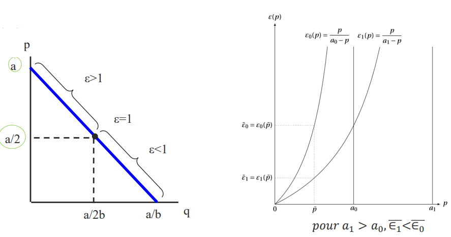

# 01 // fondamentaux 1

[Slides de fondamentaux 1](ressources/01_fondamentaux_1_corolleur_f._2021_22_lecture_1_fondamentaux.pdf)

# Concurrence et pouvoir de marché

## Moyens de concurrence et la mesure du pouvoir de marché

Les firmes disposent de nombreux moyens pour se concurrencer sur un marché :

- Court terme : prix
- Moyen terme : choix et positionnement des produits, coûts et capacités de production
- Long terme : recherche et développement

Le pouvoir de marché, l’écart entre prix-coût marginal $\left( \frac{p - Cmg}{p} \right)$ peut être vu comme un spectre :

L’indice de Lerner $L$ est la capacité du monopole à fixer un $p$ supérieur à $Cmg$ : $\frac{p-Cmg}{p}$. L’indice est toujours positif ou nul, p étant le prix imposé par le monopole. Si on a $L = 2/3$, on a que $66\%$ du prix imposé est dû à sa position de monopole.

**L’Indice de Lerner est différent du taux de marge !** On utilise plutôt Lerner car il est borné entre 0 et 1, tant que taux de marge va dès 0 jusqu’à l’infini. En plus, dans le calcul de CPO et CSO et d’autre calculs algébriques, on peut faire faire apparaître l’indice de Lerner et donc établir un lien théorique.

Note. Le taux de marge est plutôt $\frac{p-Cmg}{Cmg}$.

# Fonction de demande

### Rappel : construisant la demande à partir des préférences

Ici, on parle particulièrement de la fonction de demande marshallienne, càd. celle issue du programme de maximisation de l’utilité sous contrainte de revenu. Cette demande est construite de la fonction de préférence et la contrainte budgétaire, ce qu’on a vu en Micro 1. Comme rappel :

- Fonction d’utilité : $U(q_1,q_2)=q_1^\alpha q_2^\beta=C$, où $C$ constante (niveau de preférence) et $\alpha$ et $\beta$ déterminent les préférences en termes relative de $q_1$ et $q_2$ respectivement..
- Contrainte budgétaire : $p_1 q_1 + p_2 q_2 = R$, où $R$ revenu et $p_1,p_2$ les prix.

Les quantités choisies $q_1,q_2$ sont celles que satisfont la contrainte budgétaire, mais aussi simultanément la condition equi-marginale qui découle de la fonction d’utilité : $\frac{Um_1}{p_1} = \frac{Um_2}{p_2}$. On fait donc un systèmes d’équations avec ces deux conditions.

Normalement, l’un des biens est la monnaie $M = q_2$, donc son prix devient unitaire $(p_2 = 1)$.
À partir de là, on laisse $p_2,q_2,R,C,\alpha$ et $\beta$ tous constants. On fait varier $p_1$ et on voit son effet sur le $q_1$ optimal choisi (solution du système d’équations). Pour chaque $p$ on déduit son $q$ optimal correspondant et finalement comme ça on construit la demande de l’individu. Cette relation est normalement inverse, ce qui implique que le bien $1$ est un bien normal.

### Construisant la demande pour $G$ biens

Dans le cas précédent on se limite à deux biens étudiés, mais on peut généraliser à $G$ biens. On garde l’un des biens pour représenter la monnaie $M$ à prix unitaire.

- Fonction d’utilité : $U(M,q_1, \dots, q_G) = M + u(q_1, \dots, q_G)$
Notons que chaque unité de monnaie est une unité d’utilité ici. Le définition de $u$ n’est pas limitée à une hyperbole généralisée.
- Contrainte budgétaire : $R = M + \sum_{g=1}^G p_g q_g$
- On peut réécrire $M$ en termes de $R$ et puis l’injecter dans la fonction d’utilité, arrivant à la reformulation qui suit : $U(R,p,q)=R-\sum_{g=1}^G p_gq_g + u(q_1, \dots, q_G)$. Ceci nous sera d’aide pour la suite.

Pour chaque bien étudié, et pour leus prix fixés, la condition équi-marginale serait comme suit :

$$
\text{Pour bien }g\text{, on cherche }:\argmax_{q_g}U(M,q_1, \dots, q_G)
\\

U(R,p,q)=R-\sum_{g=1}^G p_gq_g + u(q_1, \dots, q_G) \implies \frac{\partial U}{\partial q_G}=0 \implies 
p_g=\underbrace{\frac{\partial U}{\partial q_g}}_{Umg_g}

\\
\text{}
\\

\text{Le vecteur solution }(q_1, \dots, q_G)\text{ est donc }: \begin{cases}
p_1=\frac{\partial U}{\partial {q_1}}=Um_1 \\
p_2=\frac{\partial U}{\partial {q_2}}=Um_2 \\
\vdots \\
p_G=\frac{\partial U}{\partial {q_G}}=Um_G \\
\end{cases}
$$

Avec la condition budgétaire et equi-marginale on peut déduire le panier optimal. Dans ce panier, on demande $q_g = D_g(p_1, \dots, p_G)$. 

## Pour un seul bien

### Utilité quadratique

Une telle fonction d’utilité permet de modeler un individu qui arrive à un point de *satiété* par rapport à un certain bien. Elles sont de la forme suivante :

$$
U(q,M) = \begin{cases} M+aq-\frac{1}{2}bq^2, \text{si }0 \le q \le \frac{a}{b} \\

\\

M+\frac{a^2}{2b}, \text{si }q > \frac{a}{b}
\end{cases}
$$

En vrai, la première partie est la partie gauche une parabole négative avant de son maximum, puis elle devient simplement une ligne constante. Lorsque $q = \frac{a}{b}$, l’individu est satisfait du bien, donc des unités supplémentaires ne changeront pas l’utilité.

De cette fonction d’utilité découle une fonction de demande inv. : $p(q) = \max\{0, a-bq\}$. Notons qu’on peut donc déduire la fonction de demande réel : $q = \max \left\{ 0, \frac{a-p}{b} \right\}$. Il est évident qu’elle est une fonction de demande linéaire.

Notons que quand le prix est $0$ (le bien est gratuit), l’individu prend jusqu’au point de satiété. Si le prix est $a$ ou supérieur, l’individu ne voudra pas acheter du bien.

### Élasticité prix directe, cas linéaire

Ici, on parle de l’élasticité-prix de la quantité demandée d’un individu $*i*$, et on suppose une fonction de demande linéaire : $p = a-bq$ ou aussi $q = \frac{a}{b} - \frac{1}{b}p$ (on utilisera plutôt cette dernière formulation).

$$
\varepsilon_i=\frac{\mathrm{d}{q}/q}{\mathrm{d}p/p}=\underbrace{\frac{\mathrm{d}q}{\mathrm{d}p}}_{-1/b} \cdot \frac{p}{q}=\frac{1}{b} \cdot \frac{p}{\frac{a-p}{b}}=\frac{p}{a-p}
$$

**Propriétés**. Cette élasticité est une fonction croissante de $p$ et ne dépend que de $a$, pas de $b$.

### Paramètre $a$ : coefficient de position et utilité marginale maximale

On pourrait visualiser cette relation comme une fonction : $\varepsilon(p) = \frac{p}{a-p}$, où $a$ est un paramètre.
Plus le prix $p$ se rapproche de $a$, plus l’élasticité est plus grande (elle tend vers l’infini asymptotiquement).

Astuce : si on lit le premier graphique de droite `guache (à l'invers), l'utilité que correspond va de gauche à droite (le bon sens).

Le paramètre $a$ a l’interpretation économique d’utilité marginale maximale. En termes mathématiques, c’est simplement le point maximum de $\frac{\partial U}{\partial q}$, et on avait dit que si la fonction d’utilité est quadratique, la fonction de demande qui en découle est $p=a-bq$, précisément la fonction linéaire de demande qu’on traite. Donc, $\frac{\partial U}{\partial q} = a-bq$.

> [!note]
> On pourrait voir la fonction de demande simplement comme l’utilité marginale !

Dans un sens plus économique, pensons qu’on est le demandeur du bien. Pour une quantité minimale $\epsilon$ proche de $0$, on est prêt à payer $p(\epsilon)$ proche de $a$. Donc, a serait l’utilité marginal maximale de consommer une unité du bien, et notons qu’elle diminue pour chaque unité supplémentaire jusqu’à qu’on consomme $a/b$, où on n’est plus interesé au bien et on préfère garde la monnaie $M$. Cette utilité marginale maximale $a$ est mesurée en unités de monnaie.

Comme on peut voir dans le graphique à droite, plus $a$ est élevé, moins forte est la élasticité (sensibilité) pour chaque point de prix $p$. C’est-à-dire, le consommateur réagit moins forte réduisant sa quantité demandée à une hausse de prix.

### Paramètre $b$ : pente et représentation de la taille du marché

En comparaison, il n’y a pas trop à dire sur $b$, mais on se rend compte avec le graphique suivant que un plus grand $b$ indique un plus grand groupe de consommateurs. Si le bien était gratuit ($p = 0$), donc toutes les personnes intéressées au bien l’obtiendraint. On en déduit que le $q$ qui atteint le minimum de $p(q)$ est la quantité maximum possiblement demandée.

## Pour $n$ biens

### Fonctions d’utilité quadratique et demande

Dans la section precedente, on a evalué juste un bien et le reste est la quantité de monnaie liquide. Maintenant on considère deux biens et on garde en tête aussi la monnaie $M$. Avec deux biens, on peut parler de de la substituabilité et complémentarité de biens, qui sont idées qui découle des dérivées secondes de la fonction d’utilité.

La nouvelle fonction d’utilité quadratique prend la forme suivante :

$$
U(q_1,q_2,M)=
\begin{cases}
M+a_1q_1+a_2q_2-\frac{1}{2}(b_1q_1^2+b_2q_2^2+2dq_1q_2), \text{ si } q_i \le \frac{a_ib_j-a_id}{b_1b_2-d^2} \\
M+\frac{a_1^2b_2+a_2^2b_1-2a_1a_2d}{2(b_1b_2-d^2)}, \text{ sinon}
\end{cases}
$$

La dérivée première (utilité marginale) et la dérivée seconde sont les suivantes :

$$
\frac{\partial U}{\partial q_i}=Umg_i=a_i-b_iq_i-dq_j \text{ et } \frac{\partial^2U}{\partial q_i \partial q_j}=-d
$$

Notons que dans la fonction d’utilité et sa première dérivée, $d$ multiplie les deux bien et l’autre bien, respectivement. On voit que $d$ represente l’effet sur l’utilité d’un bien sur l’autre, donc leur relation. C’est ici où on peut parler de substituabilité et complémentarité :

- Pour $d<0$, les biens sont complémentaires ($Umg_i$ croissante)
- Pour $d=0$, les biens sont indépendants (un bien n’affecte pas l’autre)
- Pour $d>0$, les biens sont substituables ($Umg_i$ décroissante)
    - Pour $d = 1$, les biens sont **parfaitement** substituables

> [!note]
> Pour des raisons mathématiques, on impose $|b_i| > |d|$. Si on voit sur l’expression d’utilité marginale, on voit que $b_i$ régule $q_i$ et $d$ régule $q_j$. On veut que l’effet sur l’utilité marginale de bien i soit plus affectée par la quantité du même bien que celle de l’autre bien, d’où la condition $|b_i|>|d|$.

Pour des consommateurs parfaitement rationnels, on peut déduire leurs demandes à partir de leurs fonctions d’utilité comme on l’avait vu dans le cas général dans la section précédente :

$$
\begin{cases}
p_1=Um_1\\
p_2=Um_2
\end{cases} \implies
\begin{cases}
p_1=a_1-b_1q_1-dq_2 \\
p_2=a_2-dq_1-b_2q_2
\end{cases}
\\
\text{}
\\
\text{Supposons : }
\begin{array}{c}
a_1=a_2=a  \\
b_1=b_2=b
\end{array} \implies \begin{cases}
p_1=a-bq_1-dq_2 \\
p_2=a-dq_1-bq_2
\end{cases}
$$

Utilisant un peu d’algèbre linéaire, on peut réécrire le système comme suit, où $|\beta|>|\delta|$:

$$
\begin{bmatrix}
a-p_1\\
a-p_2
\end{bmatrix}
=
\begin{bmatrix}
b&d\\
d&b
\end{bmatrix}
\begin{bmatrix}
q_1\\
q_2
\end{bmatrix} \implies 
\begin{bmatrix}
b&d\\
d&b
\end{bmatrix}^{-1}
\begin{bmatrix}
a-p_1\\
a-p_2
\end{bmatrix}
=
\begin{bmatrix}
q_1\\
q_2
\end{bmatrix}

\\
\text{}
\\

\text{On arrive à : } \begin{cases}
q_1=\alpha-\beta p_1+\delta p_2 \\
q_2=\alpha-\beta p_2+\delta p_1
\end{cases}, \text{ où } \alpha=\frac{a}{b+d}, \beta=\frac{b}{b^2-d^2}, \delta=\frac{d}{b^2-d^2}
$$

Voyons $q_i=\alpha-\beta p_1+\delta p_2$ : il y a une relation inverse entre prix et quantité car $-\beta < 0$, ce qui décrit la “loi” de la demande pour un bien normale. Cela dit, on voit que la quantité demandé $q_i$ dépend aussi de l’autre bien à travers $\delta$.

- Si $\delta < 0$, ils sont biens complémentaires (plus grand le prix de $j$, moins on veut de $i$)
- Si $\delta = 0$, ils sont bien indépendants
- Si $\delta >0$, ils sont biens substituables (plus grand le prix de $j$, plus on veut de $i$)

### Demande quasi-linéaire

On part d’une fonction d’utilité de la forme $U(q_1,q_2)=v(q_1)+q_2$ et on fixe $U$ a une constante $C$ qui représent le niveau de préférence. On impose que $v$ est une fonction non-linéaire, et $v\prime(q_1) > 0, \space v\prime\prime(q_2)<0$, donc le bien $1$ est un bien désirable mais à rendements décroissants. On fait noter toute suite que $U$ est linéaire par rapport au bien $2$ mais pas au bien $1$, d’où son nom *quasi-linéaire*.

> [!note]
> On peut voir $v(q_1)$ comme la propension totale à payer pour $q_1$ unités du bien $1$ et $v\prime(q_1)$ comme la propension marginale pour payer une unité de plus de bien $1$ ayant déjà $q_1$ unités acquises.

Si on calcule le taux marginale de substitution $TmS = \frac{\partial U/\partial q_2}{\partial U/\partial q_1}=\frac{v\prime(q_1)}{1}=v\prime(q_1)$, on voit que la TmS ne dépend pas du bien 2 mais seulement du bien 1. Une telle fonction d’utilité a des implications notables :

- Pour chaque niveau de préférence, la pente de $q_2$ est la même pour chaque niveau de $q_1$
- Le bien non-linéaire est demandé toujours en quantité fixe, peu importe les prix et le revenu. L’individu voudra toujours la même quantité du bien 1. Une hausse de revenu sera consacrée entièrement à l’achat du bien linéaire.

Note : Les courbes d’indifférence sont convexes mais non asymptotiques aux axes. C’est-à-dire, il peut y avoir des solutions en coin où $q_1 = 0$ ou $q_2=0$.

### Demande à élasticité constante

?

## Élasticités

### Types d’élasticités

Ils existent 3 élasticités qu’on utiliserait principalement :

- Élasticité-prix de la quantité demandée : $\varepsilon_{ii}=\frac{\mathrm{d}q_i/q_i}{\mathrm{d}p_i/p_i}$.
Si $\varepsilon_{ii} > 1$, on parle d’une demande élastique, et inélastique si $\varepsilon_{ii} < 1$.
- Élasticité-prix croisée de la quantité demandée : $\varepsilon_{ij}=\frac{\mathrm{d}q_i/q_i}{\mathrm{d}p_j/p_j}$.
Si $\varepsilon_{ij} > 0$, on parle des biens substituables, et complémentaires si $\varepsilon_{ij} < 0$.
- Élasticité-revenu de la quantité demandée : $\varepsilon_{R}=\frac{\mathrm{d}q/q}{\mathrm{d}R/R}$,
    - Bien inférieur si $\varepsilon_R<0$
    - Bien normal de nécessité si $0 < \varepsilon_R < 1$
    - Bien normal de luxe si $1 < \varepsilon_R$

### Élasticités à court et long terme

Les élasticités varient avec le temps dont les consommateurs disposent pour réagir à un changement de prix. **En termes généraux, les élasticités sont plus fortes à long terme qu’à court terme** : il prend du temps pour changer des habitudes, il se peut qu’il y ait pas de substituts actuellement, etc.

Cela dit, c’est le contraire pour les biens durables : les agents diffèrent le remplacement du bien durable, comme une voiture, jusqu’à qu’ils ont vu une offre convaincante à court terme ou jusqu’à qu’ils ne peuvent plus différer le rachat du bien durable au long terme. 

### Élasticités au point moyen

Prenons deux point sur une courbe de demande $(p_A,q_A)$ et $(p_B,q_B)$. Si on calcule l’élasticité passant de $A$ à $B$, elle est différent si on passe de $B$ à $A$. D’où le besoins de la méthode du point moyen, pour que l’élasticité de passer de $A$ à $B$ “soit la même” que de $B$ à $A$. Le point de référence qui l’on utilise ici est la moyenne des deux $q$ et $p$ (regarde les dénominateurs).

$$
\varepsilon=\frac{(q_B-q_A)/[(q_B+q_A)/2]}{(p_B-p_A)/[(p_B+p_A)/2]}
$$

Cette méthode est utile aussi si on ne connaît que deux points de la courbe de demande.

# Technologie et coûts

## Fonction de production et concepts associés

Rappel : une firme rationnelle cherche à maximiser sa fonction de profit, où $f$ ici est l’output total utilisant $x_1$ unités de input $1$ et $x_2$ unités de input $2$.

$$
\pi(x_1,x_2) = RT(x_1,x_2)-CT(x_1,x_2) = pf(x_1,x_2)-(w_1x_1+w_2x_2)
$$

Cela se fait avec la condition de premier ordre et deuxième ordre (CPO suffit dans ce cas) :

$$
\text{CPO : } \frac{\partial\pi}{\partial x_i}=0 \implies p\frac{\partial f(x_1^*,x_2^*)}{\partial x_i}=w_i
$$

## Fonction de coûts (un bien) et concepts associés

La fonction de coût est construite de manière analogue à la fonction de demande : on cherche chaque combinaison optimale d’inputs pour une quantité $y$ à produire, de la même manière qu’on cherche la plus grande utilité obtenable pour une contrainte budgétaire $R$.

Encore dans l’analogie, on utilise la courbe d’isocoûts comme l’analogue de la courbe des préférences. Normalement, on voit que deux inputs : le travail $L$ et le capital $K$, ce dernier souvent consideré constante dans le court terme et seulement variable dans le long terme.

$$
\text{Court terme : } c(y,\bar{x_2}) =\min_{x_1}w_1x_1+w_2\bar{x_2}=y
\\
\text{Long terme : } c(y) =\min_{x_1,x_2}w_1x_1+w_2x_2=y
$$

L’optimum pour $w_1$,$w_2$ et $y$ fixés est aussi analogue à celle du cas du consommateur. On utilise la condition équi-marginale et la contrainte de production :

$$
\begin{cases}
\frac{Pm_1}{Pm_2}=\frac{w_1}{w_2} \\
y=f(x_1,x_2)
\end{cases}, \text{ où } Pm_i=\frac{\partial f}{\partial x_i}

$$

**Note #1**. $Pm_1/Pm_2$ est appelé le taux de substitution technique ou TST.

**Note #2**. la fonction de production $f(x_1,x_2)$ n’est pas explicitée car elle peut prendre une forme Cobb-Douglas, une forme linéaire (substituts) ou une forme en L ou de Leontief avec la fonction $\min$ (compléments).

## Fonction de coûts ($n$ biens) et concepts associés

### Coût moyen de proportion

La plupart de firmes ne sont pas mono-produits, mas multi-produits. Le fait de passer à une firme qui produit deux biens change notre analyse :

- On ne peut plus parler d’un coût moyen ni marginale, car il n’y a plus de mesure homogène de la production.
- À leur place, ils existent autant de coût marginaux comme des produits, dans ce cas $Cm_1$ et $Cm_2$, où $Cm_i=\frac{\partial C(q_1,q_2)}{\partial q_i}$.
- Pour le coût moyen, on devra créer la notion de coût moyen de proportion ou *ray average cost*.

On suppose d’abord une fonction de quantité totale de la forme $Q=\lambda_1 q_1 + \lambda_2 q_2$. L’idée c’est que les $\lambda_i$ sont de constantes de proportion, càd $\lambda_1 + \lambda_2 = 1$ et $0 < \lambda_1,\lambda_2 < 1$.

Ce changement nous permet maintenant de “homogénéiser” la production : si le bien $1$ est une voiture et le bien $2$ un camion, de proportions $\frac{1}{3}$ et $\frac{2}{3}$respectivement, on pourrait dire qu’une voiture est un tiers d’une “unité abstraite de production”, et similairement pour un camion. On homogénéise les produit sous cette unité abstraite de production.

Avec cette fonction de quantité, on déduit le coût moyen homothétique ou de proportion :

$$
CMP(Q)=\frac{C(\lambda_1q_1,\lambda_2q_2)}{Q}
$$

D’autre côté, on peut construire l’idée de coût de production incrémental. Pour un $q_2$ constante donné, on regarde le coût de produire $q_1$ produisant $q_2$. Avec une logique similaire, on peut parler du coût moyen de production incrémental $CMI$ ou aussi coût supplémentaire incrémental $CSI$ :

$$
CI(q_1|q_2) = C(q_1,q_2)-C(0,q_2)
\\
\text{}
\\
CSI(q_2|q_2)=\frac{C(q_1,q_2)-C(0,q_2)}{q_1}
$$

### Économies d’échelle (avec $n$ biens) et d’apprentissage

### Trois définitions d’économies d’échelle

Dans le cas mono-produit, on disait qu’**on avait des économies d’échelle si le coût moyen est décroissant en fonction de la quantité produite**. On dira le même dans le cas d’une firme multi-produit pour un niveau fixe de $q_2$ (mais pas pour tout niveau de prod. de $q_2$ !)

$$
\frac{\partial CMP}{\partial Q} = \frac{q_1Cm_1+q_2Cm_2-C(q_1,q_2)}{Q^2}
$$

- $\frac{\partial CMP}{\partial Q }> 0$ : dés-économies d’échelle
- $\frac{\partial CMP}{\partial Q } = 0$ : on se trouve sur la TMO ou minimum de CMP
- $\frac{\partial CMP}{\partial Q } < 0$ : économies d’échelle

Note. On appelle le minimum du coût moyen ou coût moyen de proportion la “taille minimale optimale” ou TMO dans ce cours.

Il existe deux autres définitions équivalentes des économies d’echelle, dont l’une qu’on a vu en Micro 1.

- Rendements croissants : on a une économie d’echelle pour tout niveau de production $(q_1,q_2)$, on vérifie que $C(\lambda q_1, \lambda q_2) < \lambda C(q_1,q_2)$.
- Indice d’économies d’échelle multi-produits : c’est un indicateur $S$ dont on peut déduire s’il s’agit d’une économie d’échelle ou non. Si $S > 1$, on a des économie d’échelle, et si $S < 1$ on a des dés-économies d’échelles.
    
    $$
    \text{Mono-produit : }
    S=\frac{CM(q)}{Cmg(q)}=\frac{C(q)}{q \cdot Cmg(q)}
    
    \\
    \text{}
    \\
    
    \text{Multi-produit : } S=\frac{C(q_1,q_2,\dots,q_n)}{q_1Cmg_1 + q_2Cmg_2+\dots + q_nCmg_n}
    $$
    

Toutes les trois définitions sont mathématiquement équivalentes : si l’une est vraie, les autres deux sont aussi vraies, et de même si l’une est fausse.

### Économies d’échelle spécifiques

> [!note]
> Les coûts spécifiques sont des coûts pour produire un bien $1$ mais pas un bien $2$.

Ayant défini le coût moyen incrémentale $CMI$ (aussi appelé à coût supplémentaire moyen), on peut aussi définir les “économies d’échelles spécifiques”, que c’est une réécriture de l’indice d’économie d’échelles mono-produit mais remplaçant le $CM(q)$ pour le $CMI(q_i|q_j)=CMI_i$.

$$
S=\frac{CM(q)}{Cmg(q)} \longrightarrow ESP_i=\frac{CSM_i}{Cm_i}
$$

L’interprétation de $ESP_i$ reste la même de celle de $S$ pour le cas mono-produit.

**Note**. Il se peut qu’il existe un cas où il n’existe pas des économie d’échelles spécifiques mais qu’il existe simultanément des économies d’échelles conjointes (car les rendements à échelles sont croissants pour tout niveau de production).

### Économie d’apprentissage

Les économies d’apprentissages sont les réductions de coût pour tout niveau de production $q$ qui arrive avec le temps et l’expérience acquise.

### Économies de gamme

On dit qu’il y a économies de gamme (ou d’envergure) quand il est moins coûteux de produire $n$ produits ensemble plutôt que séparément. Cela se produit à cause des partages des inputs ou de complémentarités en coût.

La définition mathématique des économies de gammes est la suivante :

1. $C(q_1,q_2)<C(q_1,0)+C(0,q_2)$
2. Complémentarité en coût : $\frac{\partial Cm_i}{\partial q_j} < 0$ et $\frac{\partial Cm_j}{\partial q_i} < 0$.
**Il faut absolument qu’il y ait complémentarité, sinon ce n’est pas éco. de gamme !**

Une autre méthode pour vérifier une situation des économies de gammes, sans passer par la définition, c’est d’utiliser l’indice des économies de gammes $EG$, similaire à l’idée de l’indice d’économies d’échelle.

$$
EG=\frac{C(q_1,0)+C(0,q_2)-C(q_1,q_2)}{C(q_1,q_2)}
$$

Intuitivement, cet indice montre la différence de cout total résultant de la production séparée de biens (proportionnel au coût conjoint).

- Si $EG > 0$, on a des économies de gamme
- Si $EG < 0$, on a des dés-économies de gamme

### Relation entre économies d’échelle, de gamme et sous-additivité

Pour rappel, la sous-additivité de coûts est la condition $C(q)<C(q_1)+C(q_2), q=q_1+q_2$. Confirmer cette condition avec une fonction de coût multi-produits est fatiguant. Encore plus, on peut faire réutilisant les notions de économies d’échelle et de gamme.

**La fonction de coût est sous-additive si et seulement s’il y a des eco. d’échelle ET gamme**. Si jamais on a une sans l’autre, la fonction de coût n’est pas sous-additive.

Exemple #1 :

$$
C(q_1,q_2)=q_1+q_2+(q_1q_2)^{1/3}

\\
\text{}
\\

\text{Échelle mais pas de gamme : }
\\
C(\lambda q_1,\lambda q_2) < \lambda C(q_1,q_2), \text{ mais }
\\
C(q_1,q_2) \nless C(q_1,0)+C(0,q_2)

\\

\implies C \text{ non sous-additive.}
$$

Exemple #2 :

$$
C(q_1,q_2)=q_1^{1/4}+q_2^{1/4}-(q_1q_2)^{1/4}

\\
\text{}
\\

\text{Échelle et gamme : }
\\
C(\lambda q_1,\lambda q_2) < \lambda C(q_1,q_2), \text{ et }
\\
C(q_1,q_2)< C(q_1,0)+C(0,q_2)

\\

\implies C \text{ sous-additive.}
$$

Les conditions nécessaires et suffisantes pour avoir sous-additivité globale de la fonction de coût multi-produits sont plus complexes que pour le cas mono-produit.