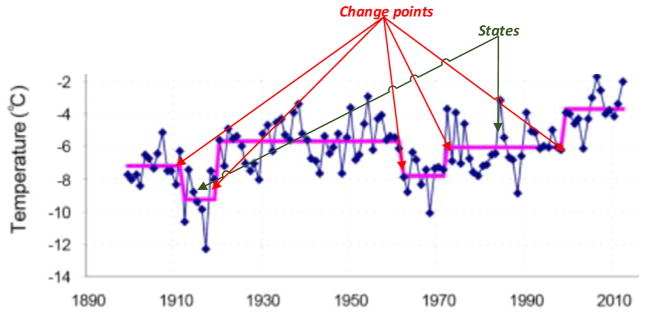
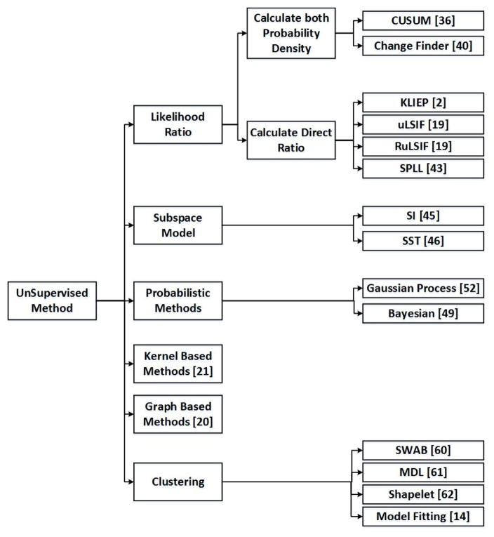

# 02 // summary : paper #2

> [!note]
> Link to the state-of-the-art paper :
> [https://www.ncbi.nlm.nih.gov/pmc/articles/PMC5464762/](https://www.ncbi.nlm.nih.gov/pmc/articles/PMC5464762/)

# Introduction

- Change point detection (CPD) is the problem of finding abrupt changes in data when a property of the time series changes.
- Segmentation, edge detection, event detection and anomaly detection are similar concepts which are occasionally applied as well as change point detection.
- Change point detection is closely related to the well-known problem of change point estimation or change point mining. Unlike CPD, however, change point estimation tries to model and interpret known changes in time series rather than identifying that a 
change has occurred.
- CPD is used in :
    - Medical condition monitoring
    - Climate change detection
    - Speech recognition
    - Image analysis
    - Human activity analysis
    
    
    

# Background

## Mathematical definitions

### Time series data stream

This is a sequence of vector of dimension $d$ that contains data at time $t$. $S$ is an infinite sequence.

$$
S=\{\mathbf{x}_1, \cdots, \mathbf{x}_i, \cdots\}
$$

### Stationary time series

This is a property of a stochastic process such that observations are not dependent on time. What is more important is that, as a consequence, statistical properties as expectation, variance (which should be finite), auto covariance, etc., are also not depending on time.

Auto covariance is a variance of a random variable with itself at different points in time.

$$
\gamma(s,t)=\text{cov}(\mathbf{X}_s, \mathbf{X}_t)=\mathbb E[(\mathbf{X}_s-\mu_s)(\mathbf{X}_t-\mu_t)]
$$

Still, auto covariance does not depend on specific time but rather on relative time like their difference $|t_1 - t_2|$.

### Independent and identically distributed variables (iid)

*Independent and identically distributed (i.i.d.) variables* are mutually independent of each other, and are identically distributed in the sense that they are drawn from the same probability 
distribution. **An i.i.d. time series is a special case of a stationary time series**.

### WM matrix

We take a subsequence from the infinite time series $S$ called $T$ of size $m$. This $T$ would contain the evolution of $X$ from a certain initial time $t$.

A matrix *WM* of all possible subsequences of length $*k*$ can be built by moving a *sliding window* of size $*k*$ across $*T*$ and placing subsequence $W_{i,k}=\{\mathbf{X}_i, \mathbf{X}_{i+1}, \cdots, \mathbf{X}_{i+k-1}\}$ at the $i^{th}$ row of WM. Notice the $(i+k-1)$ index at the last element of $W$.

$$
T=\{1,2,3,...,10\}, \hspace{5pt}i=2 , \hspace{5pt}k=4

\\[10pt]

\begin{bmatrix}
W_{i,k}
\\
W_{i+1,k}
\\
\vdots
\\
W_{i+n-1,k}
\end{bmatrix}

=

\begin{bmatrix}
\mathbf{X}_{i} & \mathbf{X}_{i+1} & \cdots & \mathbf{X}_{i+k-1}

\\

\mathbf{X}_{i+1} & \mathbf{X}_{i+2} & \cdots & \mathbf{X}_{i+k}

\\

\vdots & \vdots & \ddots & \cdots

\\

\mathbf{X}_{i+n-1} & \mathbf{X}_{i+n} & \cdots & \mathbf{X}_{i+n+k} 

\end{bmatrix}

\longrightarrow 

\begin{bmatrix}
2 & 3 & 4 & 5

\\

3 & 4 & 5 & 6

\\

\vdots & \vdots & \vdots & \vdots

\\

7 & 8 & 9 & 10 

\end{bmatrix}
$$

The consequent WM matrix is of dimensions $(m-k+1) \times k$ or also simply $n\times k$. In this example, the WM matrix is $6\times4$.

**Note**. A WM matrix is a Hankel matrix.

### Interval $\chi_{t,n}$

An interval would be just an extraction of n rows from the WM matrix starting from time $t$. For example, an interval $\chi_{5,3}$ would be as follows :

$$
\chi_{5,3}=
\begin{bmatrix}
5 & 6 & 7 & 8

\\

6 & 7 & 8 & 9

\\

7 & 8 & 9 & 10 

\end{bmatrix}
$$

### Change point

In the most general sense, a *change point* represents a **transition between different states** in a process that generates the time series data.

### Change point detection, as an hypothesis test

*Change point detection (CPD)* can be defined as the problem of hypothesis testing between two alternatives, the null hypothesis $H_0:$ “No change occurs” and the alternative hypothesis $H_A:$ “A change occurs”

$$
H_0: ℙ_{W_{i,(\cdot)}}
= ⋯ = ℙ_{W_{j,(\cdot)}}
= ⋯ = ℙ_{W_{k,(\cdot)}}

\\[4pt]

\text{vs.}

\\[6pt]

H_A: \exist j^*,\hspace{5pt} ℙ_{W_{i,(\cdot)}}
= ⋯ = ℙ_{W_{j^*,(\cdot)}}
\ne ℙ_{W_{j*+1,(\cdot)}}
= ⋯ = ℙ_{W_{k,(\cdot)}}
$$

where $ℙ_{W_{i},(\cdot)}$ is the probability density function of the sliding window start at time $i$ and $j^*$ is a change point.

## Criteria

### Online or offline detection

- Change point detection algorithms are traditionally classified as “online” or “offline”.
    - Offline algorithms consider the entire data set at once, and look back in time to recognize where the change occurred. The goal of this scenario is generally to identify all of a sequence’s change points in batch mode.
    - In contrast, online, or real-time, algorithms run concurrently with the process they are monitoring, processing each data point as it becomes available, with a goal of detecting a change point as soon as possible after it occurs, ideally before the next data point arrives. In practice, **no change point detection algorithm operates in perfect real time** because it must inspect new data before determining if a change point occurred between the old and new data points.
    - We will denote as an **$*ε*$**–***real time algorithm*** an online algorithm which needs at least $*ε*$ data samples in the new batch of data to be able to find change points. A perfect online change detection algorithm is a $1$-real time algorithm because it only needs $1$ next observation to be able to tell if there has been a change or not.

### Scalability

- Change detection methods need to be designed in a computationally efficient manner so that they can scale to massive data sizes.
- One way to compare the computational cost of the algorithms is finding the algorithm is parametric or non-parametric. **Nonparametric approaches have demonstrated greater success for massively large datasets**.
- A parametric approach specifies a particular functional form to be learned by the model and then estimates the unknown parameters based on labeled training data. Once the model has been trained the training examples can be discarded.
- In contrast, nonparametric methods do not make any assumptions about the form of the underlying function. The corresponding price to be paid is that all the available data has to be retained while making the inference.

### Algorithm constraints

- Approaches to CPD can also be distinguished based on the requirements that are imposed on the input data and the algorithm. These constraints are important in selecting an appropriate technique for detecting change points in a specific data sequence.
    - Constraints related to the nature of the time series data may emanate from the stationarity, i.i.d., dimensionality, or continuity of the data.
    - Another important issue in parametric methods is the degree to which the algorithm is sensitive to the choice of initial parameter values.

## Performance evaluation

Normally, the output of CPD algorithms can contain the following:

- Change-point yes/no decisions (the algorithm is a binary classifier)
- Change-point identification with varying levels of precision (i.e., the change point occurs within $*x*$ time units). This type of algorithm utilizes a multi-class classifier or unsupervised learning methods.
- The time of the next change point (or the times of all change points in the series).

For the first two types of algorithms, we need to establish a confusion matrix or error matrix as follows :

|  | Classifies as change point | Classifies as non-change point |
| --- | --- | --- |
| True change point | $TP$ | $FN$ |
| True non-change point | $FP$ | $TN$ |

**The next indicators are used in the field of *binary classification***. More info in these links:

[Binary classification](https://en.wikipedia.org/wiki/Binary_classification)

[Confusion matrix](https://en.wikipedia.org/wiki/Confusion_matrix)

### Accuracy

- Calculated as the ratio of correctly-classified data points to total data points.
- This measure provides a high-level idea about the algorithm’s performance.
- They are ineffective for evaluating performance in a class-imbalanced dataset, which is typical for change point detection, because they consider different types of classification errors as equally important.

$$
\text{Accuracy}=\frac{TP+TN}{TP+FP+FN+TN}
$$

- Consider a sample with $95$ negative and $5$ positive values. Classifying all values as negative in this case gives $0.95$ accuracy score. There are many metrics that don't suffer from this problem. Here is a better accuracy metric.

$$
\text{Balanced accuracy}=\frac{TPR+TNR}{2}
$$

### Sensitivity

- Also called True Positive rate.
- This refers to the portion of a class of interest (Change Points) that was recognized correctly with respect of all times there were change points.

$$
\text{Sensitivity}=\text{Recall}=\text{TP rate} =\frac{TP}{TP+FN}
$$

### G-mean

- Change point detection typically results in a learning problem with an imbalanced class distribution because the ratio of changes to total data is small.
- This is just the geometric mean of the true positive and true negative rate.

$$
\text{G-mean}=\sqrt{\text{Sensitivity}\times\text{Specificity}}=\sqrt{\frac{TP}{TP+FN} \times \frac{TN}{TN+FP}}
$$

### Precision

- This is calculated as the ratio of true positive data points (change points) to total points classified as change points.

$$
\text{Precision}=\frac{TP}{TP+FP}
$$

### F-measure (F-score)

- This measure provides a way to combine Precision and Recall as a measure of the overall effectiveness of a CPD algorithm.

$$
F_\beta=\frac{(1+\beta)^2\times\text{Recall}\times\text{Precision}}{(\beta^2\times\text{Recall})+\text{Precision}}
$$

- $F_\beta$ measures the effectiveness of retrieval with respect to a user who **attaches $\beta$ times as much importance to recall as precision**.
- The most popular F-measure is the $F_1$ score, where $\beta =1$, because it weights recall and precision equally.

### Receiver Operating Characteristics Curve

- ROC-based assessment facilitates explicit analysis of the tradeoff between true positive and false positive rates.
- This is done by plotting a two-dimensional graph with the false positive rate on the $x$ axis and the true positive rates on the $y$ axis. A CPD algorithm produces a $(FPR, TPR)$ pair that corresponds to a single point in the ROC space.
- One algorithm can generally be considered as superior to another if its point is closer to the $(0,1)$ coordinate (the upper left corner) than the other.
    - To assess the overall performance of an algorithm, we can look at the Area Under the ROC curve, or AUC. In general, we want the false positive rate to be low and the true positive rate to be high. This means that the closer to $1$ the AUC value is, the stronger is the algorithm.
- Another useful measure that can be derived from the ROC curve is the Equal Error Rate $(EER)$, which is the point where the false positive rate and the false negative rate are equal. This point is kept small by a strong algorithm.

### Precision-recall curve

- A PRC can also be generated and used to compare alternative CPD algorithms. The PR curve plots precision rate as a function of recall rate.
- While optimal algorithm performance for an ROC curve is indicated by points in the upper left of the space, optimal performance in the PR space is near the upper right.
- As with the ROC, the area under a PRC can be computed to compare two algorithms and attempt to optimize CPD performance.
- The PR curve in particular provides insightful analysis when the class distribution is highly skewed.

> [!note]
> The previous methods are used in a context of binary classification, i.e. if a point is a change point or not. The idea of “how much a point is a change point” or “how close is a point to be a change point” is not taking in consideration in binary classification.
>
> If the difference in time between the detected change point (CP) and the actual CP represents the measure of performance (utilizing supervised or unsupervised CPD methods), then the above metrics are not appropriate choices.
>
> Evaluating the performance of these algorithms is not as straightforward as for the previous case, because there is no single label against which the performance of the algorithm can be measured.

However, a number of useful metrics exist for this case. For all algorithms below, let $n$ be both the number of real change points and the number of predicted change points.

### Mean absolute error (MAE)

A classic and direct measure of performance. 

$$
MAE=\frac{1}{n}\sum_{i=1}^n|\text{Predicted}(CP_i)-\text{Actual}(CP_i)|
$$

### Mean squared error (MSE)

This one is more punishing with change points that are dramatic outliers because of the squaring.

$$
MSE=\frac{1}{n}\sum_{i=1}^n\Big(\text{Predicted}(CP_i)-\text{Actual}(CP_i)\Big)^2
$$

### Mean signed difference (MSD)

This indicator shows the general direction of the CPs with respect of the predictions.

$$
MSD=\frac{1}{n}\sum_{i=1}^n(\text{Predicted}(CP_i)-\text{Actual}(CP_i))
$$

### Root mean squared error (RMSE)

This is a kind of analog of the standard deviation.

$$
RMSE=\sqrt{\frac{1}{n}\sum_{i=1}^n\Big(\text{Predicted}(CP_i)-\text{Actual}(CP_i)\Big)^2}
$$

### Normalized root mean square error (NRMSE)

Normalizing the RMSD facilitates the comparison between datasets or models with different scales. Though there is no consistent means of normalization in the literature, common choices are the mean or the range (defined as the maximum value minus the minimum value) of the measured data. Here, $ACP$ means actual change point.

$$
NRMSE=\frac{RMSE}{ACP_{max}-ACP_{min}}\text{ or }NRMSE=\frac{RMSE}{\overline{ACP}}
$$

# Review

## Supervised methods

- The definition of supervised learning algorithms are machine learning algorithms that **learn a mapping from input data to a target attribute of the data**, which is usually a class label.
- When a supervised approach is employed for change point detection, machine learning algorithms can be trained as binary or multi-class classifiers. If the number of states is specified, the change point detection algorithm is trained to find each state **boundary**.
- A first way to detect change is with *multi class classifiers*, which detects each class (state) separately and provides enough information to find both the nature and the amount of detected change.
    - Decision tree
    - Naive bayes
    - Bayesian net
    - Support vector machine
    - Nearest neighbor
    - Hidden Markov model
    - Conditional random field
    - Gaussian mixture model

- A second way to detect change is with a *binary class classifier*. The idea is to treat change point detection as a binary class problem, where all of the possible state transition (change point) sequences represents one class and all of the within-state sequences represents a second class. While only two classes need to be learned in this case, this is a much more complex learning problem if the number of possible types of transitions is large.
    - Support vector machine
    - Naïve Bayes
    - Logistic regression
- A third way to detect change is with a *Virtual Classifier*. We take our time series and we take two windows (samples adjacent in time) where we suspect a change has happened. We label the points in Window 1 with (-1) and Window 2 as (+1). We use a multi-class classifier that learns how to classify new data points in one window or another. If there has really been a change between window #1 and window #2, the classifier should have a good accuracy.

We say concretely that there has been a change if the classifier’s accuracy $p$ is **significantly** better than a random accuracy of $0.5$. We use a statistical test where we test if $(H_0)$ the expected value of $p$ is $p_{rand}$ against $(H_A)$ if it is not. This test is a $z$-test.

## Unsupervised methods

- The difference with supervised methods is that unsupervised methods discover patterns while not having access to labeled data. They cluster and label data by exploring features in the time series.
- The clustering take the form of segmenting the time series where the algorithm thinks there are different states, therefore a change has happened.

### Likelihood ratio methods

- A typical statistical formulation of change-point detection is to analyze the probability distributions of data before and after a candidate change point. If the two probabilities are **significantly** different, then we label that point a change point.
- This normally takes two steps: we compute the probability density of two adjacent intervals, then we compute their ratio.
    - **CUSUM**: accumulates deviations relative to a specified target of incoming measurements and indicates that a change point exists when the cumulative sum exceeds a specified threshold.
    - **Change finder**: we compute the probability densities of each datapoint, we then compute a “score” for each data point, then we make an auto-regression model on the score-against-time data points and we derive again the densities of the score-against-time data points. We used again the score function defined earlier with the new densities to get the “final score”. A higher final score usually means a higher possibility of being a change point.
- We could also just compute the ratio of densities without computing the densities individually. This is a simpler and more flexible way to perform detections. All methods below estimate the density ratio between consequent intervals $\chi$ and $\chi^\prime$ by a Gaussian kernel model. With the estimation of the density ratio at hand, we use a dissimilarity measure of both intervals. The higher the result of dissimilarity, the more likely there has been a change between them.
    - **KLIEP**: uses Kullback-Leiber divergence as a dissimilarity measure.
    - **uLSIF**: uses Pearson divergence as a dissimilarity measure.
    - **RuLSIF**: uses $\alpha$-relative Pearson divergence as a dissimilarity measure if the density ratio is unbounded.
    - **SPLL**: supposes that $W_1$ data comes from a Gaussian mixture. The change detection criterion is derived using an upper bound of the log-likelihood of the data in $W_2$ determined by the smallest Mahalanobis distance between $x$ and its center. Finally, If $*W_2*$ does not come from the same distribution of $*W_1*$, then the mean of the distances will deviate from $*n*$ (the dimensionality of the feature space)

### Subspace model methods

These methods use the notion of subspaces to identify changes in data. This approach is closely related to system identification, a field in control theory that deals with modeling and understanding dynamic systems.

- **SI**: stands for “subspace identification”. Proposes parametric equations where $x(t)$ is the internal state of the system we want to observe and $y(t)$ is the observed output, this last depending on $x(t)$ but also on an error term $e(t)$.
    
    $$
    \begin{align*}
    &x(t+1)=Ax(t)+Ke(t)
    \\
    &y(t)=Cx(t)+e(t)
    \end{align*}
    $$
    
    The target is to estimate a matrix called the extended observability matrix, which is a measure of how well internal states of a system $(x(t))$ can be inferred by knowledge of its external outputs $(y(t))$.
    
    $$
    O_k=
    \begin{bmatrix}
    C^T & (CA)^T & \cdots&(CA^{k-1})^T
    \end{bmatrix}
    $$
    
    The SI method uses LQ factorization and Singular Value Decomposition (SVD) of the normalized conditional covariance to estimate the observability matrix.
    
- **SST**: stands for “Singular Spectrum Transformation”. It takes the Hankel matrix of the time series with a window of a set size $L$. This Hankel matrix is also called the “trajectory matrix”, and it can decomposed into submatrices using SVD. We compute a distance-based core comparing the singular spectrums of two consecutive trajectory matrices.

### Probabilistic methods

- **BCPD (Bayesian change point detection)**: a CPD algorithm with Bayesian principles. It assumes that a sequence of observations can be divided into non-overlapping states, and data within each state follows an independent and identically distributed (i.i.d.) probability distribution $P(x_t|η_ρ)$.
    - This methods uses an auxiliary variable called “run-length”, noted $r_t$. On a point in time $t$, $r_t$ indicates the time elapsed since the last change point. $r_t$ resets to zero on point $t$ if there has been a change of state, else it increases by $1$ unit of time. We compute the distribution of the run-length and also the probability that the most recent data point belongs to the current run.
    - We decide that a change has occurred if, while looking at the distribution of $r_t$, it has the highest probability.
- **GP (Gaussian Process)**: probabilistic method for stationary time series analysis and prediction. It’s a generalization of a Gaussian distribution and is defined as a collection of random variables any finite number of which hava a joint Gaussian distribution.
    - Time series observations are define as a noisy version of Gaussian distribution function values, where $\varepsilon_t\sim\mathcal N(0,\sigma^2_n)$ and $f(t)\sim GP(0,K)$. Here, GP is a distribution function with mean zero and covariance function $K$.
        
        $$
        x_t=f(t)+\varepsilon_t
        $$
        
        The GP Change algorithm uses a Gaussian process to estimate the predictive distribution at time $*t*$ using available observations through time $(t-1)$.
        
    - The algorithm then computes the $p$-value for the actual observation $*y_t*$ under the reference distribution, $\mathcal N(\hat y_t,\hat{\sigma^2})$.
    - A threshold $*α ∈ (0,1)*$ is used to determine when the actual observation does not follow the predictive distribution, which is indicative of a possible state change (and thus a change point).

### Kernel-based methods

- These methods map the observations in a reproducing kernel Hilbert space (RKHS) $*ℋ*$ associated with a reproducing kernel $*k(. , . )*$ and a feature map $Φ(X) = k(X, . )$. They then use a test statistic based upon the kernel Fisher discriminant ratio as a measure of homogeneity between windows.
- We pass all windows through a kernel, then we compute their mean and covariance (actually just variance but with a tensor product).
    
    $$
    \hat\mu=\frac 1 n \sum_{\ell=1}^n k(X_\ell,\cdot)
    \\[10pt]
    \hat\Sigma=\frac 1 n \sum_{\ell=1}^n(k(X_\ell,.)-\hat\mu)\otimes(k(X_\ell,.)-\hat\mu)
    $$
    
    Here, $(u\otimes v)_f=\lang v,f \rang_{ℋ}u$. We compute de Kernel Fisher Discriminant Ratio between two samples as follows :
    
    $$
    KFDR(X_1^{\text{length }n_1},X_2^{\text{length }n_2})=\frac{n_1n_2}{n_1+n_2}\lang\hat\mu_2-\hat\mu_1,(\hat\Sigma_w+\gamma I)^{-1}(\hat\mu_2-\hat\mu_1)\rang_ℋ
    $$
    
    Where $\gamma$ is a regularization parameter and
    
    $$
    \hat\Sigma_w=\frac{n_1}{n_1+n_2}\hat\Sigma_1+\frac{n_2}{n_1+n_2}\hat\Sigma_2
    $$
    
- The easiest way to determine whether a change point exists between two windows is comparing the KFDR ratio with a threshold value. The other method known as running maximum partition strategy calculates the KFDR ratio between all consequent windows in each interval. Then the maximum ratio will be compared to threshold to detect change point.
- A common drawback for kernel-based methods is that they rely heavily on the choice of the kernel function and its parameters, and the problem becomes more severe when the data are in moderate to high dimensional spaces.

### Graph-based methods

- The graph is usually derived from a distance or a generalized dissimilarity on the sample space, with time series observations as nodes and edges connecting observations based on their distance.
    - This graph can be defined based on a minimum spanning tree, minimum distance pairing, nearest neighbor graph, or visibility graph.
    - For a time $t^*$ where a change might occur, the data is split into two windows, before $t^*$ and after $t^*$. This also looks like taking the graph $G$ and creating two subsets of nodes (datapoints) that correspond to the datapoints in windows #1 and #2.
    - We create a measure called $R_G$, which is the number of edges that connect the nodes from $W_1$ to the nodes of $W_2$, independent of their distance. Intuitively, if the numbers of edges connecting the windows is low (small $R_G$).
    - Different couples of windows $(W_i,W_j)$ gives us different values of $R_G\space(R_{G,(i,j)})$. We create an $z$-statistic from $R_G$ and we find its maximum value in the data set. This maximum points is labeled a potential change point.
    - Potential change point are considered real change point if their $z$-value is grater than a threshold.
- This method is effective for high-dimensional data and doesn't rely on many assumptions about the data's properties. However, it doesn't make full use of the time series data itself and mainly depends on defining the right kind of graph structure.

### Clustering methods

- The problem of change point detection can be considered as a clustering problem with a known or unknown number of clusters, such that observations within clusters are identically distributed, and observations between adjacent clusters are not.
- If a data point at time stamp $*t*$ belongs to a different cluster than the data point at time stamp $*t+1*$, then a change point occurs between the two observations.
- Bottom-up: basic algorithm. If a time series has length $n$, bottom-up starts proposing $\lfloor n/2 \rfloor$ segments (i.e it connects pairs of points left-to-right). Then, it considers an maximum error $e$ to respect. For all the segments, it computes the cost (error) if they were to be merged.

From the cheapest cost, it starts merging segments, then recalculating merge costs, until the cost for the next cheapest merge is greater than $e$, at which point it stops and it returns the “linerized time-series”. The change points here are the points connecting two different segments.
- **SWAB (Sliding window and bottom-up)** : build on “bottom-up”. Takes the whole times series $T$ and takes a buffer or sliding window $W$ of enough length to take $5$ segments. We perform bottom-up (with max. error tolerance $e$) on the data in the window and we keep the leftmost segment as final.

We start reading new data in $S$ from the time series to the buffer, respecting $e$. Once we stop gathering points, we concatenate them to the buffer $W$ and we repeat bottom-up and the whole process. We end when we can’t add new data points to the buffer, in which case we concatenate all the segments from the last bottom-up to the final segments.
- **MDL (Minimum Description Length)**: we define a term called “description length of a time series $T$” noted $DL(T)$ which is the total number of bits that are required to represent the series. The length of $T$ is $m$ and $H(T)$ is the entropy of $T$.
    
    $$
    DL(T)=m\times H(T)
    $$
    
    Normally, we would want an encoding of the time series that uses the least possible number of bits, we don’t care about the encoding algorithm itself.
    
    We create clusters and we start modifying them while reading the data. At every data point, we decide the option that reduces the greater number of bits that we need to describe all clusters. The options are to create a new cluster for the current data point or to add it to an existing cluster. Also, just before making this decision, we can also decide to merge two clusters if it reduces the number of bits needed to represent their data. It isn’t surprising that the algorithm is named “minimum description length”.
    
- **Shapelet method** : from a time series $T$, we create a “shapelet” that is a “small pattern in $T$”. Particularly, this shapelet subsequence is much closer to a part of $T$ (with a given definition of distance) than the rest of $T$.

The method itself creates a shapelet associated with a few data points and then it removes them from $T$. It repeats this method until all data is clustered. It helps itself to identify shapelets with a greedy algorithm that tries to maximize the gap between two subsets of data.
- **Model fitting**: from a data stream $\{x_1, \cdots , x_i, \cdots \}$ (the $y$-coordinate of data points in the time series), detects a change when a new data item or block of data items do not fit into any of the existing clusters. Particularly, there has been a change if the following expression is true.
    
    $$
    \text{Change}=\bigwedge_{j=1}^k [d(x_{i+1}, \text{center}(C_j))>\text{radius}(C_j)]
    $$
    
    Here, $k$ is the number of clusters, $*d(x_{i+1}, \text{center}(C_j))*$ is the Euclidian distance between a newly-incoming data point $*x_{i+1}*$ and the center of cluster $*C_j$, and $\text{radius}(C_j)$* is the radius of cluster $j$ defined as follows :
    
    $$
    \text{radius}(C)=\sqrt{\frac{\sum_{i=1}^n(x_i-\mu)^2}{n}}
    $$
    

# Discussion and comparison

## Online vs. offline performance

- Supervised methods are n-real time because they check if there is a CP in the current window.
- Likelihood ratio methods read a current windows of length n and a retrospective subsequence of length k. They are then (n+k)-real time.
- Subspace models are also (n+k)-real time.
- Probabilistic models are n-real time.
- Kernel based methods are (n+k)-real time.
- Graph based methods are n-real time.
- For clustering methods :
    - SWAB is w-real time, where w is the length of the buffer.
    - MDL and Shapelet are infinity-real time (offline).
    - Model fitting technique is n-real time.

## Scalability performance

The following table resumes each algorithms scalability.

In general, as the dimension of the time series increases the nonparametric methods gain power in computational cost and will be less expensive than parametric methods.

## Learning constraints of each one

- Generalities :
    - Supervised approaches suppose that a transition period can be detected independent of the current time series state, whereas the unsupervised learning algorithms suppose that the distribution of time series data changes before and after each change point.
    - Supervised approaches frequently outperform unsupervised methods in detecting change points.
    - Supervised approaches depend on sufficient quality and quantity of training data, which is not always accessible for real world data. In addition to training data, multi-class supervised algorithms also need the number of possible states.
    - Non-parametric CPD methods are more robust than parametric ones because the parametric methods rely heavily on the choice of parameters. In addition, the CPD problem becomes more complex for parametric methods when the data has moderate to high dimensionality.
- The following table summarizes all algorithm’s limitations :

## Performance evaluation

- An objective comparison of the performance of different CPD methods is very difficult due to the use of these different datasets.
- The datasets were:
    - **Dataset #1**: speech recognition.
    Records of a human voice in a noisy environment.
    The task is to extract speech sections from recorded signals.
    - **Dataset #2**: ECG.
    - **Dataset #3**: speech recognition.
    Soundtracks from the TV show (“Le Grand ‘Echiquier”).
    - **Dataset #4**: brain-computer interface data.
    - **Dataset #5**: Iowa crop biomass NDVI data.
    - **Dataset #6**: smart home data (sensor readings).
    - **Dataset #7**: human activity dataset.
    Data collected from a walking person by portable three-axis accelerometers.
- A majority of the studies do not provide any comparisons, or in some cases, even measures of performance (e.g. SPLL and clustering methods).
- The following table summarizes all algorithm’s performance, based on the datasets they were applied on.

- **Supervised methods tend to be more accurate than unsupervised methods if enough training data exist and the series is stationary**.
    - If these conditions are not met, the unsupervised methods are more useful.
    - Most unsupervised algorithms place constraints on the types of time series methods that can be processed. One notable exception to this is the AR method.
- There is no comprehensive performance comparison among unsupervised methods, but it can be seen from experimental results that **RulSIF consistently yields strong accuracy**.
- Parametric methods do not exhibit good performance for noisy data or highly dynamic systems. This is the case of CUSUM, AR, subspace models, kernel methods and clustering methods.
- For high-dimension time series data, the likelihood ratio and subspace models are not the best choices, because they cannot directly handle multidimensional data. In this case, graph-based or probabilistic methods are more promising.

# Conclusions and challenges for future work

- There is still a need for development of online algorithms.
- There is no formal analysis of robustness of algorithms. The assertion “non-parametric methods are more robust than parametric ones” isn’t rigorous.
- For the algorithms that employ a window, smaller windows don’t allow to look deeper into the future. One can hypothesize a solution with a window of variable size.
- Evaluating the significance of a change point candidate is an open issue for unsupervised methods.
- Methods for handling non-stationary time series are also in need and could be potentially useful cor change detection work.