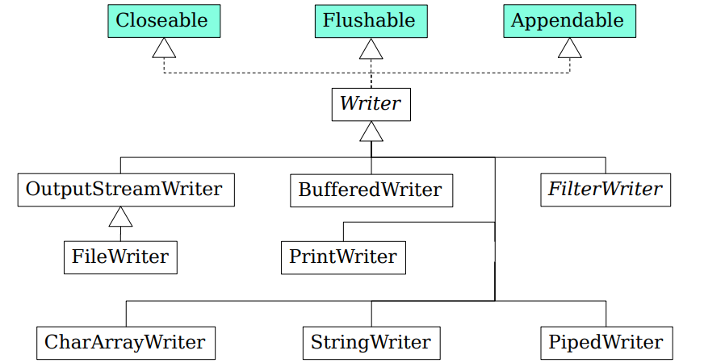

# 05 // flux et fichiers

[INFF5-5.pdf](ressources/05_flux_et_fichiers_inff5-5.pdf)

# Introduction

## Notion de flux

Un flux (de données) est l’abstraction d’une séquence de taille variable (voire inconnue) de données éventuellement hétérogènes qui peut constituer une entrée ou une sortie pour un programme.

Un flux peut être associé à divers éléments du système d’entrées/sorties d’un ordinateur : clavier, écran, imprimante, fichier, connexion réseau, etc.

## Les flux en Java

Il existe plusieurs classes prédéfinies en Java permettant de créer et manipuler des flux. On distingue les flux selon deux critères :

- leur direction (flux en lecture ou en écriture),
- l‘élément atomique pouvant être lu ou écrit (octet ou caractère).

Les classes relatives aux flux sont pour la plupart regroupées dans le paquetage `java.io`, mais aussi dans d’autres paquetages (`java.util`, `java.util.zip`, `java.security`, `javax.crypto`).

# Flux d’octects

## Comment ça marche en Java

Deux hiérarchies de classes prédéfinies existent en Java pour les flux d’octets.

- En entrée ou lecture : la classe `java.io.InputStream` est la racine de la hiérarchie d’héritage des classes concernant les flux d’octets en lecture.
- En sortie ou écriture : la classe `java.io.OutputStream` est la racine de la hiérarchie d’héritage des classes concernant les flux d’octets en écriture.

Il existe une interface importante qui interagit avec les flux d’octects : l’interface `Cloaseable`, qui contient un seule méthode `void close() throws IOException`. Telle méthode ferme le flux et libère toutes les ressources systèmes associées au flux. N’a aucun effet si le flux est déjà fermé.

## Flux d’octects en lecture


Les diagrammes sont un peut inverses, mais bref, si une classe A pointe vers une autre classe B, donc A hérite de B. 

### Classe abstraite `InputStream`

```java
// méthodes de lecture

abstract int read() throws IOException{ ... }
int read(byte[] t) throws IOException{ ... }
int read(byte[] t, int d, int lg) throws IOException{ ... }

// autres méthodes

int available(){...}
void close() throws IOException{ ... }
long skip(long n) throws IOException{ ... }
void mark(int limite) throws IOException{ ... }
boolean markSupported() throws IOException{ ... }
void reset() throws IOException{ ... }
```

- `abstract int read()`
lit et retourne l’octet suivant. Retourne `-1` si EOF. Bloque jusqu’à la lecture de l’octet, EOF ou levée d’une `IOException`.
- `int read(byte[] t)` 
lit jusqu’à `t.length` octets, les range dans `t` et retourne le nombre d’octets lus ou `-1` si EOF. Méthode bloquante. Lève une `NullPointerException` si `t` vaut `null`.
- `int read(byte[] t, int d, int lg)` 
lit jusqu’à `lg` octets, les range dans `t` à partir de l’indice `d` et retourne le nombre d’octets lus ou `-1` si EOF. Méthode bloquante. Lève une `NullPointerException` si `t` vaut `null`.
- `int available()` 
retourne le nombre d’octets disponibles (pouvant être lus sans bloquer avec `read()`).
- `void close()` 
ferme le flux.
- `long skip(long n)` 
saute `n` octets et retourne le nombre d’octets effectivement sautés.
- `void mark(int limite)` 
positionne une marque à laquelle il est possible de revenir par un reset. limite indique le nombre d’octets pouvant être lus avant que cette marque soit invalidée.
- `boolean markSupported()` 
retourne `true` si et seulement si le flux autorise l’utilisation de mark et reset.
- `void reset()` 
repositionne la lecture à la dernière marque placée dans le flux. Une `IOException` est levée si aucune marque valide existe ou si les marques ne sont pas autorisées par le flux.

### Classe `FileInputStream`

```java
// constructeurs
FileInputStream(String name) throws FileNotFoundException{ ... }
FileInputStream(File file) throws FileNotFoundException{ ... }
FileInputStream(FileDescriptor fd) throws FileNotFoundException{ ... }

// méthodes additionnelles
FileDescriptor getFD() throws IOException{ ... }
FileChannel getChannel() throws IOException{ ... }
```

- Les constructeurs sont un peu évidents.
- `FileDescriptor getFD()`
retourne le `FileDescriptor` représentant la connexion courante au fichier.
- `FileChannel getChannel()`
retourne le `FileChannel` représentant la connexion courante au fichier (avec la même position de lecture).

### Classe abstraite `FilterInputStream` et ses classes enfants

La classe `FilterInputStream` est une classe abstraite dont héritent de nombreuses sous-classes destinées à être des « décorateurs » pour un `InputStream` existant, dont notamment :

- `BufferedInputStream`
- `DataInputStream`
- `InflaterInputStream` (dans le paquetage `java.util.zip`)

### Classe `BufferedInputStream`

Elle ne contient que deux constructeurs :

- `BufferedInputStream(InputStream in)`
décore `in` en le dotant d’un accès tamponné de 8192 octets.
- `BufferedInputStream(InputStream in, int taille)`
décore `in` en le dotant d’un accès tamponné de `taille` octets.

### Classe `DataInputStream`

Elle ne contient qu’un constructeur :

- `DataInputStream(InputStream in)`
décore `in` en le dotant d’un accès conforme à l’interface `DataInput`.

L’interface `DataInput` donne accès a plusieurs méthodes :

- `void readFully(byte[] tab)`
lit `tab.length` octets dans le flux et les place dans `tab`, méthode bloquante.
- `void readFully(byte[] tab, int d, int l)`
lit `l` octets dans le flux et les place dans `tab`, à partir de l’indice `d`, méthode bloquante.
- `int skipBytes(int n)`
tente de sauter `n` octets dans la lecture du flux et retourne le nombre d’octets effectivement sautés.
- `boolean readBoolean()`
lit l’octet suivant et retourne `true` s’il est différent de 0, false sinon.
- `byte readByte()`
lit 1 octet.
- `short readShort()`
lit 2 octets.
- `char readChar()`
lit 2 octets.
- `int readInt()`
lit 4 octets.
- `long readLong()`
lit 8 octets.
- `float readFloat()`
lit 4 octets.
- `double readDouble()`
lit 8 octets.
- `int readUnsignedByte()`
lit 1 octet.
- `int readUnsignedShort()`
lit 2 octets.
- `String readLine()`
lit plusieurs octets en les interprétant chacun comme des caractères qui sont mis dans la String retournée. La lecture s’arrête à une fin de ligne ou en fin de flux.
- `String readUTF()`
lit plusieurs octets constituant une chaîne de caractères au format UTF8 modifié et retourne la `String` correspondante.

L’interface lève une exception `EOFException` si il y a une tentative de lire au-delà de la fin du flux).

### Exemple de lecture basique

```java
InputStream entree;
byte b;
try {

	entree = new BufferedInputStream(new FileInputStream("essai"));

	for (int i = entree.read(); i != -1; i = entree.read()) {
		b = (byte) i;
		// …
	}
	entree.close();

} catch (IOException ioe) {
	// …
}
```

## Flux d’octects en écriture


Les diagrammes sont un peut inverses, mais bref, si une classe A pointe vers une autre classe B, donc A hérite de B. 

### Classe abstraite `OutputStream`

Les méthodes plus importantes sont celles d’écriture :

- `abstract void write(int i) throws IOException`
écrit l’octet de poids faible de `i` dans le flux.
- `void write(byte[] t) throws IOException`
écrit tous les octets de dans le flux. Lève une `NullPointerException` si `t` vaut `null`.
- `void write(byte[] t, int d, int l) throws IOException`
écrit `l` octets qui se trouvent dans le tableau `t` à partir de l’indice `d`. Lève une `NullPointerException` si `t` vaut `null`. Lève une `IndexOutOfBoundsException` si les
valeurs de `d` et/ou `l` sont incorrectes.

Après, on a des méthodes additionnelles :

- `void flush() throws IOException`
vide le flux (assure que tout octet éventuellement « bufferisé » est bien envoyé à l’autre extrémité du flux.
- `void close() throws IOException`
ferme le flux.

### Classe `FileOutputStream`

Commençons par le constructeur :

- `FileOutputStream(String name, boolean ajout) throws FileNotFoundException`
ouvre une connexion en écriture sur le fichier nommé `name` dans le système de fichiers. Si le fichier n’existe pas, il est créé. Si le fichier existe et que ajout vaut `false`, il est écrasé, sinon il est augmenté. Levée d’exception s’il n’est pas possible d’écrire dans le fichier.
- `FileOutputStream(String name) throws FileNotFoundException`
correspond à `FileOutputStream(name, false)`.
- `FileOutputStream(File file, boolean ajout) throws FileNotFoundException`
similaire à `FileOutputStream(String, boolean)`.
- `FileOutputStream(File file) throws FileNotFoundException`
correspond à `FileOutputStream(file, false)`.
- `FileOutputStream(FileDescriptor fd)`
ouvre une connexion en écriture décrite par `fd`.

Après, on a des méthodes additionnelles :

- `FileDescriptor getFD() throws IOException`
retourne le `FileDescriptor` représentant la connexion courante au fichier.
- `FileChannel getChannel() throws IOException`
retourne le `FileChannel` représentant la connexion courante au fichier (avec la même position d’écriture).

### Classe abstraite `FilterOutputStream` et ses sousclasses

La classe `FilterOutputStream` est une classe abstraite dont héritent de nombreuses sousclasses destinées à être des « décorateurs » pour un `OutputStream` existant, dont notamment les suivantes :

### Classe `BufferedOutputStream`

Il ne contient que deux constructeurs :

- `BufferedOutputStream(OutputStream out)`
décore `out` en le dotant d’un accès tamponné de 8192 octets.
- `BufferedOutputStream(OutputStream out, int taille)`
décore `out` en le dotant d’un accès tamponné de `taille` octets.

### Classe `DataOutputStream`

Elle ne contient qu’un constructeur :

- `DataOutputStream(OutputStream out)`
décore `out` en le dotant d’un accès conforme à l’interface `DataOutput`.

L’interface `DataOutput` donne accès a plusieurs méthodes :

- `void writeBoolean(boolean b)`
écrit un booléen (un octet valant 1 si `true`, valant 0 si `false`).
- `void writeByte(int b)`
écrit l’octet de poids faible de `b`.
- `void writeShort(int s)`
écrit les 2 octets de poids faible de `s`.
- `void writeChar(int c)`
écrit les 2 octets de poids faible de `c`.
- `void writeInt(int i)`
écrit 4 octets.
- `void writeLong(long l)`
écrit 8 octets.
- `void writeFloat(float f)`
écrit 4 octets.
- `void writeDouble(double d)`
écrit 8 octets.
- `void writeBytes(String s)`
écrit les octets de poids faible de chacun des caractères de `s`.
- `void writeChars(String s)`
écrit les caractères de `s`.
- `void writeUTF(String s)`
écrit 2 octets indiquant un format UTF-8, puis les caractères de `s` en utilisant le format UTF-8.

### Exemple d’écriture basique

```java
OutputStream sortie;
byte b;
try {

	sortie = new BufferedOutputStream(new FileOutputStream("essai"));

	for (int i = 0; i < 1000000; i ++) {
		b = (byte)(Math.random() * 256 - 128);
		sortie.write(b);
		// …
	}

	sortie.flush();
	sortie.close();

} catch (IOException ioe) {
	// …
}
```

# Flux de caractères

## Flux de caractères en lecture


Les diagrammes sont un peut inverses, mais bref, si une classe A pointe vers une autre classe B, donc A hérite de B. 

### Classe abstraite `Reader`

Elle contient deux constructeurs :

- `Reader()`
permet d’obtenir un `Reader` synchronisé avec lui-même.
- `Reader(Object lock)`
permet d’obtenir un `Reader` synchronisé avec `lock`.

En plus, elle contient de méthodes de lecture :

- `int read() throws IOException`
lit et retourne le caractère suivant. Retourne -1 si `EOF`. Bloque jusqu’à la lecture du caractère, `EOF` ou levée d’une `IOException`.
- `int read(char[] t) throws IOException`
lit jusqu’à `t.length` caractères, les range dans `t` et retourne le nombre d’octets lus ou -1 si EOF. Méthode bloquante. Lève une `NullPointerException` si `t` vaut `null`.
- `int read(char[] t, int d, int l) throws IOException`
lit jusqu’à `l` caractères, les range dans `t` et retourne le nombre d’octets lus ou -1 si EOF. Méthode bloquante. Lève une `NullPointerException` si `t` vaut `null`.
- `int read(CharBuffer cb) throws IOException` 
tente de lire des caractères dans `cb` et retourne le nombre d’octets lus ou -1 si EOF. (Méthode imposée par l’interface `Readable`).

Finalement, d’autres méthodes :

- `void close() throws IOException`
ferme le flux.
- `boolean ready() throws IOException`
retourne `true` si et seulement si une tentative de lecture ne serait pas bloquante.
- `long skip(long n) throws IOException`
saute `n` octets et retourne le nombre d’octets effectivement sautés.
- `void mark(int limite) throws IOException`
positionne une marque à laquelle il est possible de revenir par un reset. `limite` indique le nombre d’octets pouvant être lus avant que cette marque soit invalidée.
- `boolean markSupported() throws IOException`
retourne `true` si et seulement si le flux autorise l’utilisation de `mark` et `reset`.
- `void reset() throws IOException`
repositionne la lecture à la dernière marque placée dans le flux. Une `IOException` est levée si aucune marque valide existe ou si les marques ne sont pas autorisées par le flux.

### Classe `InputStreamReader`

Elle ne contient que des constructeurs :

- `InputStreamReader(InputStream in)`
permet d’obtenir un `InputStreamReader` sur `in` en utilisant le `Charset` par défaut.
- `InputStreamReader(InputStream in, Charset cs)`
permet d’obtenir un `InputStreamReader` sur `in` en utilisant `cs` comme `Charset`.
- `InputStreamReader(InputStream in, CharsetDecoder dec)`
permet d’obtenir un `InputStreamReader` sur `in` en utilisant `dec` comme `CharsetDecoder`.
- `InputStreamReader(InputStream in, String name) throws UnsupportedEncodingException`
permet d’obtenir un `InputStreamReader` sur `in` en utilisant le `Charset` nommé `name`.

### Classe `FileReader`

Elle ne contient que des constructeurs :

- `FileReader(String name) throws FileNotFoundException`
ouvre une connexion en lecture sur le fichier nommé `name` dans le système de fichiers. Levée d’exception s’il n’est pas possible de lire dans le fichier.
- `FileReader(File file) throws FileNotFoundException`
ouvre une connexion en lecture sur le fichier `file`. Levée d’exception s’il n’est pas possible de lire dans le fichier.
- `FileReader(FileDescriptor fd) throws FileNotFoundException`
initialise le `FileInputStream` d’après `fd` (pouvant être obtenu depuis une connexion existante).

### Classe `BufferedReader`

Elle contient deux constructeurs :

- `BufferedReader(Reader r)`
permet d’obtenir un `BufferedReader` sur `r` avec un tampon de taille 8192.
- `BufferedReader(Reader r, int t)`
permet d’obtenir un `BufferedReader` sur `r` avec un tampon de taille `t`.

Finalement, une méthode additionnelle :

- `String readLine()`
retourne une ligne lue dans `this`. Une ligne est toute suite de caractères se terminant par '`\n`', '`\r`', ou "`\r\n`". Les caractères de fin de ligne ne font pas partie du résultat. Retourne `null` si EOF.

## Flux de caractères en écriture



Les diagrammes sont un peut inverses, mais bref, si une classe A pointe vers une autre classe B, donc A hérite de B. 

### Classe abstraite `Writer`

Elle contient deux constructeurs :

- `Writer()`
permet d’obtenir un `Writer` synchronisé avec lui-même.
- `Writer(Object lock)`
permet d’obtenir un `Writer` synchronisé avec `lock`.

Additionnellement, des méthodes d’écriture :

- `void write(int i) throws IOException`
écrit le caractère encodé dans les 2 octets de poids faible de `i` dans le flux.
- `void write(char[] t) throws IOException`
écrit tous les éléments de `t` dans le flux.
- `void write(char[] t, int d, int l) throws IOException`
écrit les `l` éléments de `t` situés à partir de l’indice `d` dans le flux.
- `void write(String s) throws IOException`
écrit tous les caractères de `s` dans le flux.
- `void write(String s, int d, int l) throws IOException`
écrit les `l` caractères de `s` situés à partir de l’indice `d` dans le flux.
- `Writer append(char c) throws IOException`
écrit `c` dans le flux et retourne le flux (permet la cascade de messages).
- `Writer append(CharSequence cs) throws IOException`
écrit tous les caractères de `cs` dans le flux et retourne le flux. `String`, `StringBuffer`, `StringBuilder` en particulier implémentent l’interface `CharSequence`.
- `Writer append(CharSequence cs, int d, int f) throws IOException`
écrit les caractères de `cs` de l’indice `d` inclus à l’indice `f` exclus dans le flux et retourne le flux.

Et finalement, d’autres méthodes :

- `void close() throws IOException`
ferme le flux.
- `void flush() throws IOException`
vide le flux.

### Classe `OutputStreamWriter`

Elle ne contient que des constructeurs :

- `OutputStreamWriter(OutputStream out)`
permet d’obtenir un `OutputStreamWriter` sur `out` en utilisant le `Charset` par défaut.
- `OutputStreamWriter(OutputStream out, Charset cs)`
permet d’obtenir un `OutputStreamWriter` sur `out` en utilisant `cs` comme `Charset`.
- `OutputStreamWriter(OutputStream out, CharsetDecoder dec)`
permet d’obtenir un `OutputStreamWriter` sur `out` en utilisant `dec` comme `CharsetDecoder`.
- `OutputStreamWriter(OutputStream out, String name) throws UnsupportedEncodingException`
permet d’obtenir un `OutputStreamWriter` sur out en utilisant le `Charset` nommé `name`.

### Classe `FileWriter`

Similairement, elle ne contient que des constructeurs :

- `FileWriter(String name, boolean ajout) throws IOException`
ouvre une connexion en écriture sur le fichier nommé `name` dans le système de fichiers. Si le fichier n’existe pas, il est créé. Si le fichier existe et que ajout vaut `false`, il est écrasé, sinon il est augmenté. Levée d’exception s’il n’est pas possible d’écrire dans le fichier.
- `FileWriter(String name) throws IOException`
correspond à `FileWriter(name, false)`.
- `FileOutputStream(File file, boolean ajout) throws IOException`
similaire à `FileWriter(String, boolean)`.
- `FileWriter(File file) throws IOException`
correspond à `FileWriter(file, false)`.
- `FileWriter(FileDescriptor fd)`
ouvre une connexion en écriture décrite par `fd`.

### Classe `BufferedWriter`

Elle contient deux constructeurs :

- `BufferedWriter(Writer w)`
permet d’obtenir un `BufferedWriter` sur `w` avec un tampon de taille 8192.
- `BufferedWriter(Writer w, int t)`
permet d’obtenir un `BufferedWriter` sur `w` avec un tampon de taille `t`.

Aussi, elle contient une méthode additionnelle :

- `void newLine()`
écrit un séparateur de ligne dans le flux (dépend du système).