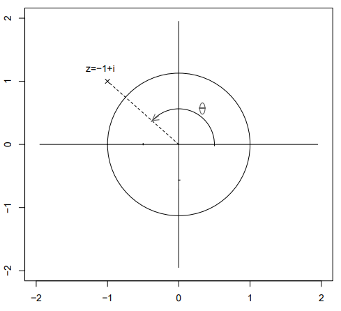
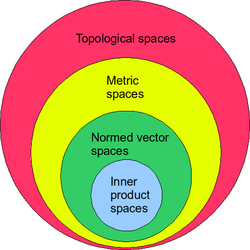

# 01 // analyse fonctionnelle (complexes, topologie, espaces)

[Slides annotés #1 : analyse fonctionnelle.pdf](ressources/01_analyse_fonctionnelle_(complexes_topologie_es_slides_analyse_fonctionnelle_annote.pdf)

# Nombres complexes

## Forme algébrique et module

La forme la plus classique de représenter un nombre complexe est la suivante :

$$
a+bi\hspace{6pt}\text{où } a,b\in\R
$$

Supposons que $z=-1+i$. Donc, sa représentation graphique est la suivante :

Le module est défini comme une fonction qui prend un nombre complexe sur le plain complexe et retourne de ce nombre complexe à partir de l’origine. $|z|$ est le module du nombre $z$ et il est calculé comme suit :

$$
|z|=\sqrt{a^2+b^2}
$$

## Forme trigonométrique

La forme trigonométrique d’un nombre complexe $z$ nécessite la conception du cercle trigonométrique : un cercle de rayon $1$ centré sur l’origine. Si on trace une ligne de l’origine à $z$, on pourrait déterminer tout $z$ à partir de son module et les radians $\theta$ jusqu’au point d’intersection de telle ligne avec cercle unitaire. **Ce $\theta$ est appelé l’*argument ou phase***.

Une technique intéressante c’est de prendre un nombre $z$ et de le diviser par son module $|z|$. Le résultat de cette opération est appelé le point d’affixe noté $\tilde z=z/|z|$, et il garde le même angle $\theta$ que le nombre original $z$, mais son module est $1$.

En rappelant les définitions trigonométriques, pour $\tilde z$, la coordonnée des abscisses serait $\cos\theta$ et celle des ordonnées serait $\sin\theta$. Finalement, on a que :

$$
z=|z|(\cos\theta+i\sin\theta)
\\
\tilde z=\cos\theta+i\sin\theta
$$

## Propriétés élémentaires

Toutes les propriétés qui suivent, si on mentionne $\arg(z)$, l’image $\arg(z)$ est modulo $2\pi$.

- Inégalité triangulaire : $|z+z^\prime|\le |z|+|z^\prime|$
- $|z\times z^\prime|=|z|\times|z^\prime|$
- $\arg(zz^\prime)=\arg(z)+\arg(z^\prime)$
- $|1/z|=1/|z|$ et $\arg(1/z)=-\arg(z)$
- $|z/z^\prime|=|z|/|z^\prime|$ et $\arg(z/z^\prime)=\arg(z)-\arg(z^\prime)$

## Notation exponentielle

Rappelons que :

$$
z=|z|(\cos\theta+i\sin\theta)
$$

Seulement si $z$ est un nombre de modulo $1$, on pourrait écrire :

$$
e^{i\theta}=\cos\theta+i\sin\theta
$$

Donc, on pourrait réécrire tout nombre $z$ d’une manière altérée de la forme trigonométrique, avec $r=|z|$ et $\theta=\arg(z)\mod 2\pi$.

$$
z=re^{i\theta}
$$

> [!note]
> La preuve de ce théorème vient de l’expansion de Taylor pour $e^x$, $\sin x$ et $\cos x$. Il est aussi nécessaire le fait que le rayon de convergence est infini pour telles séries de Taylor.
>
> $$
> \begin{align*}
> e^{iz}
> &=\frac{(iz)^0}{0!}+\frac{(iz)^1}{1!}+\frac{(iz)^2}{2!}+\frac{(iz)^3}{3!}+\frac{(iz)^4}{4!}+\frac{(iz)^5}{5!}+\frac{(iz)^6}{6!}+\frac{(iz)^7}{7!}+\cdots
> \\[8pt]
> &=\frac{z^0}{0!}+i\frac{z^1}{1!}-\frac{z^2}{2!}-i\frac{z^3}{3!}+\frac{z^4}{4!}+i\frac{z^5}{5!}-\frac{z^6}{6!}-i\frac{z^7}{7!}+\cdots
> \\[8pt]
> &=
> \left(
> \frac{z^0}{0!}-\frac{z^2}{2!}+\frac{z^4}{4!}-\frac{z^6}{6!}+\cdots
> \right)
> +i
> \left(
> \frac{z^1}{1!}-\frac{z^3}{3!}+\frac{z^5}{5!}-\frac{z^7}{7!}+\cdots
> \right)
> \\[10pt]
> &=\cos(z)+i\sin(z)
> \end{align*}
> $$
>
> **Note**. Le réordonnancement est possible car chaque série évoquée est absolument convergente.

Notons qu’avec la notation exponentielle, on peut définir $\sin$ et $\cos$ comme suit :

$$
\begin{cases}
e^{ix}=\cos x+i\sin x
\\
e^{-ix}=\cos x-i\sin x
\end{cases}
\implies
\begin{cases}
\cos x=\frac{e^{ix}+e^{-ix}}{2}
\\
\sin x=\frac{e^{ix}-e^{-ix}}{2i}
\end{cases}
$$

## Racines de l’unité

Soit $n ∈ \N^∗$ un entier non nul. Si $z^n = 1$, alors $z\ne 0$ et on peut donc écrire $z = re^{iθ}$. De plus,

$$
z^n=1\iff r=1 \text{ et } \theta=\frac{2k\pi}{n}
$$

On a donc $n$ racines de l’unité souvent notées :

$$
\xi_k=e^{\frac{2k\pi}{n}}
$$

Si $z_0\ne 0$, pour résoudre l’équation $z^n = z_0$, on utilisera la forme exponentielle.

# Espace métrique

## Topologie et normes

### Rappel de norme

Une norme est toute fonction $f : x \mapsto ||x|| \in \R^+$ qui intuitivement capture une “distance” d’un point à partir de l’origine. Elle doit vérifier les conditions suivantes :

- $||\lambda x|| = |\lambda| ||x||$
La norme est multiplicative, càd. $f(xy)=f(x)f(y)$
- $||x+y|| \le ||x|| + ||y||$
Inégalité triangulaire
- $||x|| = 0 \implies x = 0$ 
Si la longueur ou magnitude d’un élément est $0$, donc il est le vecteur nul

On peut définir une ***norme issue du produit scalaire*** : $||x|| = \sqrt{\langle x,x \rangle}$, ce qui nous donne la norme euclidienne, la norme la plus populaire (la ligne diagonale entre deux points). Cela dit, on peut avoir des normes qui ne sont pas issues ou définies à partir du produit scalaire.

**Théorème : Inégalité de Cauchy-Schwarz**. $|\langle x,y \rangle| \le \sqrt{||x||}\sqrt{||y||}$. Cette inégalité devient une égalité stricte en valeur absolue si et seulement si $x$ et $y$ sont colinéaires entre eux.

### Rappel de distance

Une distance entre deux points est toute fonction $f : (x,y) \mapsto d(x,y) \in \R^+$ qui vérifie ce qui suit :

- $d(x,y)=0 \iff x=y$ 
Si la distance entre deux points est $0$, $x$ et $y$ sont à la même position
- $d(x,y)=d(y,x)$
La distance de $x$ à $y$ est la même de $y$ à $x$, on appelle ceci *symétrie*
- $d(x,z) \le d(x,y) + d(y,z)$
Inégalité triangulaire

Similairement, on peut définir une distance issue d’une norme : $d(x,y)=||x-y||$. **Par contre, deux observations :**

- La norme dont la distance est issue n’est pas forcément une norme euclidienne.
- On n’a même pas besoin de définir la distance à partir d’une norme. Il y a des distances sans une norme correspondante. Par exemple :
    - $d_1(x,y) = 0\text{ si }x=y, 1\text{ sinon}.$
    - $d_2 (x,y) = |\arctan x - \arctan y\space|$
    - Une norme est déduite d’une distance si $d(\alpha x, \alpha y)=|\alpha|d(x,y)$.

Malgré ça, dans la pratique une distance est issue par une norme et les distances “inusuelles” sont juste utilisés pour induire un concept. Par exemple, $d_2$ donne un exemple d’un espace métrique incomplet.

### Espaces normés et espaces métriques

Comme il est visible dans l’image ci-contre, un espace (ensemble) $E$ muni d’une distance $d$ constitue un espace métrique représenté par la couple $(E,d)$. Il est de même pour un espace muni d’une norme, appelé espace normé $(E, ||\cdot||)$. Cela dit, tout espace normé est un espace métrique, mais la réciproque n’est pas vrai.

- Sur $\R$, la fonction valeur absolue $|x|$ est une norme. Puis, on définit une distance $|x-y|$ à partir de la valeur absolue.
- Sur $\mathbb C$, le module d’un complexe est une norme : $\sqrt{a^2+b^2}$, puis on définit une distance du point $(a+bi)$ à $(c+di)$ comme $\sqrt{(a-c)^2+(b-d)^2}$.
- On pourra noter que ce deux normes sont la norme-deux. On la verra ci-dessous.

Soit $\bold x\in\R^n$ un point de coordonnés $(x_1, x_2, \dots, x_n)$. Donc, les normes les plus communes sont :

- Norme-un : $||\bold x||_1=\sum_{i=1}^n|x_i|$
Aussi appelé la norme de Manhattan. Elle induit la norme du taxi.
- Norme-deux : $||\bold x||_2=\left(\sum_{i=1}^n x_i^2\right)^{\frac 1 2}=\sqrt{x_1^2+\cdots+x_n^2}$.
Elle induit la norme euclidienne.
- Norme-p : $||\bold x||_p=\left(\sum_{i=1}^n |x_i|^p\right)^{\frac 1 p}=\sqrt[p]{|x_1|^p+\cdots+|x_n|^p}$
- Norme-sup ou norme uniforme : $||\bold x||_{\infin} =\max(|x_1|, \cdots, |x_n|)$

**On peut tout de même définir des normes pour des suites !** On suppose que l’entrée $i$ du vecteur $\bold x$ est juste la valeur de la suite en indice $i$. Par contre, la norme-sup passe de $\max$ à $\sup$, c’est-à-dire la borne supérieure de la suite.

Finalement, on peut définir des normes sur les fonctions, mais on le verra plus tard.

**Théorème**. Deux normes $N$ et $N^\prime$ sont équivalentes si la proposition suivante est vérifié. Cette relation est symétrique : si $N$ équivalente à $N^\prime$, donc $N^\prime$ équivalente à $N$.

$$
\exist \alpha, \beta > 0, \forall x\in E:\alpha N(x)\le N^\prime(x) \le \beta N(x)

\\

\text{ Si vrai, donc } \beta^{-1}N^\prime(x)\le N(x) \le \alpha^{-1}N^\prime(x)
$$

**Théorème**. Sur $\R^n$, toutes les normes sont équivalentes. càd. elles valent le même. Ceci n’est pas vrai pour tous les espaces métriques, notamment le espace de suites avec la suite $u_n=1/n$.

## Boules et sous-ensembles ouverts/fermés

### Premières définitions

Une boule est la généralisation d’un cercle pour tous les espaces métriques. Pour la définir, on a besoin d’un espace métrique, un centre $x\in E$ et d’un rayon $r>0$ :

$$
\text{Boule ouverte : }B(x,r)=\left\{y\in E : d(x,y)<r \right\}

\\

\text{Boule fermée : }\bar B(x,r)=\left\{y\in E : d(x,y)\le r \right\}
$$

Les boules nous permettent de généraliser les ensembles ouverts et fermés pour tous les espaces métriques, pas seulement $\R^n$. En particulier, $U$ est un (sous-ensemble) ouvert de $E$ si : 

$$
\forall a\in U, \exist r > 0: B(a,r) \sub U
$$

Ceci veut dire qu’on peut prendre un point du sous-ensemble $U$ et qu’on peut faire une boule centré sur $a$ et de rayon arbitrairement petit tel que toute la boule est incluse dans $U$, qui est lui-même inclut en $E$. Il est possible donc de couvrir tout $U$ avec des boules de différentes tailles. **L’ouvert ne contient pas de frontières**.

On définit un ouvert à partir d’un fermé : $F$ est (sous-ensemble) fermé de $E$ si son complémentaire $F^c=E\setminus F$ est ouvert. Voyons que le problème de l’image suivante c’est que, si on essai de définir un ouvert sur toute la forme géométrique, les boules sur la frontière forcément contiendront des points dehors la forme.

**Remarque**. Un ensemble peut être ni ouvert ni fermé. Sur $\R$, par exemple, $[a,b[$ est un tel exemple.

### Propriétés

Voyons une liste utile de propriétés :

- Toute boule ouverte est un ouvert.
- Toute boule fermée est un fermé.
- $\empty$ et $E$ sont, à la fois, ouverts et fermés.
- Toute réunion d’ouverts est un ouvert. (Complémentaires #1)
- Toute intersection de fermés est un fermé. (Complémentaires #1)
- Toute intersection **finie** d’ouverts est un ouvert. (Complémentaires #2)
- Toute réunion **finie** de fermés est un fermé. (Complémentaires #2)
- Un ouvert est un ouvert pour toute norme équivalente.
- Un fermé est un fermé pour toute norme équivalente.

**Note**. Une intersection infinie d’ouverts n’est pas nécessairement un ouvert. Par exemple :

$$
\bigcap_{n=1}^\infin \left] -\frac{1}{n}, \frac{1}{n}\right[=\{0\}
$$

**Note**. Dans $\R^n$, un ensemble $E$ fermé et **borné** (admettant un élément dont la norme est maximale) est un ensemble compact. Voyons que d’être fermé n’est pas d’être borné. Borné veut dire que ses bornes sont finies.

## Limites, continuité et fonctions lipschitziennes

### Convergence de suites avec des boules

En Analyse Réelle, on a déjà vu une définition de limites (de suites) et continuité. On va généraliser telles notions.

Soit $(E,d)$ un espace métrique et $(x_k)_{k\in\N}$ une suite d’éléments de $E$. $(x_k)$ converge vers une limite $\ell \in E$ et on note $x_k\rightarrow \ell$ ssi. :

$$
\forall \varepsilon > 0, \exists n_0 \in \N, \forall k > n_0: 
\begin{cases}
d((x_k), \ell) < \varepsilon 
\\
x_k\in B(\ell, \varepsilon)
\end{cases}
$$

Notons que la convergence de suites nous permet de redéfinir un (sous-ensemble) fermé d’une manière qui n’est pas juste le complémentaire d’un ouvert. $F$ est un fermé de $E$ si, pour toute suite $(x_k)$ d’éléments de $F$ qui converge vers $\ell$, on a que $\ell\in F$. Ceci aide trivialement à atteindre les bornes. 

### Continuité avec des boules

Soit $(E,d)$, $(E^\prime, d^\prime)$ deux espaces métriques et $f$ une application $E\rightarrow E^\prime$. $f$ est continue en un point $x_0\in E$ si :

$$
\forall \varepsilon >0, \exist \delta >0 : f(B(x_0, \delta))\sub B(f(x_0), \varepsilon)
$$

De plus, si $A\sube E$, $f$ est continue sur $A$ si elle est continue en tout $a\in A$.

**Théorème**. $f$ continue en $a$ équivaut à que toute suite $(x_k)$ convergente à $a$ implique $f(x_n)$ converge à $f(a)$. 

### Fonctions lipschitziennes

Une fonction lipschitziennes (aussi fonctions lpz.) est une fonction avec à peine un peu plus de restrictions que la continuité.

Soit $(E,d)$, $(E^\prime, d^\prime)$ deux espaces métriques et $f$ une application $E\rightarrow E^\prime$. $f$ est $L$-lipschitzienne, où $L>0$, si :

$$
\forall x,y \in E: d^\prime(f(x),f(y))\le L d(x,y)
$$

Si $L$ est le plus petit réel strictement positif vérifiant l’inégalité, on dit que $L$ est la constante de Lipschitz de $f$.

Quelques propriétés :

- Une fonction lipschitzienne est une fonction continue : si la suite $(x_k)$ converge vers $a$ donc :
    
    $$
    d^\prime(f(x_k),f(a))\le L d(x_k,a)\longrightarrow 0 \implies d^\prime(f(x_k),f(a))\longrightarrow 0
    $$
    
    La réciproque est fausse, $f(x)=x^2$ comme exemple.
    
- Si $f$ est lpz. pour tout compact (fermé et borné) de $E$, donc $f$ est localement lpz : c’est le cas de $f(x)=x^2$ aussi.
    
    
    
- Si une application $L$-lipschitzienne a une constante de Lipschitz $L<1$, l’application est contractante. Ceci permet l’existence d’un point fixe.
- Si $E$ est un espace métrique complet, $f : E\rightarrow E$ et $f$ est une application contractante, donc il existe un point fixe $x^*$ tel que $f(x^*)=x^*$. De plus, toute suite  de la forme $x_{n+1}=f(x_n)$ converge vers $x^*$.
    - Espace complet : dont toute suite de Cauchy converge. Dans la pratique, nos espaces sont complets. “Il faut aller chercher un monstre de fonction pour que l’espace ne soit pas complet”.

# Espaces hilbertiens et hermitiens

## Produit scalaire et hermitien

Sincèrement, la seule différence importante du produit scalaire avec le produit hermitien est que le résultat du produit scalaire est réel et celui de l’hermitien est complexe. Comme rappel :

Le produit scalaire n’est pas seulement le produit matriciel. En réalité, un produit scalaire est une opération d’une famille d’opération qui satisfait quelques propriétés :

$$
f :(x,y) \mapsto \langle x,y \rangle
$$

- Linéaire par rapport à chaque variable :
$\langle x+ \lambda x', y \rangle = \langle x,y \rangle + \lambda\langle x',y \rangle$ et $\langle x, y+ \lambda y' \rangle = \langle x,y \rangle + \lambda\langle x,y' \rangle$
- Symétrie : $\langle x,y \rangle = \langle y,x \rangle$
- Définition positive : $\langle x,x \rangle \ge 0$ et  $\langle x,x \rangle = 0 \implies x = 0$.

Un propriété exigé en plus, pour un produit hermitien, est que $\lang x,y \rang = \overline{\lang y, x \rang}$, où la barre est le conjugué.

Un espace vectoriel muni de la norme issue d’un produit scalaire est dit “espace de Hilbert”. Similairement, un “$\mathbb C$-espace vectoriel” (les scalaires sont complexes) muni d’un produit hermitien est un espace de Hermite.

Il existe deux inégalités notables pour un espace hilbertien ou hermitien :

- Inégalité de Schwarz : $|\lang x,y \rang| \le ||x|| ||y||$
L’égalité est vérifié si $x$ et $y$ sont colinéaires.
- Inégalité triangulaire : $\sqrt{\lang x+y, x+y \rang} \le ||x|| + ||y||$

Voyons quelques produits hermitiens :

- Le produit hermitien courant est juste l’analogue du produit matriciel. Si $x=(z_1, \cdots, z_n)$ et $y=(z_1^\prime, \cdots, z_n^\prime)$ sont deux vecteurs à coordonnées complexes, donc le produit est l’expression suivante. Notons que **ce produit retourne encore un réel même si les inputs sont des nombres complexes**, l’explication est visible dans la dernière ligne.
    
    $$
    \lang x,y \rang = z_1\bar {z_1^\prime}+ z_2 \bar {z_2^\prime}+\cdots+z_n \bar{z_n^\prime}=\sum_{i=1}^n z_i\bar{z^\prime_i}=\sum_{i=1}^n|z_i|^2 \in\R^+
    $$
    
- Sur l’espace des polynômes de degré inférieur ou égal à $n$ à coefficients complexes, l’opération suivante est un produit hermitien, avec $t\in\R$.
    
    $$
    \lang P,Q \rang = \int_0^1 P(t)\overline Q(t)dt
    $$
    

## Orthogonalité, projections et orthonormalité

### Orthogonalité

On dit que deux vecteurs $x$ et $y$ sont **orthogonaux** si et seulement si $\langle x,y \rangle = 0$.

**Théorème de Pythagore**. Deux vecteurs $x$ et $y$ sont orthogonaux si et seulement si |$|x+y||^2=||x||^2+||y||^2$. De manière générale, une famille de vecteurs $\{x_i\}$ est orthogonale deux à deux si et seulement si $||x_1+ \dots+ x_n||^2 = ||x_1||^2 + \dots + ||x_n||^2$.

Avec cette définition, on peut définir un ensemble $F^\perp \in E$ de vecteurs orthogonal à un autre ensemble $F\in E$ de vecteurs tel que $F^\perp = \{y\in E : \langle x,y \rangle = 0, \forall x \in F \}$. C’est-à-dire, chaque vecteur de $F^\perp$ est orthogonal à tous les vecteurs de $F$.

- **Propriété #1** : $(F^\perp)^\perp = F$.
- **Propriété #2** : Si $F = \text{Vect}(\{a_i\})$, donc $F^\perp = \big\{ \{x_i\} : a_1x_1 + \dots + a_n x_n = 0 \big\}$
- **Propriété #3** : $E = F \oplus F^\perp$.

On peut donc voir chaque vecteur de $E$ comme une somme d’un vecteur de $F$ et de $F^\perp$. C’est-à-dire, $x = p_F(x) + p_{F^\perp}(x)$. Donc, une projection d’un vecteur $x$ sur un ensemble  est le vecteur $x_F$, c’est-à-dire, le composant du vecteur  qui vient de l’ensemble .

**Note** : on peut voir donc $p_F(x) + p_{F^\perp}(x)$ comme la fonction identité $\text{Id}(x)$.

### Base orthonormées et projection orthogonale

Soit $B=\{e_i\}$ une base de $E$. Elle est orthonormée si :

- $\forall e_i\in B, ||e_i||=1$.
- Les vecteurs sont deux à deux orthogonaux : $\langle e_i, e_j \rangle = 0, i \ne j$.

Une première note importante à faire c’est que, si $F_1\in E$ tel que $F_1=\text{Vect}(e_1)$, donc

$$
p_{F_1}(u)=\langle u, e_1 \rangle e_1 
\\
\text{D'où, } u = \text{Id}(u)=p_{F_1}(u)+\dots+p_{F_n}(u)=\langle u,e_1\rangle e_1 +\dots+ \langle u,e_n \rangle e_n
\\
\text{Et, appliquant Pythagore, }||u||^2=\langle u,e_1 \rangle^2 + \dots + \langle u,e_n \rangle^2
$$

Pour tout ce qui précède, il est vital que la norme de $||e_i|| = 1$. Sinon, la règle générale est :

$$
p_F(u)=\frac{\langle u,v \rangle}{||v||^2}v
$$

**Théorème**. Soit $E$ un espace (hilbertien ou hermitien) de dimension $n$ muni d’un produit scalaire/hermitien. Donc, il existe dans $E$ des bases orthonormées.

Sur l’espace vectoriel $E$ de dimension $n$, soit $F$ un sous-espace de base orthonormé $\{e_1\}$.

**Théorème**. La projection orthogonale de $u\in E$ sur $F$ est :

$$
p_F(u)= \langle u, e_1\rang e_1 + \dots + \lang u, e_n \rang e_n=\sum_{i=1}^n \lang u, e_i \rang e_i
$$

La chose à retenir est que la projection orthogonale $v=p_F(u)$ d’un vecteur $u$ est le point qui minimise la distance de $u$ à $v$. C’est-à-dire : $||u-p_F(u)||=\inf \{ ||u-v||,  v\in F\}$.

### Orthonormalisation : procédé de Gram-Schmidt

> [!note]
> Théorème. Si $\{v_i\}$ est famille libre, donc il existe une unique $\{e_i\}$ orthonormée telle que :
>
> 1. $\{e_i\}$ engendre le même espace que $\{v_i\}$, donc $\text{Vect}(\{e_i\})=\text{Vect}(\{v_i\})$
> 2. Les produits scalaires entre deux vecteurs de $\{e_i\}$ et $\{v_i\}$ resp. sont strict. positifs. C’est-à-dire, $\lang v_i, e_j \rang > 0, \forall i,j \le n$.

À partir d’une famille libre de vecteurs $\{v_i\} \in E$, on peut construire une base orthonormée $\{e_i\}$ avec ce procédé de Gram-Schmidt. La logique est la suivante :

1. De la famille $\{v_i\}$, on normalise $v_1$ à $e_1$, qui sera le premier vecteur orthonormée de $\{e_i\}$
2. On prend $v_2$ et on lui rend orthogonal à $v_1$, donc on a $o_2$, puis on normalise et on a $e_2$.
3. On prend $v_3$, on l’orthogonalise p.r. à $\{v_1,v_2\}$ et on le normalise, on finit avec $e_3$.
4. Pour $v_n$, on l’orthogonalise p.r. à $\{v_{n-1}\}$, puis on le normalise et on finit avec $e_n$.
5. La base orthonormée finale sera finalement donné par $\{e_1, e_2, \dots, e_n\}$.

Plus mathématiquement, et soit $p_\bold{u}(\bold{v})=\frac{\lang \bold{u},\bold{v} \rang}{\lang \bold{u},\bold{u} \rang} \cdot \bold{u}$ la projection orthogonale de $\bold{v}$ sur $\bold{u}$, donc l’algorithme ou le procédé de Gram-Schmidt est comme suit :

$$
\begin{align*}
&&\bold{u}_1 = \bold{v}_1 &&\longrightarrow &&\bold{e}_1=\frac{\bold{u}_1}{||\bold{u}_1||} \\

&&\bold{u}_2 = \bold{v_2} - p_{\bold{u}_1}(\bold{v}_2) &&\longrightarrow &&\bold{e}_2=\frac{\bold{u}_2}{||\bold{u}_2||} \\

&&\bold{u}_3 = \bold{v_3} - p_{\bold{u}_1}(\bold{v}_3) - p_{\bold{u}_2}(\bold{v}_3)  &&\longrightarrow &&\bold{e}_3=\frac{\bold{u}_3}{||\bold{u}_3||} \\

&& &&\vdots \\

&&\bold{u}_k = \bold{v}_k - \sum_{i=1}^{k-1} p_{\bold{u}_i}(\bold{v}_k)&&\longrightarrow &&\bold{e}_k=\frac{\bold{u}_k}{||\bold{u}_k||} \\

\end{align*}
$$

Les deux premières étapes de Gram-Schmidt.

# Espace de fonctions

## Régularité

L’espace de fonctions est un espace vectoriel. La regroupement de fonctions peut se faire sous plusieurs critères, mais ici on se fixe sur le critère de continuités. On va prendre un gros groupe de fonctions : $L^0$, qui est l’ensemble de toutes les fonctions mesurables dans un espace mesurable.

Ceci n’est pas un cours de théorie de la mesure, mais les fonctions communes sont normalement dans $L^0$. À partir de $L^0$, tous les groupes à continuation y sont inclus. Par exemple :

- $\mathcal C^0(J, \R)$ : l’ensemble des fonctions continues de $J$ vers $\R$
- $\mathcal C^k(J, \R)$ : l’ensemble de fonctions continues de $J$ vers $\R$ dont la $k$-ième dérivée est continue.
- $\mathcal C^\infin(J, \R)$ : l’ensemble de fonctions continues de $J$ vers $\R$ indéfiniment dérivables.
- $L^\infin(J, \R)$ : l’ensemble des fonctions bornées sur $J$.
Par exemple, $\arctan(x)$, $1(x)$ ou $e^{-x^2}$.

Tous ces espaces peuvent être munis de la norme $||f||_\infin = \sup |f(x)|$. Il suit que $L^\infin$ est l’ensemble des fonctions dont la norme $||\cdot||_\infin$ est finie, donc **l’ensemble des fonctions bornées.**

$$
L^\infin=\left\{f\in L^0: ||f||_\infin < \infin \right\}
$$

**Théorème**. Une fonction continue à support compact est bornée et atteint ses bornes.

## Normes sur les fonctions

Pour $p\ge 1$, on peut définir une norme-p pour une fonctions comme suit :

$$
||f||_p=\left(\int_a^b |f(t)|^pdt \right)^{1/p}

\\[6pt]

L^p=\left\{ f\in L^0 : ||f||_p < \infin \right\}
$$

Et donc, on peut créer définir d’autres espaces de fonctions à partir de $L^0$, particulièrement dont l’intégrale définie est finie. $L^1$ est l’ensemble de fonctions intégrables (intégrale définie finie, contient les densités de probabilités), $L^2$ est l’ensemble des fonctions dont le carré a une intégrale finie, etc.

**Théorème**. L’ensemble $L^2$ muni de la norme $||\cdot||_2$ est un espace hilbertien (resp. hermitien) dont la norme découle du produit scalaire :

$$
\lang f,g \rang =
\begin{cases}
\int f(u)g(u)du,\text{ si espace hilbertien,}
\\
\int f(u)\overline g(u)du, \text{ si espace hermitien.}
\end{cases}
$$

**Note**. Sur l’espace des fonctions, les normes-$p$ ne sont pas équivalentes.