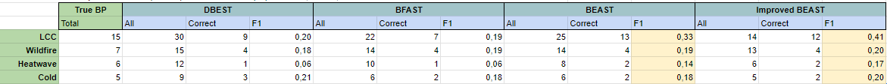

# 01 // summary : paper #1

Date de création: July 16, 2024 11:49 PM
Modifié: July 16, 2024 11:49 PM

# Introduction

<aside>
📌 Link to the paper : [https://www-sciencedirect-com.sid2nomade-1.grenet.fr/science/article/pii/S0034425722003285](https://www-sciencedirect-com.sid2nomade-1.grenet.fr/science/article/pii/S0034425722003285)

</aside>

## A dictionary of frequently used terms

- LST: land surface temperature. It is the main indicator/statistic in the paper. It is usually expressed as a function of time.
- LCC: land cover change. A change over the LC (Land Cover) statistic.
- Decomposition: expressing a statistic as a sum of three other statistics (trend, seasonality, and error). It looks like “$Y_t = T_t + S_t + e_t$”. Every term in the sum is called a “component”.
- Trend $(T_t)$: long-term gradual variation of a statistic. It usually takes the form of a piecewise linear function. When it comes to the LST, it responds to climate change, land management or land degradation.
- Seasonality $(S_t)$: periodic regular variations associated with the stages of a cycle. It takes the form of a piecewise harmonic function. When it comes to the LST, it is associated with the stages of a solar year.
- Remainder $(e_t)$ : difference of $Y_t$ with respect to $T_t+S_t$.
- Abrupt changes: variations of big magnitude with respect to the time it takes to present itself. They can present on the trend or the seasonality or both simultaneously. Usually, they are caused by natural or anthropogenic disturbances.

## Key points

- Previous efforts in LST time-series analysis have mainly employed interannual LST data to characterize trends and abrupt changes on an annual scale.
- Interannual time series ignores the intra-year variability of LST and cannot provide the specific timings of abrupt changes. Using intra-annual LST time series (e.g., 8-day, 16-day, and monthly data) **can simultaneously capture trend, seasonality, and abrupt change**. Intra-annuel time series are consequently preferred over interannual data.
- Methods with intra-annual time series can be roughly grouped into two categories: change detection with unknown component forms and change detection with known component forms.
    - Change detection with unknown component form: this type of method first iteratively estimates trend and seasonality, and then detects abrupt changes by segmenting them. Here, we are interested in DBEST.
    - Change detection with known component form: this type of method defines the trend using a piecewise linear model and approximates the seasonality using a harmonic model. Here, we are interested in BFAST and BEAST.

| Algorithm | Function | Advantages | Disadvantages | Applications |
| --- | --- | --- | --- | --- |
| DBEST
 
(unknown component form) | 1) Trend and seasonality decomposition
 
 
2) Abrupt changes detection in trend | Characterize both abrupt and non-abrupt changes in the trend component | 1) The accuracy will decrease in the presence of high-frequency variation
 
 
2) Many thresholds and parameters can lead to different performance
 
 
3) Cannot deal with missing data | Vegetation change detection based on VI time series |
| BFAST
 
 (known component form) | 1) Trend and seasonality decomposition
 
 
2) Abrupt changes detection in trend and seasonality | Distinguish trend abrupt change and seasonal abrupt change | 1) Sensitive to the specification of the parameters
 
 
2) Cannot deal with missing data
 
 
3) Computationally expensive | LCC, fire detection, or trend and seasonal decomposition using time series of VI, reflectance, and LST |
| BEAST
 
 (known component form) |  | 1) Distinguish trend abrupt change and seasonal abrupt change
 
 
2) Reduce the uncertainty of the single best model in traditional methods by combining many competing models
 
 
3) Able to deal with missing values
 
 
4) Offer a rich set of diagnostic statistics to assist interpretation | 1) Sensitive to the specification of parameters
 
 
2) Computationally expensive | LCC, ice storm, and fire detection based on VI time series;
Reconstruction of LST time series |

# Brief review of previous methods

## Tool needed: STL

- “Seasonal-Trend iterative decomposition procedure based on Locally weighted regression”.
- DBEST and BFAST deduce their seasonality using STL. They modify its trend output.
- http://www.nniiem.ru/file/news/2016/stl-statistical-model.pdf

## DBEST

- Obtains linear segments of the trend component via trend estimation and trend segmentation.
    - In trend estimation, major discontinuities of a time series are firstly identified by level-shift points. Then, STL decomposition is performed for each segment separated by the level-shift points to estimate the trend and seasonality.
    - In trend segmentation, the turning points (i.e., breakpoints) are first identified based on rank statistics and sorted according to the local change in the trend. Then, the breakpoints are specified by minimizing the Bayesian information criterion (BIC) for least-squares fitting. The number of output breakpoints is determined by the maximum number of breakpoints $m$ or the change-magnitude threshold $ε$.

### Trend estimation method

- It requires three parameters: $\theta_1$, $\theta_2$ and $D$.
    - $\theta_1$ wants to capture a big absolute difference of a data point $Y_t$ with respect to the next data point $Y_{t+1}$.
    - Once we locate a point $Y_t^*$ that presents a big difference with the next data point, $\theta_2$ wants to capture a big difference in the mean value of $Y$ before and after $t$. Particularly, the difference $\Delta \bar Y _{t,D}$ between…
        - The mean value of $Y$ on the interval $[t-D, t]$ noted $\bar Y_{[t-D, t]}$, and
        - The mean value of $Y$ on the interval $[t, t+D]$, noted $\bar Y_{[t, t+D]}$.
    - $D$ is then the size of the window over which we take two mean values of $Y$, before $t$ and after $t$.
- If $Y_t^*$ is noted a “candidate level-shift point” (or LSP) if it verifies:
    1. $\Delta Y_t > \theta_1$, and
    2. $\Delta \bar Y_{t,D} > \theta_2$ 
- The candidate LSP are sorted in descending order by the value of their $\Delta Y_t$, with the first candidate LSP being marked as the “most important LSP”. Then, for the second most important LSP onwards, from the earliest time-step $t$ to the latest (from left to right, basically), we check if the current candidate LSP has a distance in time of $D$ or greater to the previous detected candidate LSP.
- With the definitive list of LSP, we divide the intervals with the LSP as cutpoints to perform a STL for every segment. We obtain then our trend function and seasonality function.

### Segmentation method : turning points detection

Here, we focus on the obtained trend function.

- We classify all points in the time-series as a “peak”, a “valley” or neither. A peak at $t$ is a point where the function was increasing from t-1 and decreasing to t+1. It is analogically the same for a valley. These points are called “turning points” for reasons that will be clear later.
- We start a iterative loop involving another function : the turning point criterion function.
    - We create lines that connect every turning point to the next one. Between two turning points, and for every side of the line (over and under), we detect the point with the maximum perpendicular distance to the line. These will be called “turning point candidates”.
    - We pass every turning point candidate through a “turning point function” $g_{(i)}$. This function returns 1 if the point is a peak or valley, or if turning point candidate has a distance to the perpendicular line greater than the parameter $\varepsilon$ and 0 otherwise. For the non-candidates, it also returns 0.
    - Notice that, when the first iteration ends, this set that includes turning points is usually bigger that the set that only contained the peak/valleys. We *add* points.
    - We start again from 1) until we end an iteration with no new turning points. Normally, when we end the iteration, the level-shift points are almost always naturally included as turning points. If this is not the case, we manually add the level-shift points to the set of turning points.
    - Finally, the set of turning points contains : the starting point of the time series, all level-shift points, and all points for which the turning point criterion is fulfilled.

### Segmentation method : turning points validation

- “Valid turning points” are defined as turning points that significantly reduce the residual sum of squares of a least-square fit to the trend time series (explained in next paragraph) and do not result in overfitting.
- The number of valid turning points can be determined by minimizing an information criterion. The Bayesian Information Criterion (BIC) is a criterion for optimal model selection among a finite set of models. When computing the least-squares fit, adding more turning points reduces the residual sum of squares but also increases the number of model parameters, which may result in an over-fitting problem. BIC resolve this problem by introducing a penalty term for the number of parameters in the model. Given a finite set of estimated models, the preferred or optimal model is the one with the lowest BIC value.
- We pass all points through a “trend local change” function $h_{(i)}$. On a turning point on time $t$, this points computes the difference of $T_{t-1}-T_t$.  We then sort all turning points into descending order according to the magnitude of their trend local change (in absolute value).
    - Notice : for the last turning point from left to right, we compute its trend local change with respect to the last point in the time series.
    - There should be $u$ total turning points.
    - We index their trend local change with $j$ : $j=1$ is the turning point with the greatest trend local change, $j=2$ is the turning point wit the second greatest… until $j=N$.
- We start doing linear regression by picking a subset of size $s$ of the $u$ total turning points. We pick by prioritizing the turning points with the greatest trend local change. Once we find the subset of turning points such that its linear regression minimizes the BIC, those $s$ points are “valid turning points” or “breakpoints”.
- We run a special kind of linear regression on every interval which bounds are the breakpoints. The non-linear regression used is a [piecewise linear regression](https://online.stat.psu.edu/stat501/lesson/8/8.8). Note that the resulting regression does not necessarily pass through all breakpoints. We could also chose to make a piecewise linear regression only on $m$ breakpoints out of all the $s$ breakpoints.

## BFAST

BFAST outputs trend and seasonality, and the number, timing, and confidence interval of abrupt changes in the two components.

Before we start, we need to mention two mathematical tools used here :

- The Ordinary Least Squares (OLS) residuals-based MOving SUM (OLS-MOSUM) test and least squares are used to determine the number and position of the breakpoints.
- The component coefficients are estimated using a robust regression based on M-estimation.

We should know that given that the OLS-MOSUM test for examining breakpoints requires regularly spaced data, BFAST cannot handle equally spaced time series with missing values.

The algorithm is as follows :

1. First, we fix the parameters. **All parameters have a heavy impact on the final result**.
    - Maximum number of breakpoints in trend ($m$) and seasonality ($q$).
    **This is the most influential parameter**.
    - Minimum separation interval $\phi$ (between adjacent breakpoints).
    - Maximum number of iterations.
2. Gets seasonality from STL
3. Detection of trend breakpoints.
We use OLS-SUM here.
4. Estimation of trend coefficients : $\alpha_i, \beta_i$
We use a robust regression based on M-estimation.
Finally, we adjust the previous trend with the new coefficients.
5. Detection of season breakpoints.
We use OLS-SUM here.
6. Detection of seasonality coefficients : $\gamma_{j,h},\space \delta_{j,h}$
We use a robust regression based on M-estimation.
We adjust the previous seasonality with the new coefficients
7. We repeat 3. to 6.
The process ends when the number and position of breakpoints are unchanged.

## BEAST

BEAST infers the number and positions of the breakpoints, and the coefficients in trend and seasonality in one step. BEAST also adopts a piecewise linear model and a piecewise harmonic model to parameterize the trend and seasonality. However, BEAST does not require the specification of the harmonic order.

As a result, BEAST outputs trend and seasonality, the number, timing, occurrence probability, confidence interval of abrupt changes in the two components, and time-series seasonal
harmonic orders

BEAST takes the following inputs :

- Maximum number of breakpoints in trend ($m$) and seasonality ($q$).
Again, **this is the most influential parameter**.
- Minimum separation interval $\phi$ (between adjacent breakpoints).
- Maximum harmonic order ($H$) (optional).
- Sample number. This is specifically a parameter for the reversible-jump Markov Chain Monte Carlo sampling, or MCMC sampling.

BEAST uses a Bayesian model to find the optimal value and posterior probabilities of the following elements :

- Model structure parameters $M$: this includes the number (effective, not maximum) and timing of breakpoints in trend and seasonality. Also includes harmonic order.
    - For calculating the breakpoints, BEAST infers them using Bayesian Model Averaging (BMA).
- Segment-specific coefficient parameters $\varphi$: trend coefficients $\{\alpha_i, \beta_i\}$ and seasonality coefficients $\{\gamma_{j,h},\space \delta_{j,h}\}$.

## Summary table

| Algorithm | Mechanism | Input | Output |
| --- | --- | --- | --- |
| DBEST
 | $Y_t = T_t + S_t + e_t$

Decomposes $T_t$ and $S_t$
using separated STL.

Detects abrupt changes in $T_t$ based on trend segmentation | Level-shift-threshold
($θ_1$ and $θ_2$) and
duration threshold
($D$);

Maximum numbers
of breakpoints in
trend ($m$) or change-
magnitude threshold
($ε$) | $T_t$ and $S_t$;
Abrupt changes and their duration in $T_t$ |
| BFAST
 | $Y_t = T_t + S_t + e_t$

$T_t$: piecewise linear
model
$S_t$: piecewise harmonic
model (harmonic
order $= 3$)

Iteratively decomposes data into $T_t$ and $S_t$ and detects abrupt changes | Maximum numbers
of breakpoints in $T_t$ ($m$) and $S_t$ ($q$);

Minimum separation
interval ($ϕ$);

Number of iterations | $T_t$ and $S_t$;
Abrupt changes and
their confidence
intervals in $T_t$ and $S_t$ |
| BEAST | $Y_t = T_t + S_t + e_t$

$T_t$: piecewise linear
model
$S_t$: piecewise harmonic
model

Simultaneously infers abrupt changes and $T_t$ and $S_t$ based on BMA | Maximum numbers
of breakpoints in $T_t$
($m$) and $S_t$ ($q$);

Maximum harmonic
order ($H$);

Minimum separation
interval ($ϕ$);

Sample number | $T_t$ and $S_t$;
Abrupt changes,
their probabilities,
and confidence
intervals in $T_t$ and $S_t$ |

# Data description

## Simulated data

- A LST time series was simulated with $10$ years of length and a yearly period of $46$, which means $8$ days as temporal resolution.
- Trend, seasonality and remainder were all simulated. The LST time series is the sum of those three. This result is called in this section the “**basic time series**”, particularly because other datasets are created from this time series.
- The trend is a piecewise linear function that changes its slope (from $-0.14K$ to $0.14K$) for every decade. Its intercept (initial LST at $t=0$) was set to $288K$.
- The seasonality was simulated by a harmonic function. The harmonic order (i.e. the multiple of the “fundamental” frequency, the base frequency) was 1st or 2nd. The amplitudes changed from $20K$ to $40K$. The phases varied from $1/9$ period to $1/3$ period.
- The remainder is just random numbers from $-3K$ to $3K$ with a mean value of $0K$.
- The scenario where data is missing is also simulated. Specifically, random data points are removed with certain proportions $(0-40\%)$. These scenarios imitate data discontinuities caused by clouds, snow, or the LST retrieval algorithm.
- Six datasets were then simulated using the basic time series :
    - **Dataset 1**: only contains basic time series. They were directly employed to evaluate the performance of component decomposition.
    - **Dataset 2**: this dataset contains one abrupt change in the trend component of the basic time series. The abrupt change in different time series had different timing coordinates, different change magnitudes $(5–10 K)$, and different trend slopes after the abrupt change.
    - **Dataset 3**: same as dataset 2, but with two abrupt changes on the trend component instead of one.
    - **Dataset 4**: one seasonal abrupt change was simulated by changing the harmonic parameters (order, amplitude, and phase) after the abrupt change.
    - **Dataset 5**: same as dataset 4, but with two abrupt changes on the seasonality component instead of one.
    - **Dataset 6**: these dataset present one trend abrupt change and one seasonal abrupt change.

## Real data (MODIS)

Apart from simulated data, the three algorithms were test with real data from around the world, particularly data the presented significant disturbances. The statistic studied here was Land Cover (LC). Examples of the events that occurred in the places of interest were :

- Deforestation with LC changing from forest to savannas (SAV)
- Agricultural expansion with LC changing from barren (BAR) to cropland (CRO)
- Farmland abandonment with LC changing from CRO to SAV
- Urbanization with LC changing from grassland (GRA) to urban and built-up land (UBL)

# Design of the comparison and criteria

## Setting all the parameters

- For DBEST, the parameters were fixed following the recommendation of Jamali et al. (2015) : $\theta_1=0.1$, $\theta_2=0.2$ and $D=2$ years. Also, missing data was filled with interpolation.

Then, the common parameters for BFAST and BEAST are set. These are the maximum number of breakpoints for trend ($m$) and seasonality ($q$), and minimum separation interval ($\phi$). In the paper, $m=q=3$ and $\phi = 0.5$ years. Then, for specific parameters,

- For BFAST, the maximum number of iterations was set to $5$.
- For BEAST, the maximum seasonal harmonic order was set to $3$ and the sample number of MCMC simulation was $10.000$.

## Measuring performance

- We are interested in measuring two criteria: detection accuracy of abrupt changes, and component decomposition accuracy.
- These criteria are differently measured for the simulated data and the real data.

### Detection accuracy of abrupt changes

### Detection accuracy of abrupt changes (simulated data)

- If the simulated dataset did not contain abrupt changes, the commission error (calculated by dividing the number of false detections by the total number of datasets) was employed to compare the three methods.
- Otherwise, we use two performance indicators : the $F1$ score and the $MAE_{\partial t}$.
- For the three methods, a breakpoint detected within half a period of the actual breakpoint (i.e., the simulated breakpoint in the simulated data) was determined to be a correct detection; otherwise, it was defined as a false detection.
- $F1$ score, calculated based on the user's accuracy (UA) and producer's accuracy (PA).
    
    $$
    F1=2\times\frac{PA\times UA}{PA+UA},\hspace{6pt}PA=\frac{TD}{TN},\hspace{6pt}UA=\frac{TD}{DN}
    $$
    
    - $PA$ is the total correct breakpoints detected over the all the real breakpoints
    - $UA$ is the total correct breakpoints detected over all the detections.
    - The highest value of $F1$ is $1.0$ indicating perfect $PA$ and $UA$
    - The lowest value of $F1$ is $0.0$ indicating $PA=0$ or $UA=0$
- The second indicator is $MAE_{\partial t}$ which is just the average of the absolute distance in time of a detected breakpoint and a real breakpoint.
    
    $$
    MAE_{\partial t}=\frac{\sum_{i=1}^n\partial t_i}{n}, \partial t_c=|t_{ref}-\hat t|
    $$
    

### Detection accuracy of abrupt changes (real data)

For MODIS LST time series, owing to the small amount of data and the unknown underlying disturbances, the ability of the change detection method to detect disturbances was evaluated by comparing the number of correct detections.

Considering the complexity of disturbances that occur in reality, a breakpoint detected within one year of the actual LCC disturbance or within six months of an actual small disturbance is determined as a correct detection

### Component decomposition accuracy

### Component decomposition accuracy (simulated data)

- In the simulated dataset, the root mean square errors $(RMSE)$ values and correlation coefficient $(R)$ values between each predicted and simulated (i.e., actual) component (i.e., trend and seasonality) were employed to measure the decomposition accuracy of each component.
- The RMSE of the predicted trend component was denoted as $RMSE_{T_t}$, and the RMSE of the predicted seasonality was denoted as $RMSE_{S_t}$.

### Component decomposition accuracy (real data)

- The true trend and seasonality are not known in MODIS LST time series, so the RMSE between the sum of the predicted trend and seasonality and time-series observations $(RMSE_{T_t+S_t})$ was employed to measure the overall fitting accuracy of the $T_t + S_t$.

# Comparison with simulated data

## Results of detecting breakpoints

- This finding suggests that as the complexity of the data increases, BEAST and DBEST exhibited more stable $F1$ than BFAST, on the contrary, BFAST was ineffective for detecting trend abrupt changes when seasonal abrupt changes occur simultaneously.
- When there is no abrupt changes in the trend, BEAST performed equally good for both components. BFAST had a good estimation of the breaks on seasonality, but bad estimations of breaks on the trend, which suggests that BFAST has low robustness to data with high complexities. DBEST had bad result all round, specially detecting false breakpoints in every simulation data.
- With respect to the $MAE_{\partial t}$ indicator, BEAST performed the best in all cases. BFAST had result comparable to BEAST on datasets that didn’t present trend breakpoints, and worse but still acceptable results when the data did present trend breakpoints. DBEST had also the worst performance.

## Results of decomposition accuracy

- Here again, BEAST has the best performance with the lowest $RMSE$ ($0.28K$ and $0.27K$) and the best $R$ for both trend and seasonality, respectively: $0.90$ and $0.99$.
- DBEST had a better decomposition stage, with $RMSE$ of $0.64K$ and $1.37K$ and $R$ of $0.78$ and $0.98$ for trend and seasonality, respectively.
- BFAST had the worst all-around results, with RMSE of $1.34K$ and $1.46K$ and $R$ values of $0.69$ and $0.97$ respectively.
- For datasets 1, 2, and 3, BFAST showed better performance than DBEST
- For dataset 4, 5 and 6, BFAST exhibited larger RMSEs and smaller $R$ values than DBEST
- This reduction in accuracy suggests that BFAST is inefficient for data with high seasonal variation.
- Additionally, it is interesting to note that the $R$ values of the trend components were smaller than those of the seasonal components. This is mainly because the high seasonality of the LST produces a mirage correlation between the predicted and actual seasonal components

# Improvement of BEAST

## Problems with BEAST and modifications

- Although the accuracy of BEAST was significantly higher than that of the other change detection methods, this method exhibited non-negligible commission errors for trend breakpoint detection (mean value on simulated data: $18.6\%$).
- To accurately describe long-term variations in LST, **it is necessary to further eliminate false breakpoints** detected by BEAST.
- True abrupt changes are always accompanied by sudden increases or decreases in $T_t$ or significant changes in the slope of $T_t$. Meanwhile, BEAST outputs the occurrence probability of the breakpoint and remainder $(e_t)$. A high probability indicates a high likelihood of the breakpoint. The abnormal $e_t$ tends to occur when true abrupt change happens.
- Based on these facts, four features were first selected to describe the above characteristics, including
    - The change magnitude of trend abrupt changes $(\Delta\text{trend})$.
    - The changes in the slope of the trend before and after the abrupt change occurred. This one is measured by the angle between the two trends $(\text{angle})$.
    - The occurrence probability of the detected breakpoints $(\text{Prob})$
    - The proportion of abnormal remainders in the confidence interval of the abrupt change $(\text{Pp})$. An abnormal remainder will be detected if the remainder is larger than three times the $RMSE_{T_t+S_t}$.
- Then, four criteria are used to judge the false breakpoints: $Δ\text{trend} < T1,\text{ angle} < T2, \text{Prob}<T3$ and $\text{Pp}<T4$. The thresholds were defined empirically observing the data where false breakpoints where detected.
    - Most false breakpoints had $Δ\text{trend}<1 K$, $\text{angle}<0.3◦$, $\text{Prob}<0.5$, and $\text{Pp}\approx 0$.
    - Playing with the parameters revealed that a higher $F1$ may result in a smaller $TD$. The following final parameters were set as a compromise of balance between $F1$ and $TD$ and also to avoid excessively harsh threshold conditions : $Δ\text{trend}\le1 K$, $\text{angle}<1◦$, $\text{Prob}<0.5$, and $\text{Pp}\le 1\%$.
    - These modifications ended in a general improvement of $F1$ of $0.03$ and a reduction of the commission error of $13,23$ points of $\%$.

# Application of iBEAST

## iBEAST does actually correct BEAST

- The algorithms were applies to MODIS LST data with three different types of LCC, including deforestation, urbanization, and forest gain and loss.
- Again, BEAST outperformed both BFAST and DBEST. iBEAST did reduce very significantly the false positives from BEAST, but it also missed just two true breakpoints that the original BEAST detected. Still, iBEAST had better $F1$ than BEAST for every category.
    - BEAST had the best ratio of detected breakpoints over true disturbances. DBEST had actually a better ratio than BFAST.
    - All three methods exhibited poor detection efficiency for small disturbances (wildfires, heatwaves, cold, etc.)
    - When it comes to $RMSE_{T_t+S_t}$, DBEST had actually the lowest value than the other three methods by a small margin. This doesn’t mean that the components obtained by DBEST are accurate. This is just caused because the trend and seasonality decomposed by DBEST tend to contain many meaningless detailed fluctuations and turning points.

# Conclusion

## iBEAST rises above all

- **BEAST**. Exhibited the highest detection accuracy for abrupt changes in both trend $(F1 = 0.83)$ and seasonality $(F1 = 0.95)$, and can characterize the process of abrupt changes. In addition, it can accurately decompose time-series data into trend and seasonality, with mean RMSE values of $0.28 K$ and $0.27 K$, respectively.
    - However, **BEAST lacks sensitivity to subtle changes** with non-negligible omission errors in simulated data and with around $50\%$ precision of low-magnitude short-lived disturbances.
- **BFAST**. It demonstrated poorer performance than BEAST, with lower mean $F1$s of breakpoints ($0.56$ and $0.52$ in trend and seasonality, respectively) and higher $RMSE$s of components ($1.34 K$ and $1.46 K$ for the two components, respectively) in simulated data. **This method appeared to be more affected by data complexities**. Moreover, BFAST tends to detect incorrect trend dynamics when the time-series data have long-lasting missing.
- **DBEST**. Out of the three, DBEST had the poorest accuracy in simulated LST data: the mean $F1$ was $0.37$ and mean $RMSE$s of trend and seasonality were $0.64 K$ and $1.37 K$, respectively. Additionally, **the trend trajectory estimated by DBEST contains a quantity of non-essential change information**, and it cannot detect seasonal abrupt changes.
- **iBEAST**. Compared with BEAST, the user accuracy of the improved BEAST was significantly increased by $13.9\%$ in the simulated data, resulting in an $F1$ increase of $0.04$, and $15$ (from a total of $53$ detections) false breakpoints were eliminated in the MODIS LST time series.
    - The improved version of BEAST was the best of all the four detecting changes in LST time series. Moreover, the optimal seasonal harmonic order in the improved BEAST was determined.