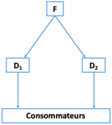

# 04 // relations verticales

[Partie 2_05_L3 MIASHS_Relations verticales_cours.pdf](ressources/04_relations_verticales_partie_2_05_l3_miashs_relations_verticales_cours.pdf)

[06_L3 MIASHS_Eco_cont_Intégration et restrictions verticales_moodle.pdf](ressources/04_relations_verticales_06_l3_miashs_eco_cont_integration_et_restrictions_verticales_moodle.pdf)

# Formes de relations verticales

## Premières définitions

Définition de “relations verticales”: les relations verticales désignent les interactions entre les entreprises opérant à différents niveaux d’une même chaîne de production ou de distribution. Par exemple, un fabricant et un fournisseur, ou un détaillant et un distributeur. Les relations verticales sont donc différentes des relations horizontales qui se produisent entre entreprises opérant au même niveau.

Définition de “filière/chaîne verticale/chaîne de valeur”: une filière ou chaîne verticale est l’ensemble des étapes successives qu’un produit ou service traverse depuis sa conception jusqu’à sa consommation finale. Chaque maillon de cette chaîne ajoute de la valeur au produit, d’où l’expression “chaîne de valeur”.

Définition d’intégration verticale : une entreprise est intégrée verticalement lorsqu’elle contrôle plusieurs ou toutes les étapes de production impliquées dans la création de son produit ou service.

Les relations verticales sont différentes des relations offre-demande. Beaucoup de firmes vendent à d’autres firmes, pas (uniquement) à des consommateurs finals qui vendent ensuite aux consommateurs finals (ou à d’autres firmes) :

- **Example #1** : un producteur de lait qui vend sa production à une entreprise de transformation laitière.
- **Example #2** : un fabricant d’électronique qui fournit des composants à une entreprise d’assemblage de smartphones.
- **Example #3** : une entreprise de textile qui fournit des tissus à une marque de vêtements.

On fait donc les distinctions suivantes :

- Les firmes en amont (upstream) : des fabricants de biens de
consommation, des producteurs de biens intermédiaires, ...
- Les firmes en aval (downstream) : des distributeurs, des détaillants, ...
- Le marché entre les firmes amont et les firmes aval : le marché
intermédiaire (ou marché de gros).
- Le marché entre les firmes aval et les consommateurs finals : le marché final (ou marché de détail).

Une relation verticale de production et de distribution.

Nous allons donc étudier successivement trois types de relations
verticales

1. Transaction par le marché (Spot Markets)
2. Intégration verticale
3. Entre ces deux extrêmes il existe les contrats (de long terme)

## Les transactions par le marché (spot markets)

- Les avantages liés aux transactions par les marchés viennent du fait qu’il n’y a pas de relation entre la firme et ses fournisseurs.
- La firme est indifférente entre les fournisseurs (le changement d’offreurs est sans coût).
- La firme peut même se substituer aux fournisseurs qui ont des coûts élevés ou qui ne sont pas disposés à ajuster les quantités pour maximiser les gains du commerce.

Pour que la firme soit incitée à sortir d’une simple relation de marché, il faut que des variables nouvelles l’amènent à lier un lien particulier avec un ou plusieurs fournisseurs. C’est ce que nous allons voir maintenant.

## Les transactions hors marché

Sortir du marché pour faire peut être souhaitable pour plusieurs raisons

- Le problème de mesure de l’effort,
- Les problèmes de coordination,
- L’existence de pouvoir de marché,
- La nécessité d’avoir des actifs spécifiques

Possibilité de ne pas pouvoir mesurer l’effort de vente des détaillants.

- Problème de passager clandestin (free rider). Pour éviter ce problème :
    - Intégration verticale
    - Contrats long terme... dont les termes incitent à accroître les ventes

Une des raisons pour préférer des transactions hors marché qu’une firme avec du pouvoir de marché peut utiliser l’intégration verticale pour accroître ses profits.

Certaines productions nécessitent des investissements spécifiques en
actifs.

Définition “actif spécifique” : un actif qui ne peut pas être redéployé sans perte de valeur à d’autres transactions.

1. Physique : équipements (machines) qui vont produire des inputs spécifiques à un groupe d’acheteurs en particulier
2. De site : seule utilisable par un petit nombre d’acheteurs : les pipelines en Alaska.
3. Actif humain : niveau de qualification et expertise et que on développe cet expertise particulièrement pour un partenaire.
4. Actif spécialisés : n’est pas spécifique à un partenaire, mais si ce dernier n’achète pas, l’offreur risque de retrouver un excédent de capacité. Exemple :

Dans le cas d’actifs spécifiques la firme peut choisir :

- Des contrats de long terme dont les termes indiquent le niveaux d’actifs spécifiques
- L’intégration verticale

### → Les contrats

A l’inverse des transactions par le marché, les contrats (long terme) permettent de construire une relation propice à des investissements
spécifiques. Cependant, ces investissements spécifiques peuvent alors générer des risques de hold-up pour les deux partenaires

Quasi-rente : montant que l’une des parties peut exiger de l’autre pendant la négociation sachant que la rupture de la négociation ne sera pas profitable à cette dernière.

…

### →→ L’exemple des franchises

Franchise : contrat par lequel une entreprise de franchiseurs accorde à une autre le franchiser en échange d’une compensation financière le droit d’exploiter une franchise dans le but de commercialiser le type de produit ou des services déterminés. 

- L’utilisation d’un nom et d’une enseigne commune et uniforme de locaux
- Le franchiseur doit communiquer un certain savoir faire au franchisé
- Le franchiseur doit apporté au franchisé une assistance commerciale ou technique pendant toute la durée de l’accord

Apres

- Franchise de distribution : vous vendez des produits selectionnés par les franchiseurs (55% des franchises en france). Ex. : tout ce qui est alimentation : mcdo, dominos… ; chaînes d’hôtel, cosmétiques (yves rocher), d’habillement…
- Franchise de services : vous vendez des services conçus par le franchiseurs (45% de franchises en france). Ex. hotellerie, coiffure,
- Franchise industrielle : vous produisez selon le savoir faire du franchiseur. Transfert de technolgie. Ex. Coca-cola, Comoposante financiere

### →→ Composante financière et contreparties

- Droit d’entrée :
    - Toute partie des investissement fait par le franchisseur (j’ai pas bien compris)
    - Grosso modo, le coût fixe
- Redevance d’enseigne (paiement annuel)
- Redevance de services : cout de services qui vous rend franchiseur
- Redevance publicitaire : cotisations pour participer aux campagnes publicitaires
- Marge sur les achats
- RFA et marges arrières

### → L’intégration verticale

La question principale devient “intégrer ou non une activité ?”, qui ressemble aussi à “faire ou faire-faire?”.

- Comparer le coût (dont coût d’opportunité)
    - D’une production en interne (intégration verticale)
    - Du recours à des firmes externes (”au marché”)

- Approches à la Coase (1937) et à la Williamson (1991) des “coûts de transactions” (coûts de transaction du recours au marché vs coûts d’organisation au sein de la firme)
    - Coûts de transaction : coût de recherche d’information, coût de
    recherche d’un nouveau partenaire, coûts de conclusion du
    contrat
- La notion d’actif spécifique va y jouer progressivement un rôle
central

### →→ Approche de Coase

Constat de départ de l’analyse : "Des îlots de pouvoir conscient dans un océan de coopération inconsciente"

Donc, pourquoi la firme existe-t-elle ? Réponse au coût de fonctionnement du système de prix (le marché).

Pourquoi l’économie n’est-elle pas constituée d’une seule et même firme ?  à cause des rendements décroissants de la fonction entrepreneuriale.

Le choix entre coordination par le marché et coordination dans la firme dépendra donc de la confrontation du coût d’une transaction supplémentaire par le marché et du coût d’organisation interne de la même transaction.

### →→ Approche de Williamson

- Hypothèses de comportement
    - Rationalité limitée : contrats incomplets
    - Opportunisme : problème du Hold-up
- Hypothèses relatives aux transactions
    - Incertitude
    - Fréquence
    - Spécificité des actifs

Typologie des relations verticales dans l’approche de Williamson (1985)

Expliquer l’intégration verticale, c’est expliquer pourquoi une coordination administrative peut être préférée à une coordination marchande. Williamson prend en considération coûts de transaction et coûts de production, il les compare selon le mode d’organisation choisi, marché ou hiérarchie.

…

Pour conclure, la différence totale entre coûts d’internalisation et coûts de recours au marché est une fonction décroissante de la spécificité des actifs. Passé un certain seuil, cette différence devient négative et l’intégration verticale devient la forme d’organisation qui minimise les coûts.

### →→ Intégration verticale et gains d’efficacité

Classiquement, le résultat de l’intégration verticale est d’augmenter le pouvoir de marché d’une firme. Mais si l’IV se traduit par des gains d’efficacité (économies d’échelle, de gamme) (compléter l’idée ici)... En effet, du fait de ces gains d’efficacité...(compléter l’idée ici)...

Du point de vue théorique, on doit distinguer entre deux d’économies sur les coûts réalisés grâce à une IV :

- Ceux qui affectent les coûts variables : …(compléter l’idée ici)...
- Ceux qui affectent les coûts fixes : …(compléter l’idée ici)...

Ceci dit, l’intégration verticale est une solution radicale. Beaucoup de bénéfices de l’intégration verticale peuvent être obtenus au travers d’arrangements contractuels entre clients et détaillants.

- Joint-ventures
- Sous-traitance
- Franchises
- Contrats d’exclusivité
- Prix de revente imposés ou conseillés...

On appelle de tels arrangements des restrictions verticales. Leur analyse est l’objet du chapitre suivant du cours.

# Intégration et restrictions verticales

## Premières définitions

La concurrence intermarques : C’est la concurrence entre les produits de marques différentes. Elle se manifeste lorsque les consommateurs choisissent entre des produits similaires offerts par des entreprises concurrentes.

La concurrence intramarques : Elle se réfère à la concurrence entre différents distributeurs ou revendeurs de la même marque. Par exemple, plusieurs magasins peuvent vendre le même produit d’une marque et se concurrencer sur le prix, le service, etc.

L’intensité de ces deux types de concurrence dans les filières dépend en grande partie des restrictions verticales.

On distingue deux catégories de restrictions verticales :

- Restrictions tarifaires : Ce sont des contrôles sur les prix et les conditions de vente des produits. Par exemple, un prix de revente imposé ou des rabais conditionnels.
- Restrictions non-tarifaires : Elles incluent des limitations qui ne concernent pas directement le prix, comme les quotas de vente, les exclusivités territoriales, ou les clauses de non-concurrence.

Pour l’économiste, les effets sur le bien-être des restrictions verticales sont ambigus...

- Des effets positifs
    - **Amélioration de l’efficacité** : Les restrictions verticales peuvent éliminer les inefficacités dues à la double marge et aligner les incitations entre les niveaux de production et de distribution.
    - **Stimulation de la concurrence** : En fixant des prix de revente ou des quotas, les fabricants peuvent encourager les distributeurs à se concentrer sur l’amélioration du service et de la qualité plutôt que sur la concurrence par les prix.
- Des effets négatifs
    - **Réduction de la concurrence** : Les restrictions tarifaires peuvent limiter la concurrence sur les prix entre les distributeurs, ce qui peut conduire à des prix plus élevés pour les consommateurs.
    - **Barrières à l’entrée** : Les restrictions non-tarifaires peuvent créer des barrières à l’entrée pour de nouveaux concurrents, réduisant ainsi la concurrence globale sur le marché.

De ce fait, l’analyse publique des restrictions verticales est compliquée par le fait que certaines clauses peuvent avoir à la fois des effets positifs et négatifs en termes d’efficacité. Il y a aussi une forte variation des politiques publiques dans le temps et entre les différentes juridictions.

## Cadre d’analyse : le modèle de double marge

… Plutôt de la math ici.

## Les restrictions verticales comme solution à la double marge

Le problème de la double marge plaide pour l’intégration verticale, mais l’intégration verticale est coûteuse.

- Coûts pour manager les employés du circuit de distribution
- Producteur et distributeur sur des marchés géographiques éloignés...

C’est pourquoi les firmes mettent en place des restrictions verticales qui permettent de restaurer de l’efficacité dans la filière.

- Solution #1 : tarification en partie double
    - Ce modèle de tarification combine un tarif fixe avec un tarif variable basé sur le volume des ventes ou l’utilisation. Le tarif fixe couvre les coûts fixes du fournisseur, tandis que le tarif variable permet de partager les bénéfices des ventes entre le producteur et le distributeur. Cela peut aider à aligner les incitations entre les deux parties et à réduire le problème de la double marge.
- Solution #2 : prix de revente imposé
    - Le fabricant fixe le prix de revente de ses produits par les distributeurs. Cela peut aider à maintenir des prix cohérents sur le marché et à éviter que les distributeurs ne fixent des prix trop élevés, ce qui pourrait réduire la demande globale.
- Solution #3 : quotas de vente
    - Le fabricant impose des quotas de vente aux distributeurs, limitant la quantité de produits qu’ils peuvent vendre. Cela peut empêcher la saturation du marché et maintenir des prix stables, tout en encourageant les distributeurs à se concentrer sur la qualité du service et la satisfaction client plutôt que sur la quantité vendue.

> [!note]
> La solution de Blockbuster :
>
> Distributeur de cassettes vidéos dans les états-unis, avant 98’, la pratique de blockbuster c’était de vendre cette cassettes vidéos aux magasins de location en vendant à un prix entre 65 et 70 dollar, en suite le magasin de location décide le prix de location.
>
> Cette cadre n’est pas si éloigné du modèle à double marge. après ‘98, blockbusters décide un nouveau type de contrat : ils propose un tarif fixe de chaque cassette vidéo de seulement 8 dollars et comme prix variable, c’est un partage de revenus entre lui et les magasin de locations entre 40% et 60%. donc, blockbuster passe d’une tarification linéaire à une tarification à prix double.
>
> Des estimations sur ce nouveau contrat, le prix de location moyen est passé de 4,6 à 4 ; puis une augmentation de quantité de location. Les profits augmentent. On a passé donc d’une situation de double marge à un monopole intégrer.

## Enjeux de concurrence intramarque et intermarques

### Concurrence intramarque

Exemple d’une concurrence intramarque

S’il y a plusieurs distributeurs, il peut exister des externalités horizontales entre ceux-ci, ce qui peut entraîner un problème de free-riding (passager clandestin)

Externalités sur la qualité et le niveau de service proposés par les
distributeurs :

- **Externalité de réseau** : Cela se produit lorsque la valeur d’un produit ou service pour un utilisateur augmente avec le nombre d’autres utilisateurs.
- **Externalité de connaissance** : C’est quand un distributeur développe une expertise ou une connaissance spécifique sur un produit qui bénéficie à d’autres distributeurs.
- **Externalité de réputation** : Elle se manifeste lorsque les actions d’un distributeur affectent la perception de la marque par les consommateurs, ce qui a un impact sur les autres distributeurs.

Sans intégration verticale, peut-on corriger une "externalité horizontale" entre les distributeurs (problème d’incitation à l’effort commercial) ? La firme amont (le fabricant) doit prendre des mesures pour réduire la concurrence en aval, comme les territoires exclusifs ou le prix de revente imposé.

### Concurrence intermarques

Exemple de concurrence intermarques

Parce qu’elles affectent les formes de la concurrence entre distributeurs d’une même marque, les contraintes verticales affectent indirectement la concurrence entre distributeurs de produits rivaux et, par suite, en amont la concurrence entre producteurs.

> [!note]
> Loi Galland : renforcer la transparence, interdire aux fabricants de discriminer par le prix aux distributeurs, un rabais fait à un distributeur devra se faire à tous le distributeur. Premier problème : si tous les distributeur vont recevoir le même rabais, pas besoin de concurrence intra-distributeur. Deuxième problème : les fabricants se sont dits qu’ils pouvaient augmenter le prix, même ensemble comme un monopole. Résultat : les prix des biens sont augmentés de 30%.
>
> En fait, le fait d’interdire la discrimination par le prix est aussi, de manière cachée, une manière d’interdire l’intégration verticale.