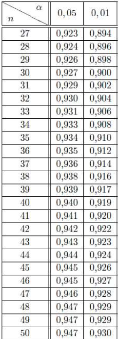

# 02 // tests de normalité

[slides normalite stat 3 annote 2.pdf](ressources/02_tests_de_normalite_slides_normalite_stat_3_annote_2.pdf)

# D’autres tests de normalité

## Points en commun

Tous les tests de normalité classiques testent l’hypothèse nulle $H_0 = \text{“la distribution est normale”}$.

Pour prendre une décision :

- Si la $p$−value est inférieure au un niveau $α$ choisi (en général $0.05$), alors on rejette l’hypothese nulle et il est improbable d’obtenir de telles donn´ees en supposant qu’elles soient normalement distribues.
- Si la $p$−value est supérieure au niveau $α$ choisi (en général $0.05$), alors on ne doit pas rejeter l’hypothèse nulle. Rien ne s’oppose au fait que la série soit normale (Pour autant, rien ne l’assure non plus ! D’où la nécessité de la puissance élevée pour le test).

## Le test du $\chi^2$ d’adéquation à une loi normale

Le reproche fait `a l’utilisation de ce test est la nécessité de regrouper les observations en classes. Ainsi, l’intervention de ce choix plus ou moins arbitraire lui fait perdre de la puissance.

## Tests de Lilliefors et d’Anderson-Darling

Ces test sont des mises en application dans le cadre normal du test de Komogorov–Smirnov qui, de manière générale s’intéresse a l’adéquation des fonctions de répartition de la loi statistique et de celle de la loi théorique d’intérêt. Ces tests ont donc pour statistique de test la distance verticale maximale entre les deux fonctions de répartition.

Le test de Lilliefors est l’application directe du test de Komogorov–Smirnov au cadre Gaussien. Ainsi, il capte peu les différences dans les queues, c’est-à-dire, l’occurrence d’événement rare.

Le test d’Anderson–Darling tente de capter ces ´événements rares en pénalisant la différence qu’ils engendrent sur les fonctions de répartition. Le problème est que les queues de distributions se ressemblent toujours. Or, la non normalité peut se traduire par des événements rares. Ce test semble assez puissant, néanmoins, il reste moins populaire que le test de Shapiro–Wilk. 

## Tests d’Agostino et de Jarque-Bera

Ces tests s’intéressent a l’aplatissement des queues (pas d'événements rares) et a la symétrie des distribution, les principaux attribus des lois normales. Leur statistiques de test pénalisent donc les écarts a l’aplatissement des queues, ainsi que les écarts a la symétrie des observations. 

Ces tests sont relativement puissants et, ce qui est notable, le restent pour des effectifs $n$ grands. On leur reprochera de ne pas exhiber le défaut de distribution amenant à la non normalité.

# Test de Shapiro-Wilk

## Le QQ-plot

> [!tip] 💡
>
> Idée : deux distributions sont égales si touts leurs quantiles sont égaux.
>
> Les quantiles observés $q_i$ sont à compares aux quantiles de la loi théorique $q^*_i$.

Soit $x₁, ..., xₙ$ une série statistique. On peut chercher à savoir si la distribution des données suit une loi gaussienne, de Poisson, etc. Notons $F₀$ la fonction de répartition de cette loi de probabilité d'intérêt.

Le QQ-plot est un outil graphique permettant de visualiser rapidement l'adéquation de la distribution d'une série numérique à une distribution de référence. Dans notre contexte, on considérera une loi normale dont les paramètres seront estimés sur la série statistique observée. 

Dans ce graphe, on reporte sur l'axe des ordonnées les fractiles $qᵢ$ correspondant à la distribution observée et sur l'axe des abscisses ceux correspondant à la distribution théorique $qᵢ$*. On reporte dans un graphique le nuage de points $(qᵢ ; qᵢ)ᵢ$*.

### Données brutes

Il est primordial de classer dans l'ordre croissant les observations statistiques :
$x₍₁₎ ≤ x₍₂₎ ≤ ... ≤ x₍ₙ₎,$. L'observation $x₍ᵢ₎$ est le $i$-ème quantile d'ordre $1/n$, plus précisément, $qᵢ = x₍ᵢ₎$ est le quantile d'ordre $i/n$. Il reste alors à calculer la série de quantiles théoriques $qᵢ = F₀⁻¹(i/n)$*.*

Note. Il se peut que la statistique d'ordre $x₍ᵢ₎$ soit considérée comme le quantile d'ordre corrigé :

- $i/(n + 1)$ si la population est divisée en $n + 1$ tranches,
- $(2i − 1)/(2n)$ si on souhaite prendre le milieu de la tranche,
- $(i − 0.375)/(n + 0.25)$ selon certains auteurs (Saporta, 2006, p. 361).

Cela ne devrait pas changer fondamentalement les résultats.

### Données discrètes ordonnées

Dans le cas d'une variable quantitative dont les valeurs sont regroupées par modalités. Soient $m₁, ..., mⱼ$ les modalités de la série $x₁, ..., xₙ$ que l'on appellera quantiles observés $(qᵢ = mᵢ)$. On a alors

### Données continues regroupées par classes

Dans le cas d'une variable quantitative dont les valeurs sont regroupées en classes de modalité :

### Interprétation

- Si les points sont alignés sur la diagonale du carré de côté 1 (première bissectrice), alors la loi théorique proposée (de fonction de répartition $F₀$) est adaptée aux observations.
- Si les points sont alignés sur une droite parallèle à la diagonale du carré de côté 1, on soupçonnera une erreur sur les paramètres de position ($\mu$) de la loi théorique.
- Si les points sont alignés sur une droite passant par l'origine mais inclinée par rapport à la diagonale du carré de côté 1, on soupçonnera une erreur sur les paramètres de dispersion ($\sigma$) de la loi théorique.
- Si les points sont alignés sur une droite ne passant pas par l'origine et inclinée par rapport à la diagonale du carré de côté 1, on soupçonnera une erreur sur les paramètres de dispersion et de position de la loi théorique.
- Si les points ne sont pas alignés sur une droite, la loi théorique n'est pas adaptée aux observations.

## Le test en soi

Le test de Shapiro–Wilk reste le plus populaire des tests de normalité, par sa puissance, mais peut-être pour le fait qu’il s’appuie sur un outil graphique de normalité qui va nous permettre de comprendre ce qui rend notre variable non normale. Concrètement, Le test de Shapiro-Wilk teste l'alignement des points du QQ-plot par rapport à une loi normale.

Sous l'hypothèse nulle $H₀ = \text{"la série statistique est normalement distribuée"}$, la statistique du test $W$ est un coefficient de détermination corrigé du QQ-plot. Ainsi, $0 ≤ W ≤ 1$ et plus $W$ est élevé, plus la compatibilité avec la loi normale est crédible. La région critique, correspondant au rejet de la normalité, s'écrit : $W < W_{crit}$.

## Exemple

On observe la richesse des régions françaises en 2019.

On souhaite observer l'ajustement à une loi normale. On trie les données dans l'ordre croissant et on donne les fréquences cumulées :

On calcule les quantiles théoriques d'après une loi normale $\mathcal N(30114; 7726)$.

Voyons le nuage de points et le résultat sur R :

Nuage non rectiligne dans QQ-plot. On pense que ce n’est pas une loi normale.

À $p < 5\%$, on rejette $H_0$, c'est-à-dire que la variable n'est pas normale (de façon significative).