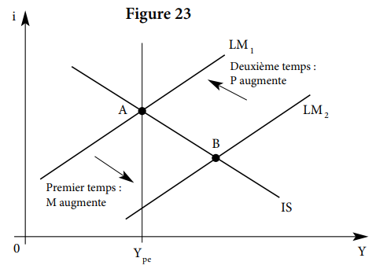

# 01 // le modèle is-lm en économie fermée

# L’histoire du modèle

## Interaction des secteurs réel et monétaire

Le modèle IS-LM a été proposé par John Hicks en 1937, comme une interprétation de la théorie générale de Keynes du 1936. Il se présente sous la forme d’un plan avec $Y$ (le niveau de production) en abscises et $i$ (le taux d’intérêt) en ordonnée, et contenant deux courbes : la courbe IS et la courbe LM.

Son intérêt est de montrer l’interaction entre le secteur réel et le secteur monétaire/réel. Donc, **il assume une interdépendance entre les deux sphères**. Il sert comme outil d’analyse des effets des politiques conjoncturelles : les politiques budgétaires déplacent la courbe IS et les politiques monétaires déplacent la courbe LM.

C’est une **synthèse** des théories classiques et keynésiennes.
On ajoute quelques suppositions :

1. Les politiques conjoncturelles ici sont vraiment simplifiées.
2. Le seul objectif des pouvoirs publics est d’atteindre le plein-emploi.
3. Il n’y a aucune interaction avec l’extérieur. On est dans une économie *fermée*. 

# La construction du modèle

> [!note]
> L’un des points les plus importants de ce modèle est interdépendance réel-monétaire.
> Dans les diagrammes de flux en bas, je ne représente pas la variation sur la demande de monnaie $D_M$, mais je passe du change de $Y$ à $i$ directement.
>
> $$
> \Delta i
> \rightarrow
> \Delta I
> \rightarrow
> \Delta Y
> \space\space\space\space
> \text{ et }
> \space\space\space\space
> \Delta Y
> \rightarrow {^*\Delta} {L_1} \rightarrow\Delta i
>
> $$

## La courbe IS (Investment-Savings)

### Construction logique de la courbe

La courbe IS, qui représente l’ensemble de points d’équilibre $I = S$, où l’investissement $I$ est égal a l’épargne $S$, pour tout niveau de production $Y$ à taux d’intérêt $i$.

Cette courbe représente l’équilibre du marché de biens et services, $Y = C + I$, et tel équilibre suppose l’équilibre de l’épargne et investissement, $I(i) = S(Y)$. L’investissement dépend du taux d’intérêt et la production determine l’épargne.

Rappelons qu’en économie, on écrit la variable indépendante ou explicative en ordonnée, donc c’est $i$. Si $i$ augmente, donc l’ínvestissement $I$ diminue et finalement la production $Y$ diminue. Le contraire de chaque étape de cette séquence est vrai aussi. Donc il existe une relation inverse dans la courbe IS, et donc elle est décroissante.

### Démonstration mathématique de la relation décroissante

Avant de commencer, il faut dire que il est déjà suffisant le raisonnement économique presenté. La présentation mathématique ne sert que comme *vérification* du raisonnement, elle n’est pas une *explication*.

Reprenons la formulation linéaire des fonctions d’investissement et de consommation et on ajoute, en plus, les dépenses publiques nettes ou balance publique $G$:

$$
Y = C_0 + cY + bi + G;\text{ avec } -1 \le b <0<  c\le 1.
$$

On peut exprimer $i$ en fonction de $Y$ comme suit. $DA$ est la “demande autonome”, qui la somme de la consommation incompressible et les dépenses publiques nettes.

$$
i = \frac{s}{b}Y - \frac{DA}{b} \text{, où } DA=C_0 + G.
$$

Finalement, notons que $i$ est une fonction linéaire en $Y$. La dérivée (où la pente dans ce cas) est $\frac{s}{b}$. $s$, la proportion marginale à épargner, est toujours positive. $b$, la sensibilité ou élasticité de l’investissement par rapport à $i$, est toujours négative. Donc la dérivée $\frac{s}{b}$ est toujours négative, et donc la droite IS est décroissante.

### Interprétation de la pente et de la position de IS

La pente ici garde la même interprétation d’élasticité de la droite. Pour une pente $\frac{s}{b}$ *très* négative (ou *très* grande en valeur absolue), la production est peu sensible au changement du taux d’intérêt. Mathématiquement, cela se produit car $s$ est très élevée ou $b$ est très petit. C’est le contraire si la pente est très faible, normalement entre $0$ et $1$.

La position de la droite dépend du coefficient libre $\frac{DA}{b}$. Donc, une augmentation des dépenses publiques, une diminution des impôts où une augmentation des exportations déplacent la courbe vers la droite. Des variations en sens inverse de ces différentes variables déplacent la courbe $IS$ vers la gauche. Mathématiquement, la variation en $Y$ est proportionnel en $k$ de la variation de $DA$.

$$
Y_2 - Y_1 = \Delta Y = k_Y\Delta DA\text{, où } k_Y\text{ constante.}
$$

## La courbe LM (Liquidity-Money)

### Construction logique de la courbe

La courbe LM, qui représente l’ensemble de points d’équilibre $L = O_M$, où la demande de monnaie ou *liquidité* $L$ est égale à l’offre de monnaie ou masse monétaire $M$ ou plutôt $O_M$, pour tout niveau de production $Y$ à taux d’intéret $i$.

L’équilibre monétaire est décrit par la relation $\frac{O_M}{P} = L_1(Y)+L_2(i)$, où $P$ est le niveaux général de prix, $\frac{O_M}{P}$ est l’offre réelle de monnaie, $L_1$ est la demande de monnaie pour les transaction et investissement, tant que $L_2$ est pour l’encaissement ou thésaurisation. Dans cette courbe, $Y$ est déterminé par l’équilibre entre l’offre et la demande de biens et services, tandis que $i$ est déterminé sur le maché monétaire. Donc, $i$ est la variable expliquée (endogène) et $Y$ est la variable explicative (exogène).

Si le “revenu national” ou la production national de biens et services s’élève et ce nouveau produits attirent l’attention des consommateurs, ils vont demander plus de moyens de transaction, et avec une même masse monétaire $O_M$, cela provoque une hausse du taux d’intérêt $i$. Donc leur relation est croissante.

### Démonstration mathématique de la relation croissante

On a déjà dit que $LM$ est croissante. Cela dit, $L_1$ est invariable. C’est-à-dire, si $\frac{M}{P}$ augmente, c’est uniquement car $L_2$ augmente, et ce dernier augmente si $i$ diminue.

Voyons les équations. Supposons que $L_1$ et $L_2$ sont deux fonctions linéaires de $Y$ et $i$, respectivement. $g$ serait l’élasticité-revenu de la demande de monnaie, et $h$ l’élasticité de la demande de monnaie par rapport à l’intérêt. Alors :

$$
\frac{O_M}{P} = L_1(Y) + L_2(i) = gY + hi.
$$

Isolant $i$, on obtient une fonction encore linéaire de $i$ en $Y$ :

$$
i = \frac{O_M/P}{h} - \frac{g}{h}Y
$$

Notons que la dérivé de $i$ par rapport à $Y$ serait $-\frac{g}{h}$. $g$ est forcément positif, tant que $h$ est forcément négative. Donc $-\frac{g}{h}$ est positif, est donc la pente de la fonction de $i$ en $Y$ est croissante.

### Interprétation de la pente et de la position de LM

La pente et la position de la droite LM gardent encore la même interprétation, respectivement. Mettant un point sur la pente $-\frac{g}{h}$ de la courbe, elle est plus raide quand $g$ est grand en valeur absolu et quand $h$ est petit en valeur absolue. De même pour l’interprétation inverse.

Cela dit, il existe un important débat à explorer pour cette courbe, particulièrement l’elasticité-intérêt de la demande de monnaie. Ici, il est important de rappeler que la demande de monnaie pour transactions $L_1$ est prioritaire à la demande pour thésauriser $L_2$. Tout à la longueur de la courbe, on peut constater trois niveaux : 

1. La phase “trappe à liquidité” : augmenter les biens et services disponibles $Y$ n’entraîne pas une hausse du taux d’intérêt $i$. Le marché considère que la masse monétaire existante $O_M$ est pratiquement suffisante pour couvrir les transactions qui entraîneront les nouveaux produits, et donc elle dépend plutôt de l’activité $Y$ et pas du taux $i$. On peut le voir aussi comme s’il y avait aussi peu de masse monétaire que ce n’est pas la peine de la thésauriser (doute : et ce n’est pas la peine non plus de l’investir ? juste de faire des transaction avec ?).  
2. La phase normale : il faudrait augmenter le taux d’intérêt $i$ pour diminuer les encaisses spéculatives $L_2$ et finalement faire augmenté l’activité $Y$. Notons qu’ici il existe effectivement des encaisse spéculatives, ce qui n’est le cas ni dans la trappe de liquidité (car la masse monétaire est très juste aux besoins de transactions) ni dans la phase classique qui suit.
3. La phase classique : **cette phase n’était pas expliqué par la prof ! Donc ça ne semble pas important**. En tout cas, les encaisses $L_2$ deviennent nulles, donc augmenter le taux $i$ à n'importe quel niveau n'entraîne pas un dégagement des encaisses, et donc il n'y a pas un effet sur la production $Y$. 

## L’équilibre global en économie fermée

La courbe IS décrit donc comment évolue le revenu sur le marché des biens et services quand le taux d’intérêt varie, càd. production en fonction du taux $Y(i)$; et la courbe LM décrit comment évolue le taux d’intérêt sur le marché monétaire quand le revenu varie, càd. taux en fonction de production $i(Y)$.

L’équilibre sur chaque marché dépend de l’équilibre sur l’autre marché. Il n’existe qu’une combinaison de $i$ et de $Y$ qui assure l’équilibre simultané des deux marchés : elle correspond à l’intersection de IS et LM.

# Les politiques conjoncturelles

> [!note]
> Pour toutes les politiques, on assume que l’objectif de l’état est de atteindre le plein emploi, donc faire augmenter $Y$.

## La politique budgétaire

### Les effets de la politique budgétaire

Le budget de l’état est ses dépenses, càd. $G$. La courbe qui prend $G$ comme paramètre est la courbe IS. Augmenter $G$ serait aussi augmenter $DA$, la demande autonome, et donc augmenter le coefficient libre de la droite, ce qui la déplace vers la droite et fait augmenter aussi le taux $i$. Inversement si on réduit $G$.

Un point important d’augmenter la dépense publique serait qu’on freine l’investissement privé (on réduit $I$) avec la hausse du taux $i$.

Sur la figure ci-dessous, on augmenterait davantage la production $Y$ si le taux $i$ restait constante. Or, une plus grande production met pression à la hausse sur le taux $i$, et donc la production n’augmente pas autant comme en $Y_3$, mais jusqu’à $Y_2$.

### Les conditions d’efficacité de la politique budgétaire

$$
\Delta^+ G \rightarrow
\overbrace{
\Delta^+ Y
}^\text{effet direct}
\rightarrow \space \space \space \overbrace{
\Delta^+ L_1 \rightarrow 
\Delta^+ i \rightarrow
\Delta^- I
}^\text{effet indirect} 
\rightarrow \space
\Delta^- Y\%
$$

On catégorise l’effet sur $Y$ de “direct” ou fort car une action sur $G$ est une action sur la courbe IS, càd. que le contexte est sur le marché de biens et services, dont $Y$. Par contre, les effets sur le reste des variables est “indirect” ou faible car elles font partie du marché de la monnaie et pas de celui des biens et services.

Cette solution est efficace pour atteindre le plein emploi **si le marché est suffisamment réactif et vite (pour que l’offre de produits réagisse à la demande)** pour augmenter $Y$. L’inconvenant est que la pénalisation en investissement peut faire rétrécir un peu la production $Y$. Ce recoulement dépend de la sensibilité de l’investissement $I$ par rapport au taux d’interet $i$. 

Il faut aussi des capacités de production inutilisées et une offre de biens et services élastique à court terme. Sinon, l’effet multiplicateur s’exerce sur les prix et non sur la production.

Les conditions d’efficacité sont les mêmes, que la politique soit expansionniste ou restrictive.

## La politique monétaire

### Les effets de la politique monétaire

Une politique monétaire expansionniste, càd. une augmentation de l’offre de monnaie ou masse monétaire $O_M$, déplace la courbe LM vers la droite.  C’est le cas car, sur le marché de la monnaie, une augmentation de $O_M$ provoque une baisse de $i$ avec le reste constant, ce qui incentive l’investissement privé $I$ et finalement augmentant la production $Y$. C’est l’inverse pour une politique monétaire contractionniste.

### Les conditions d’efficacité de la politique monétaire

$$
\Delta^+ O_M \space \rightarrow
\overbrace{
\Delta^- i
}^\text{effet direct}
\rightarrow\space\space\space
\overbrace{
\Delta^+ I \rightarrow
\Delta^+ Y}^\text{effet indirect}
$$

Il faut en effet une baisse maximale des taux d’intérêt qui stimule au mieux l’investissement pour que celui-ci ait à son tour l’impact maximum sur la production.

Cette politique est avantageuse car il n’y aurait pas de dette sur l’état, donc pas d’intérêt à payer. L’inconvenant c’est que l’effet sur la cible (investissement) est un effet indirect, et donc un effet incertain. 

Des capacités de production inutilisées et une offre de biens et services élastique à court terme. Sinon, l’effet multiplicateur s’exerce sur les prix et non sur la production.

## Interprétation keynésienne et néoclassique

### La logique keynésienne

Dans la logique keynésienne, les politiques conjoncturelles sont justifiées parce
que l’on ne peut pas compter sur les mécanismes de marché pour conduire spontanément l’économie vers le plein-emploi.

La situation keynésienne ordinaire est donc une position telle que le point $A$ sur la figure suivante : le revenu d’équilibre spontané de l’économie est $Y^*$, qui est inférieur au revenu $Y_{pe}$ qui assure le plein-emploi. On peut atteindre le plein-emploi déplaçant la courbe IS, la courbe LM ou les deux simultanément.

### Policy mix : la combinaison des politiques économiques

$$
\overbrace{\space
\Delta^+ G \space\space \rightarrow
\underbrace{ \space
\Delta^+ Y
\space}_\text{effet direct}
\rightarrow \space\space\space \underbrace{\space
\Delta^+ L_1
\rightarrow 
\Delta^+ i
\space}_\text{effet indirect}
\space}^\text{Politique budgétaire},

\\
\text{}
\\

\text{puis } 

\overbrace{ \space
\Delta^+O_M
\rightarrow
\underbrace{
\Delta^- i
\space }_\text{effet direct}
\rightarrow \underbrace{
\Delta^+ I \rightarrow
\Delta^+ Y \space}_\text{effet indirect}}^\text{Politique monétaire}
$$

On applique en premier le politique budgétaire et, jusqu’au moment que le taux $i$ commence à monter, on applique une politique monétaire pour neutraliser cette montée. On dit que la politique monétaire est “accommodante”.

Tous les mouvements décrits ci-dessus se font sans variation du niveau général des prix. Rappelons en effet que dans l’approche keynésienne, les prix sont fixés à court terme et que ce sont les quantités qui s’ajustent.

Si c’est possible, cette alternative est préférable sur chacune par elle même. L’inconvenant c’est que il n’est pas toujours possible, dépendant des facteurs plutôt politiques et légaux. En Europe, la Banque Centre Europeéne ne travaille pas avec les différents budgets des états membres. Ce n’est pas le cas pour la FED aux États-Unis, par exemple.

### Une interprétation néoclassique de la politique monétaire

Dans la logique néoclassique, le modèle IS-LM n’a guère d’utilité. En effet, si la flexibilité des prix suffit à garantir l’équilibre général, **le point d’équilibre spontané du modèle IS-LM correspond à l’équilibre de plein-emploi**, et aucun mouvement de IS ou de LM n’est souhaitable.

Si on essaie d’augmenter la masse $O_M$, la production ne pourra plus augmenter, donc ce sont les prix $P$ qui augmentent, et on revient de nouveau au lieu de départ.

### Une interprétation néoclassique de la politique budgétaire

Comme la politique monétaire, la politique budgétaire est finalement impuissante à modifier $Y$. En revanche, on ne revient pas au lieu de départ, mais on peut changer le taux d’intérêt $i$. 

On augmente la demande de produits au moment d’augmenter $G$. Cette hausse de demande, par contre, ne peut pas entraîner une augmentation de la quantité de produits offerts, donc on augmente plutôt le niveau de prix $P$, et on finit en $C$, avec un taux $i$ plus haut.

### L’effet d’éviction financière

Dans le dernier exemple, au moment que l’état augmente ses dépenses $G$ et donc le demande de produits, il va recevoir des produits qui pourraient aller plutôt aux consommateurs individuels $C$ si l’état n’avais jamais augmenté sa consommation $G$. Ceci s’appele l’effet d’éviction financière. La production $Y$ reste la même, mais une plus grande partie qu’avant correspondra à l’état.