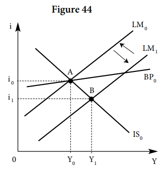
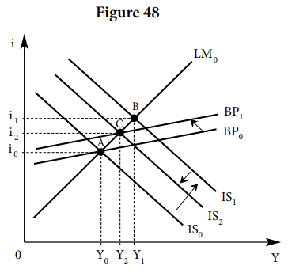
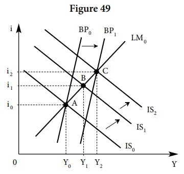

# 03 // politiques conjoncturelles en économie ouverte

# Les politiques avec une mobilité parfaite des capitaux

## Qu’est-ce que la mobilité parfaite

La mobilité parfaite des capitaux implique que l’élasticité $k$ tend ver l’infini. Économiquement, ils vont réagir immédiatement vers le taux d’intérêt le plus attractif.

> [!note]
> La politique monétaire n’est pas efficace avec un régime de change fixes et efficace en change flexible (grâce à la parité monétaire), peu importe la mobilité de capitaux.
>
> Pour la politique budgétaire, c’est qui est plutôt important c’est le degré de mobilité des capitaux.

**Note pratique**. $G = \text{Dépenses publiques} - \text{Recette fiscale}$. Donc si $G$ positif, il y a déficit.

Pour les diagrammes de flux, il faut distinguer entre mouvement d’une courbe et mouvement d’un point d’équilibre (coupure entre 2 courbes).

## Régime de changes fixes

Si le taux de change est fixé par la banque centrale, tout déficit de BP se compense avec une vente de monnaie étrangères contre la monnaie national, et analogiquement pour tout excédent de BP.

### La politique monétaire

On part de $A$. Supposons que le gouvernement veut augmenter la production à $Y_1$, il le fait avec une politique monétaire expansionniste, on arrive à la courbe $LM_1$. Sur le marché intérieur, cette hausse de masse monétaire diminue le taux d’intérêt jusqu’à $i_1$. L’investissement $I$ augmentera suite à la baisse du taux d’intérêt et éventuellement la production $Y$. On arrive a $Y_1$.

Cette chute de $i$, par contre cause des sorties de capitaux immédiatement et un déficit de la balance de paiements BP, ce qui causerait une appréciation (négative pour nous) du taux de change $e_r$. Encore plus, l’augmentation de revenu $Y$ fait augmenter les importations, donc le déficit de BP devient encore plus important.

Cela dit, puisqu’on est sur un régime fixe, la banque centrale intervient pour maintenir la parité. Elle vend des devises internationaux contre la monnaie nationale por réduire la masse monétaire, ce qui réduit finalement la production jusqu’à qu’on arrive à la production original $Y_0$.

$$
\Delta^+ O_M
\rightarrow
\Delta^- i
\rightarrow
\left.
\begin{cases}
\overbrace{
\Delta^- BCA}^\text{effet direct}
\newline \\
\underbrace{
\Delta^+ I \rightarrow \Delta^+ Y \rightarrow m_2\Delta^+ M \rightarrow \Delta^- BTC}_\text{effet indirect}
\end{cases}
\right\}

\newline
\space
\newline

\rightarrow
\Delta^{--}BP
\rightarrow
\Delta^+e.
\text{ Intervention BC : } \Delta^-O_M \rightarrow \dots \rightarrow \Delta^- Y

\newline
\space
\newline

\implies \text{On revient au même équilibre : }(Y_0,i_0).
$$

La politique monétaire est impuissante à augmenter durablement le revenu d’équilibre. On constate la même impuissance dans le sens de la restriction : toute restriction du crédit intérieur élève le taux d’intérêt national et attire des capitaux étrangers tant que l’offre de monnaie et le taux d’intérêt ne sont pas revenus à leur niveau initial.

### La politique budgétaire : éviction internationale

En revanche, en régime de changes fixes, la politique budgétaire paraît plus efficace. On part de $A$, les prochaine actions sont en premier sur la courbe IS. Une augmentation des dépense publiques nettes $G$ entraîne une augmentation de la production $Y$. Cette augmentation de revenu augmentara le taux de intérêt plus fortement que les importations, donc on aura un excédent BP et finalement on deviendra plus compétitifs grâce à l’augmentation du taux de change $e_r$. On arrive à $B$.

Cela dit, c’est la responsabilité de la banque centrale de maintenir la parité de monnaie. Donc, il devra augmenter l’offre de monnaie $O_M$, ce qui réduit le taux de change réel $e_r$ et déplace la courbe LM vers la droite. On arrive à $C$ et on garde une production $Y$ plus grande que l’originale.

Si bien dans la première politique, la BC était forcée à défaire ses propres actions, ici la BC “aide” au gouvernement à garder l’équilibre. C’est finalement le fait de la responsabilité de la BC de maintenir la parité monétaire (**et pas sur le gouv**.) que cette politique est efficace.

$$
\Delta^+G \rightarrow \overbrace{\Delta^+Y}^\text{effet direct} \rightarrow \left.
\begin{cases}
\overbrace{\Delta^+i}^\text{effet indirect} \rightarrow \Delta^+BCA
\\
\\
\underbrace{(m_2\Delta^+M \rightarrow \Delta^-BTC)}_\text{faible effet}
\end{cases} \right\} 
\newline
\space
\newline
\rightarrow\Delta^+BP \rightarrow \Delta^-e. \text{ Intervention BC : } \Delta^+ O_M \rightarrow \Delta^+ e
\newline
\space
\newline
\implies \text{Nouveau équilibre : }(Y_2, i_0)
$$

**Note #1 :** on suppose que $\Delta^+BCA$ est plus important que $\Delta^-BTC$. Donc $m_2$, la sensibilité ou élasticité des importations $M$ par rapport au revenu $Y$ est relativement faible, particulièrement $m_2 < 1$. De même, pour que l’augmentation de masse monétaire $O_M$ marche, $e_r(x_1-m_1) < 0$, donc $x_1 < m_1$, càd. l’économie a plus de propension à **nettement importer** par rapport au taux de change $e_r$.

**Note #2** : si bien je marque que l’intervention de la BC est d’augmenter $O_M$, en réalité ce qu’elle fait ce d’acheter la monnaie internationale contre la devise nationale, donc elle laisse le niveau absolu de $O_M$ circulant absolu et elle “retire” la monnaie internationale. En ***quantités relatives***, cela crée le même effet sur l’offre nationale $O_M$.

Notons que cette politique, lors du passage de $B$ à $C$, cause l’éviction de l’investissement intérieur du reste du monde en faveur de celui extérieur nationale, càd., on réduit l’investissement du reste du monde sur leur pays pour attirer leur capitaux vers notre pays grâce au taux d’intérêt plus attractif. La mobilité des capitaux, en régime de changes fixes, rompt l’indépendance macroéconomique des nations.

La politique monétaire discrétionnaire est inopérante dans la recherche de l’équilibre interne. Il convient donc d’utiliser la politique budgétaire pour la recherche du plein-emploi. Par ailleurs, pour assurer l’équilibre de la balance des paiements, il suffit d’une politique monétaire neutre qui ne contrarie pas les variations de la masse monétaire induite par les entrées ou les sorties de capitaux.

## Régime de changes flexibles

### La politique monétaire

Même début que la situation avec change fixe : On part de $A$. Supposons que le gouvernement veut augmenter la production à $Y_1$, il le fait avec une politique monétaire expansionniste, on arrive à la courbe $LM_1$. Sur le marché intérieur, cette hausse de masse monétaire diminue le taux d’intérêt jusqu’à $i_1$. L’investissement $I$ augmentera suite à la baisse du taux d’intérêt et éventuellement la production $Y$. On arrive a $Y_1$ et donc à $B$, le déséquilibre de BP.

Cette chute de $i$, par contre cause des sorties de capitaux immédiatement et un déficit de la balance de paiements BP, ce qui causerait une appréciation (négative pour nous) du taux de change $e_r$. Encore plus, l’augmentation de revenu $Y$ fait augmenter les importations, donc le déficit de BP devient encore plus important.

C’est ici où la situation diffère. On laisse augmenter le taux de change ou compétitivité $e_r$, ce qui fait augmenter nos exportations $X$, et finalement augmenter notre production $Y$, ce qui fait augmenter l’intérêt $i$ car on demandera plus de moyens de transactions pour la nouvelle production. Au même temps de l’augmentation de $X$, on arrive au nouveau équilibre de BP.

$$
\Delta^+ O_M
\rightarrow
\Delta^- i^*
\rightarrow
\left.
\begin{cases}
\overbrace{
\Delta^- BCA}^\text{effet direct}
\newline \\
\underbrace{
\Delta^+ I \rightarrow \Delta^+ Y \rightarrow m_2\Delta^+ M \rightarrow \Delta^- BTC}_\text{effet indirect}
\end{cases}
\right\}
\newline
\text{}
\newline
\rightarrow
\Delta^{-}BP
\rightarrow
\Delta^+e \rightarrow x_1\Delta^+X \rightarrow
\begin{cases}
\Delta^+Y \rightarrow \Delta^+i^*
\\
\\
\Delta^+ BTC \rightarrow \Delta^+ BP \rightarrow \Delta ^{-\text{, stable}}e
\end{cases}
$$

**Note :** $x_1$ est l’élasticité des exportations par rapport au taux de change nominale. Pour que cette politique soit effective, il faut que l’augmentation absolue des importations soit plus petite que l’augmentation absolu des exportations, de cette manière les exportations nettes augmenteront. En essence, l’impact de $x_1$ sur $X$ doit être plus fort que celui de $m_2$ sur $M$.

**Note** : dans $\Delta^+e_r \rightarrow x_1\Delta^+X$, il faut attendre du temps pourque ce soit efficace, à cause de l’inelasticité des capitaux (même si on est dans la section de “mobilité imparfaite”), voir Courbe en J.

Note : aussi, au moment de la hausse des exportations, les importations diminuent.

**Idée : Le terme BP n’est pas composant de $e_r$ dans son équation.** 

### La politique budgétaire : éviction par le taux de change

Le point C ici serait le point hypothétique où la banque central augmente l’offre de monnaie,, mais dans ce cas elle n’en est pas obligée.

Tout le raisonnement de la pol. budg. dans les régimes de changes fixes est vrai ici, à exception de l’intervention de la banque centrale. Donc, voyons :

$$
\Delta^+G \rightarrow \overbrace{\Delta^+Y}^\text{effet direct} \rightarrow \left.
\begin{cases}
\overbrace{\Delta^+i}^\text{effet indirect} \rightarrow \Delta^+BCA
\\
\\

\underbrace{(\cancel{m_2\Delta^+M \rightarrow \Delta^-BTC)}}_\text{faible effet}

\end{cases} \right\} 

\\
\text{}
\\
\rightarrow\Delta^+BP
\rightarrow \Delta^-e
\rightarrow m_1\Delta^+M \rightarrow

\begin{cases}
\Delta^-BTC \rightarrow \Delta^{-\text{, originale}}BP
\\
\\
\Delta^-Y, 
\Delta^+Y_{RDM}
\end{cases}
 
$$

Puisque la banque centrale n’as pas d’obligations de parité, on laisse le taux de change s’apprecier pour nous. Ceci cause une augmentation des importations (supposant qu’elle sont sensibles au taux de change), ce qui réduit notre production nationale Y et augmente celle du reste du monde Y_{RDM}. Au même temps, la hausse des importations augmentent notre déficit comerciale jusqu’à ce qu’on revient à l’équilibre de départ.

Notons que la politique budgétaire n’est pas totalement inefficace dans la mesure où elle exerce bien un effet stimulant, mais sur le reste du monde: en raison de l’appréciation de la monnaie, la demande nette de la nation adressée à l’étranger a en effet augmenté

# Les politiques avec une mobilité imparfaite des capitaux

## Mobilité imparfaite : forte et faible

Il existent deux degrés de mobilités de capitaux : forte et faible. Une mobilité forte est une situation où la courbe BP est dessous la courbe LM après leur coupure, de manière presque horizontale. Il convient de rappeler plutôt la mobilité parfaite qui est totalement horizontale. La mobilité faible, de sa part, est quand la courbe BP est dessus la courbe LM après leur coupure, presque verticale.

Mathématiquement, on parle de mobilité forte si $k \rightarrow \infty$ et mobilité faible si $k \rightarrow 0$.

## Régime de changes fixes

### La politique monétaire

Très similaire au cas de mobilité parfaite, **que la mobilité soit forte ou faible**. Une hausse de la offre monétaire entraîne une chute du taux d’intérêt, ce qui : 

- estimule la production $Y$, ce qui augmente légèrement les importations et donc le déficit de la balance comérciale $BTC$
- provoque une sortie de l’inversion étrangère et donc un déficit de la balance des capitaux $BCA$

Finalement, on finit avec un déficit de la balance de paiements $BP$, donc le taux de change augmente et on est plus compétitifs. Par l’obligation de la banque centrale de rétablir la parité monétaire, elle diminue l’offre monétaire et defait tout l’effet initiale. La politique monétaire est, à nouveau, donc sans effet, soit forte ou faible la mobilité des capitaux. 

### La politique budgétaire, mobilité des capitaux forte et faible

Une hausse des dépenses publiques nettes $G$ augmente la production $Y$, ce qui : 

- augmente la demande de monnaie pour les transactions et pousse le taux d’intéret à la hausse, ce qui attire les étrangers capitaux, donc une hausse des balance de capitaux BCA.
- augmente aussi les importations, donc un déficit comérciale.

$$
\Delta^+G \rightarrow \overbrace{\Delta^+Y}^\text{effet direct} \rightarrow \left.
\begin{cases}
\overbrace{\Delta^+i}^\text{effet indirect} \rightarrow \Delta^+BCA
\\
\\

{m_2\Delta^+M \rightarrow \Delta^-BTC}

\end{cases} \right\}
$$

L’effet qui domine entre les deux sur la balances de paiements $BP$ dépend du degré de la mobilité de capitaux. Si la mobilité est forte, $BCA>BTC$ et le nouveau équilibre temporel est dessus la courbe $BP$ ($BP$ est excédentaire), et si elle est faible, $BTC>BCA$, et l’équilibre temporel est dessous $BP$ ($BP$ est déficitaire).

Pour la **mobilité forte**, on finit avec un excédent de $BP$, qui diminue le taux de change et notre compétitivité. La banque centrale, par obligation, augmente l’offre de monnaie pour réduire le taux d’intérêt, ce qui fait augmenter la production à detravers l'investissement, et au même temps on réduit le déficit de $BP$ jusqu’à l’équilibre.

$$
\Delta^+BP \rightarrow \Delta^-e. 
\text{ Action BC : } \Delta^+O_M \rightarrow \Delta^-i \rightarrow \dots \rightarrow \Delta^-BP \rightarrow \Delta^+e
$$

Pour la **mobilité faible**, le déficit comercial est plus grand que l’excedent des capitaux, donc notre balance générale est déficitaire. L’extérieur demande moins notre monnaie, donc c’est une hausse pour le taux de change et de la compétitivité. La banque centrale est obligée de réduire l’offre monétaire pour revaloriser notre monnaie et garder la parité de change, ce qui déplace la droite $LM$ vers la gauche.

$$
\Delta^-BP \rightarrow \Delta^+e. \text{ Action BC : } \Delta^-O_M \rightarrow \Delta^+i \rightarrow \dots \rightarrow \Delta^+BP \rightarrow \Delta^-e
$$

L’action de l’ouverture peut se voir si, après l’intervention de la banque, la production finale $Y$ est plus grande ou plus petite en comparaison à celle après la politique budgétaire. Pour la mobilité forte, on dit que ***la politique est renforcée par l’ouverture***, et ***limitée par l’ouverture*** dans le cas de la mobilité faible. 

## Régime de changes flexibles

(Quelque que soit le degré de mobilité, les deux leviers pol. mon. et pol. budg. sont efficaces en mobilité imparfaite + changes flexibles, et leurs efficacité sont encore renforcés par l’ouverture. Elle sont efficace plus en mobilité faible que forte, mais dans le monde réelle on s’en éloigne car le mondialisation renforce la mobilité de capitaux)

### La politique monétaire

Similairement à la mobilité parfaite et change flexibles, quand la politique monétaire expansionniste fait augmenter le taux de change $e_r$ (et son effet n’est pas interrompu par la banque centrale), cela stimule nos exportations $X$, ce qui augmente la production $Y$ (IS) mais aussi la balance comercial $BTC$ (BP) jusqu’à atteindre un nouveau équilibre.

$$
\Delta^+ O_M
\rightarrow
\Delta^- i^*
\rightarrow
\left.
\begin{cases}
\overbrace{
\Delta^- BCA}^\text{effet direct}
\newline \\
\underbrace{
\Delta^+ I \rightarrow \Delta^+ Y \rightarrow m_2\Delta^+ M \rightarrow \Delta^- BTC}_\text{effet indirect}
\end{cases}
\right\}
\newline
\text{}
\newline
\rightarrow
\Delta^{-}BP
\rightarrow
\Delta^+e \rightarrow x_1\Delta^+X \rightarrow
\begin{cases}
\Delta^+Y \rightarrow \Delta^+i^*
\\
\\
\Delta^+ BTC \rightarrow \Delta^+ BP \rightarrow \Delta ^{-}e
\end{cases}
$$

Cet effet est toujours le même si la mobilité est forte ou faible, parce que les effets de $BCA$ et $BTC$ sur $BP$ vont vers la même direction, différemment du cas de politique budgétaire.

### La politique budgétaire, mobilité des capitaux forte et faible

Pour les deux cas, on commence avec le même diagramme : l’augmentation des dépenses publiques G augmente la production Y, qui augmente à la fois les importations M (un déficit de BTC) et le taux d’intérêt i (un excédent de BCA). On arrive à B.

$$
\Delta^+G \rightarrow \overbrace{\Delta^+Y}^\text{effet direct} \rightarrow \left.
\begin{cases}
\overbrace{\Delta^+i}^\text{effet indirect} \rightarrow \Delta^+BCA
\\
\\

{m_2\Delta^+M \rightarrow \Delta^-BTC}

\end{cases} \right\}
$$

Si la mobilité est forte, il y a un excédent final sur BP, donc une réduction du taux de change e. Ceci cause que IS et BP se déplacent vers la gauche, à cause d’une augmentation des importations $M$. L’effet de politique budgétaire est donc limitée par l’ouverture.

$$
\Delta^+BP
\rightarrow
\Delta^-e
\rightarrow m_1\Delta^+M \rightarrow

\begin{cases}
\Delta^-BTC \rightarrow \Delta^{-\text{}}BP
\\
\\
\Delta^-Y, 
\Delta^+Y_{RDM}
\end{cases}
$$

Si la mobilité est faible, il y a un déficit final sur BP, donc un augmentation du taux de change et compétitivité $e_r$. Ceci aumente nos exportations $X$, ce qui augmente notre production $Y$ (déplacement de IS à droite) et aussi notre balance commerciale $BTC$ (déplacement de BP vers la droite). La politique budgétaire est donc renforcée par l’ouverture.

$$
\Delta^-BP
\rightarrow
\Delta^+e
\rightarrow x_1\Delta^+X \rightarrow

\begin{cases}
\Delta^+BTC \rightarrow \Delta^+BP
\\
\\
\Delta^+Y, 
\Delta^-Y_{RDM}
\end{cases}
$$