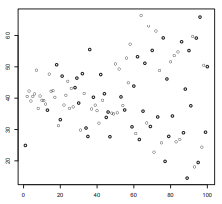
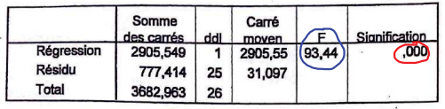

# 03 // régression linéaire

[Slides de régression linéaire](ressources/03_regression_lineaire_slides_cours_reglin_stat1_annote_4.pdf)

# Régression linéaire et statistiques descriptives

## Motivation

Dans certaines situations, on est amenés à étudier deux caractères distincts d’une même population. On peut par exemple considérer la taille ($x$) et le poids ($y$) d’un ensemble d’individus. L’objectif principal de l’étude est de déterminer l’éventuel lien entre les deux variables $x$ et $y$.

## Nuages de points

C’est juste une manière de visualiser les couples de données $(x,y)$ dans un échantillon.

Le “point moyen” est défini comme lo point qui a comme coordonnés $(\bar x, \bar y)$. Il s’agit du point de gravité.

Pour la suite, on s’intéresse aux échantillons/populations qui on plutôt une forme linéaire, comme celle de la première image. 

## Ajustement affine (droite de régression linéaire)

### Les erreurs $\epsilon_i$

Tel ajustement se fera avec une droite de la forme $y=ax+b$. La droite qui nous intéresse est celle qui réduit au minimum la somme des *résidus carrés*, qui sont les écarts du point réel au point correspondant sur la droite. Donc, pour coordonné $y_i$ d’une observation $(x_i,y_i)$, on a :

$$
y_i=\underbrace{(ax_i+b)}_{\text{estimation par la droite }\bar y}+\underbrace{\epsilon_i}_\text{erreur}
$$

### La covariance $\sigma_{X,Y}$

$$
σx,y = Cov(x, y) = \frac{1}{N}\sum_{i=1}^N
(x_i − \bar x)(y_i − \bar y)
$$

Si la covariance est proche de $0$, on on peut penser que les variables ont une dynamique qui n’ont rien de commun. Avec la covariance on peut déduire $a$ et $b$ de la meilleure droite :

$$
a=\frac{\sigma_{X,Y}}{\sigma_X^2}, \space b=\bar y - a\bar x
$$

Notons que l’équation de $b$ implique que la droite passe par le centre de gravité $(\bar x, \bar y)$.

### Le coefficient de corrélation linéaire $r$

Notons que la méthode des moindres carrés peut être utilisée pour n’importe quelle série double. On peut tout à fait obtenir une droite de régression dans la nuage de points du troisième cas. Pour s’assurer de façon objective (et non purement visuelle) que l’ajustement est valide, on considère un autre paramètre de la série, le coefficient de corrélation linéaire $r$.

$$
r=\frac{\sigma_{X,Y}}{\sigma_X\sigma_Y}
$$

- $−1 ≤ r ≤ 1$
- $r$ est toujours du même signe que la pente de la droite et de la covariance
- le degré de corrélation est d’autant plus fort que $r$ est proche de $1$ ou $−1$

En pratique, une régression linéaire est légitime si $r > 0.9$ ou si $r < −0.9$.

### Problème de biais dans la variance

Il existent deux “versions” de la variance : celle de la population (divisé par $n$) et celle d’un échantillon (divisé par $(n-1)$). Si on divise par n les écarts carrés d’un échantillon, on aura une variance plus faible car c’est un estimateur biaisé.

Cela dit, peu importe si on utilise la variance réelle ou estimée dans nos calculs de $a,b$ et $r$, car la division par $n$ ou $(n-1)$ disparaît dans l’algèbre, donc on arrive au même résultat. 

# Point de vue inférentiel

## Changement de notation : $\beta_1$ et $\beta_0$

Reprenons notre équation pour chaque couple $(x,y)$ dans la nuage de point avec la droite d’estimation : >$Y = aX+b+\epsilon$. On suppose qu’on sort chaque $x_i$ et $y_i$ d’une V.A $X$ et $Y$, respectivement. On réécrit l’équation comme suit :

$$
Y=\beta_1X+\beta_0+\epsilon
$$

Celle-ci serait l’équation de chaque terme de l’échantillon si notre échantillon était toute la population. Par contre, cela n’est pas normalement le cas. Donc, si on fait une régression linéaire avec un échantillon qui n’est pas la population, on utilise plutôt des estimateurs de $\beta_1$ et $\beta_0$ :

$$
Y=\underbrace{\hat{\beta_1}X+\hat{\beta_0}}_{\text{estimation }\hat Y}+\epsilon
$$

## Hypothèses sur les termes d’erreur $\epsilon_i$

On va supposer quelques fait sur les erreurs $\epsilon_i$ pour avancer dans notre théorie :

- Indépendance d’erreurs : les $\epsilon_0,\dots,\epsilon_n$ sont indépendantes
- Exogénéité : les variables explicatives $(X_1, \dots, X_n)$ ne sont pas corrélées au terme d’erreur. De plus, les erreurs sont centrées, càd $E(\epsilon_i) = 0$
- Homoscédasticité : les termes d’erreurs sont supposés de variance constante.
- Normalité des termes d’erreur : les termes d’erreurs suivent une loi normale, centrées (car $E(\epsilon_i) = 0$ par supposition), de variance $σ^2$.

Si on part de $\epsilon_i \sim \mathcal{N}(0,\sigma^2)$, il vient donc que $Y_i\sim\mathcal{N}(\hat Y, \sigma^2_\epsilon) = \mathcal{N}(\beta_1X+\beta_0, \sigma^2_\epsilon)$ .

## Équation de la variance

- Il en découle que $Var(Y) = Var(\hat Y) + Var(\epsilon)$
- Grâce à l’exogénéité, $\sum_i(Y-\bar Y)^2=\sum_i(\hat Y-\bar Y)^2+\sum_i(Y-\hat Y)^2$, càd. la somme de carrés totale est la somme des carrés dû au modèle plus la somme des carrés des erreurs. On peut la noter aussi $SCT = SCM + SCE$.

## Coefficient de détermination : $R^2$

C’est la quantité de la variance expliquée réelle par la droite modèle.

$$
R^2=\frac{Var(\hat Y)}{Var(Y)}=\frac{SCM}{SCT}
$$

## Les lois sur $\hat{\beta}_1$ et $\hat{\beta}_0$

Sous les hypothèses du modèle de régression linéaire simple, on admet que :

- $\hat{\beta_1} \sim \mathcal{N}(\beta_1,\sigma^2_{\hat{\beta_1}})$, où $\sigma^2_{\hat{\beta_1}} = \frac{\sigma^2_\epsilon}{\sum_{i}^n(X_i-\bar X)^2}$
- $\hat{\beta_0} \sim \mathcal{N}(\beta_0,\sigma^2_{\hat{\beta_0}})$, où $\sigma^2_{\hat{\beta_0}} = \sigma^2_\epsilon\left(\frac{1}{n}+\frac{\bar{X}^2}{\sum_{i}^n(X_i-\bar X)^2}\right)$
Celle-ci est moins indispensable pour le cours.

On constate que la variance de $\hat{\beta_1}$ augmente avec $\sigma^2_\epsilon$ et diminue quand le dénominateur (somme d’écarts de $X$) augmente. Ainsi, plus les $X_i$ sont nombreux et dispersés, plus notre estimation sera fiable.

En estimant $σ_\epsilon$ par $s_\epsilon$, on obtient les distributions des estimateurs suivantes :

- $(\hat{\beta_1}-\beta_1)/s_{\hat{\beta_1}} \sim t(n-2)$, où $s_{\hat{\beta_1}} = \frac{SCE}{(n-2)\sum_{i}^n(X_i-\bar X)^2}$
- $(\hat{\beta_0}-\beta_0)/s_{\hat{\beta_0}} \sim t(n-2)$ où $s_{\hat{\beta_0}} = \frac{SCE}{(n-2)}\left(\frac{1}{n}+\frac{\bar X^2}{\sum_{i}^n(X_i-\bar X)^2} \right)$
- Si le nombre de degrés de liberté est assez élevé (plus de trente), on peut faire une approximation de la loi $t$ de Student par une loi $\mathcal{N}(0, 1)$.

# Tests sur la pente de la droite $\beta_1$

Pour faire simple, les tests $F$ de Fisher et $t$ de Student testent l’hypothèse $\mathcal H_0$ sous laquelle le coefficient $β_1$ est nul, contre $β_1$ est non nul (ce qui permet d’affirmer que $X$ explique $Y$, au moins en partie).

## Test de Student

L’hypothèse nulle $H_0$ est “$\beta_1=0$”, càd. $X$ n’explique pas $Y$. L’estimation de $\beta_1$ montre que $(\hat{\beta_1}-\beta_1)/s_{\hat{\beta_1}} \sim t(n-2)$, et on gardera que $\hat{\beta_1}/s_{\hat{\beta_1}} \sim t(n-2)$

Nous ferons donc un test (bilatéral) de Student sur la statistique de test $|\hat{\beta_1}|/s_{\hat{\beta_1}}$. On rejettera $H_0$ au seuil $α$ (normalement $5\%$) si $|\hat{\beta_1}|/s_{\hat{\beta_1}} \ge q^{t(n-2)}_{1-\alpha/2}$

## Test de Fisher (ANOVA)

L’hypothèse nulle reste encore $H_0$ est “$\beta_1=0$”. Comme rappel, $[t(n-2)]^2\sim \mathcal{F}(1, n-2)$. Donc, on prend le carré de $\hat{\beta_1}/s_{\hat{\beta_1}}$ qui devient donc $\hat{\beta_1}^2/s_{\hat{\beta_1}}^2 = \frac{SCM}{SCE/(n-2)}\sim \mathcal{F}(1, n-2)$.

La variable statistique à étudier ici est plus simple que dans le cas du test de Student et, en plus, c’est un test unilatéral, donc encore plus simple. Pour simplifier, on appelle la statistique $F=\frac{SCM}{SCE/(n-2)}$. Si $F \ge q^{\mathcal{F}(1,n-2)}_{1-\alpha}$, on rejette $H_0$ et on en déduit que $X$ explique $Y$.

Exemple d’une table d’ANOVA

Dans ce cadre, on voit qu’on peut utiliser le test de $t$ de Student pour le rapport $\hat{\beta_1}/s_{\hat{\beta_1}}$ ou $F$ de Fisher pour le carré de ce rapport, sans distinction. Il est totalement équivalent en cas de régression simple (ce n’est pas le cas sur une régression multiple). On note d’ailleurs que la statistique $F$ est le carré de la statistique $t$.

Dans le cadre d’une régression multiple (sur plusieurs variables explicatives), le test de Fischer teste l’effet global des variables sur la variable $Y$, les tests de Student testent l’effet de chaque variable explicative sur $Y$.