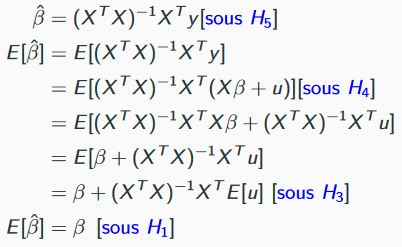

# 02 // régression linéaire multiple

[Économétrie 1 - Chap. #2](ressources/02_regression_lineaire_multiple_2_chapitre2_econometrie1_20232024.pdf)

# Le modèle

## Rappel : les cinq hypothèses fondamentales

Par la suite, on va supposer les cinq hypothèses "fondamentales" qui suivent :

- $H_1$ : $\mathbb{E} [u_i] = 0$
- $H_2$, la homoscédasticité ou variance constante : $\text{Var}(u_i)=\mathbb{E}[u_i^2]=\sigma^2_u$
- $H_3$ : la variable explicative $x_i$ est non aléatoire
- $H_4$, spécificité : le modèle est correctement spécifié.
Dans ce cas c'est linéaire, donc $y_i = \beta_0+\beta_1x_i+u_i$.
- $H_5$, non colinéarité: la variable explicative $x_i$ n'est pas constante pour toutes les observations.

> [!note]
> Les estimateurs $\hat{\beta}_0$ et $\hat{\beta}_1$ peuvent être biaisés. La source normalement vient du non respect du modèle spécifié (utiliser $\ln x$ quand ça devrait être $x$, ou vice-versa) ou de H3 : $\mathbb{E} [\mathbf{x} u] \neq 0$ donc $\text{Cov}(\mathbf{x}, u) \neq 0$.

Sous ces hypothèses, il découle que : 

- Les estimateurs $\hat{\beta}_0$ et $\hat{\beta}_1$ des MCO sont **sans biais et à variance minimale**, aussi appelés les estimateurs de Gauss-Markov. Donc :
    
    $$
    \mathbb{E}[\hat{\beta}_0]=\beta_0 \text{\hspace{8pt}et\hspace{8pt}}\mathbb{E}[\hat{\beta}_1]=\beta_1 
    $$
    
- Les variances sont les suivantes, mais il nous manque un paramètre $\sigma^2_u$.
    
    $$
    \text{Var}(\hat{\beta}_1)=\frac{\sigma^2_u}{\sum_{i=1}^N(x_i-\bar{x})^2}
    
    \text{\hspace{8pt}et\hspace{8pt}}
    
    \text{Var}(\hat{\beta}_0)=\frac{\sigma^2_u}{n}\frac{\sum_{i=1}^Nx_i^2}{\sum_{i=1}^N(x_i-\bar{x})^2}
    $$
    
- Si on prend la variance des résidus, ce serait un estimateur biaisé de $\sigma^2_u$.
Néanmoins, il existe un estimateur sans biais de $\sigma^2_u$, où $k$ le nombre de var. explicatives. Dans ce cas, $k=1$.
    
    $$
    \hat{\sigma}^2_u=\frac{\sum_{i=1}^n\hat{u}_i^2}{N-(k+1)} \implies \mathbb{E}[\hat{\sigma}^2_u]=\sigma^2_u
    $$
    

## Généralisation à $k$ variables explicatives, changement des $H_i$

C'est juste l'inclusion de plus de variables explicatives dans le modèle :

$$
y_i=\beta_0+\beta_1x_{i1}+\beta_2 x_{i2}+\cdots+\beta_k x_{ik}+u_i
$$

- $y_i$ : observation individuelle de la variable à expliquer pour l'individu $i$
- $k$ : le nombre de variables explicatives du modèle
- $x_{ik}$ : les $k$ variables explicatives qui correspondent à l'individu $i$
- $N$ : nombre d'observations
- Indice $i$ : pour les individus.
Fixer un $i$ est de se fixer sur un individu (coupe transversale)
- Indice $t$ : pour les périodes temporelles.
Fixer un $t$ est de voir une photographie des individus au moment $t$.

Pour écrire l'équation qui tient compte de tous les individus $i$, on écrit sous forme matricielle :

$$
\mathbf{y}=\mathbf{X}\boldsymbol{\beta}+\mathbf{u}

\\[10pt]

\begin{bmatrix}
y_1 \\
y_2 \\
\vdots \\
y_n
\end{bmatrix}

=

\begin{bmatrix}
1&x_{11}&x_{12}& \cdots &x_{1k} \\
1&x_{21}&x_{22}& \cdots &x_{2k} \\
\vdots&\vdots&\vdots&\ddots&\vdots \\
1&x_{N1}&x_{N2}& \cdots &x_{Nk} \\
\end{bmatrix}
\begin{bmatrix}
\beta_0 \\
\beta_1 \\
\vdots \\
\beta_k
\end{bmatrix}
+
\begin{bmatrix}
u_1 \\
u_2 \\
\vdots \\
u_n
\end{bmatrix}
$$

> [!note]
> Le vecteur $\hat{\boldsymbol{\beta}}$ qui contient les estimateurs des MCO de $\boldsymbol{\beta}$ et qui résout ce système d'équations linéaires utilise la [pseudo-inverse](https://en.wikipedia.org/wiki/Generalized_inverse) ou l'inverse de [Moore-Penrose](https://en.wikipedia.org/wiki/Moore%E2%80%93Penrose_inverse) de $\mathbf{X}$ (une généralisation de l'inverse pour les matrices pas forcément carrées. Elle est égale à l'inverse régulière si la matrice est carrée).
>
> $$
> \hat{\boldsymbol{\beta}}=(\mathbf{X}^T \mathbf{X})^{-1}\mathbf{X}^T\mathbf{y}
> $$

Les cinq hypothèses du cas linéaire simple sont légèrement changées dans le cas général :

- $H_1$ : $\mathbb{E} [u_i] = 0$
- $H_2$, variance constante : $\text{Var}(\mathbf{u})=\mathbb{E}[\mathbf{u}\mathbf{u}^T]=\sigma^2_u I_n$.
- $H_3$ : la matrice $\mathbf{X}$ est non aléatoire.
- $H_4$, spécificité : le modèle est correctement spécifié.
Dans ce cas c'est linéaire, donc $\mathbf{y} = \mathbf{X}\boldsymbol{\beta} + \mathbf{u}$.
- $H_5$, non colinéarité: la matrice $\mathbf{X}$ est de plein rang, càd $k+1 < n$.
Comme rappel, $\mathbf{X}$ est de dimension $(n, k+1)$.

# L'estimateur des Moindres Carrés Ordinaires (MCO)

## Préparation : dérivées pour les vecteurs et scalaires

[Par rapport aux dérivées des vecteurs et matrices](https://en.wikipedia.org/wiki/Matrix_calculus#Layout_conventions), il existe trois présentations de dérivée avec vecteurs: la dérivée vecteur-par-scalaire, la dérivée scalaire-par-vecteur et la dérivée vecteur-par-vecteur. Les dérivées avec matrice découlent facilement à partir de celles avec vecteurs.

- Dans la suite, un vecteur contient plusieurs fonctions de $x$ (y compris $\text{Id}(x)=x$ elle-même) et un scalaire est juste une fonction de $x$ (qui peut être aussi $x$).
    - (En fait, un vecteur est une matrice colonne et un scalaire est une matrice ligne, mais pour le scalaire on suppose qu'il n'a qu'une seule entrée, donc c'est une matrice $(1\times1)$ d'une seule entrée et donc une seule valeur)
- Le premier composant est la variable dépendante et la deuxième la variable indépendante, donc si on parle de la dérivée vecteur-par-scalaire, un vecteur est une variable dépendante et le scalaire la variable indépendante.

La dérivée d'un vecteur $\mathbf{y}$ par rapport à un scalaire $x$ est utilisée dans le cas où $\mathbf{y}$ contient à chaque entrée des fonctions de $x$ différentes. On prend donc la dérivée partielle de chaque fonction par rapport à $x$. Ceci nous donne aussi le "vecteur tangent". Si on suppose qu'en physique, $\mathbf{y}$ sont les coordonnées de position, le vecteur tangent montre la vitesse vers chaque direction.

$$
\frac{\partial \mathbf{y}}{\partial x}=
\begin{bmatrix}
\frac{\partial y_1}{\partial x}
\\[8pt]
\frac{\partial y_2}{\partial x}
\\[8pt]
\vdots
\\[8pt]
\frac{\partial y_m}{\partial x}
\end{bmatrix}
$$

Après, on a la dérivée d'un scalaire par rapport à un vecteur, où les entrées du vecteur sont les arguments du scalaire $y=f(x_1,\cdots, x_n)$. Le résultat prend la dérivée partielle du scalaire par rapport à chaque variable indépendante. On note que le gradient est un cas de dérivée scalaire-par-vecteur.

$$
\frac{\partial y}{\partial \mathbf{x}}=
\begin{bmatrix}
\frac{\partial y}{\partial x_1}
\\[8pt]
\frac{\partial y}{\partial x_2}
\\[8pt]
\vdots
\\[8pt]
\frac{\partial y}{\partial x_n}
\end{bmatrix}
=\nabla y
$$

Finalement, la dérivée d'un vecteur $\mathbf{y}$ par rapport à un autre vecteur $\mathbf{x}$ suppose que chaque entrée de $\mathbf{y}$ est une fonction à plusieurs variables qui se trouvent dans $\mathbf{x}$. Pour chaque ligne, on dérive une fonction $y_i$ par rapport à toutes ses variables indépendantes dans $\mathbf{x}$ (càd, ligne $1$ contient le gradient de $y_1$, ligne $2$ le gradient de $y_2$, etc). Concrètement, l'entrée $ij$ est la dérivée de la fonction $i$ par rapport à la variable indépendante $j$.

$$
\frac{\partial \mathbf{y}}{\partial \mathbf{x}} =
\begin{bmatrix}
\frac{\partial y_1}{\partial x_1} & 
\frac{\partial y_1}{\partial x_2} &
\cdots &
\frac{\partial y_1}{\partial x_n}

\\[8pt]

\frac{\partial y_2}{\partial x_1} & 
\frac{\partial y_2}{\partial x_2} &
\cdots &
\frac{\partial y_2}{\partial x_n}

\\[8pt]

\vdots & \vdots & \ddots & \vdots

\\[8pt]

\frac{\partial y_m}{\partial x_1} & 
\frac{\partial y_m}{\partial x_2} &
\cdots &
\frac{\partial y_m}{\partial x_n}
\end{bmatrix}
$$

## Comment calculer les MCO

Les MCO sont juste les coefficients d'une régression linéaire mais appliqués sur un échantillon, dans l'espoir que ces valeurs seront pas si éloignées des vraies valeurs qu'on obtiendrait si on appliquait la régression linéaire sur toute la population.

Partons du terme SCE pour trouver ce qui nous intéresse :

$$
SCE=\sum_{i=1}^n (y_i-\hat{y}_i)^2= \sum_{i=1}^n \hat{u}^2_i
$$

Voyons que maintenant on traite avec un vecteur d'erreurs $\mathbf{u}$. Pour que chaque entrée devienne $\hat{u}^2_i$ on peut écrire une opération avec $\mathbf{u}$ comme suit : 

$$
\mathbf{u}^T \mathbf{u} = \sum_{i=1}^n \hat{u}^2_i
$$

Et finalement, on veut minimiser cette expression.

$$
\min_{\boldsymbol{\beta}}(\mathbf{u}^T \mathbf{u}) 

\iff

\boldsymbol{\beta} : \frac{\partial}{\partial \boldsymbol{\beta}} (\mathbf{u}^T \mathbf{u}) = 0 

\text{ et }

\frac{\partial^2}{\partial \boldsymbol{\beta}^2} (\mathbf{u}^T \mathbf{u}) > 0

\\[10pt]

\begin{align*}
\min_{\boldsymbol{\beta}} (\mathbf{u}^T \mathbf{u})
&=
\min_{\boldsymbol{\beta}} (\mathbf{y} - \mathbf{X}\boldsymbol{\beta})^T(\mathbf{y} - \mathbf{X}\boldsymbol{\beta}) 
\\
&=
\min_{\boldsymbol{\beta}} (\mathbf{y}^T \mathbf{y} - 2\mathbf{y}^T\mathbf{X} \boldsymbol{\beta}+\boldsymbol{\beta}^T\mathbf{X}^T\mathbf{X} \boldsymbol{\beta})

\end{align*}
$$

On applique la condition de premier ordre à l'expression pour arriver au résultat. On omet la condition de deuxième ordre.

$$
\begin{align*}
&\frac{\partial}{\partial\boldsymbol{\beta}} (\mathbf{y}^T \mathbf{y} - 2\mathbf{y}^T\mathbf{X} \boldsymbol{\beta}+\boldsymbol{\beta}^T\mathbf{X}^T\mathbf{X} \boldsymbol{\beta}) = 0
\\
\iff
&-2\mathbf{X}^T\mathbf{y} + 2 \mathbf{X}^T \mathbf{X}\hat{\boldsymbol{\beta}} =0
\\
\iff

&\mathbf{X}^T \mathbf{X} \hat{\boldsymbol{\beta}} = \mathbf{X}^T \mathbf{y}
\\
\iff
&\hat{\boldsymbol{\beta}} = (\mathbf{X}^T \mathbf{X})^{-1}\mathbf{X}^T \mathbf{y}, \text{ sous } H_5
\end{align*}
$$

---

Pour faire le passage de la première ligne à la deuxième ligne, voici quelques opérations avec dérivées, vecteurs et scalaires à savoir, sorties du PDF ci-dessous, page 12/61.

[Ch3slides_multiple_linear_regression.pdf](ressources/02_regression_lineaire_multiple_ch3slides_multiple_linear_regression.pdf)

Pour ce premier, notons qu'on fait une combinaison linéaire de coefficients $\mathbf{a}$. Le résultat final de l'opération $\mathbf{a}^T \mathbf{x}$ est juste $[a_{j=1}x_{i=1}+a_{j=2}x_{i=2}+\cdots+a_{j=m}x_{i=n}]$. Si on dérive cette expression par $\mathbf{x}$ (scalaire-par-vecteur), on devrait avoir de retour le vecteur avec les coefficients, donc $\mathbf{a}$.  

$$
\begin{align*}
&\frac{\partial}{\partial \mathbf{x}}(\mathbf{x}^T \mathbf{a})= \frac{\partial}{\partial \mathbf{x}} (\mathbf{a}^T\mathbf{x})=\mathbf{a}
\end{align*}
$$

Pour ce deuxième, notons que l'expression qui résulte de $\mathbf{x}^T \mathbf{x}$ (comb. linéaire) est égale à $[x_1^2+x_2^2+\cdots+x_n^2]$. La dérivée de cette expression devrait nous retourner $2x_i$ pour l'entrée $i$, donc $2\mathbf{x}$.

$$
\begin{align*}
&\frac{\partial}{\partial \mathbf{x}}(\mathbf{x}^T \mathbf{x}) = \frac{\partial}{\partial \mathbf{x}}(||\mathbf{x}||^2)=2\mathbf{x}
\end{align*}
$$

Pour ce troisième, la forme de chaque entrée de $\mathbf{A} \mathbf{x}$ tout seul est un vecteur colonne $(\sum_{i,j=1}^{i=n, j=m} a_{ij}x_i)$. Après, la forme de chaque entrée de $\mathbf{x}^T(\mathbf{A} \mathbf{x})$ est donc $(\sum_{i,j=1}^{i=n, j=m} a_{ij}x_i^2)$. Si on dérive chaque terme par $x_i$, on finit avec le vecteur colonne $(\sum_{i,j=1}^{i=n, j=m} 2a_{ij}x_i)$, donc $2\mathbf{A}\mathbf{x}$.

$$
\begin{align*}
&\frac{\partial}{\partial \mathbf{x}}

(\mathbf{x}^T \mathbf{A} \mathbf{x})=2\mathbf{A}\mathbf{x}
\end{align*}
$$

Finalement, on utilise un raisonnement pareil pour ce dernier.

$$
\begin{align*}
&\frac{\partial}{\partial \mathbf{x}}(\mathbf{x}^T \mathbf{B}^T \mathbf{B} \mathbf{x})=\frac{\partial}{\partial \mathbf{x}}(||\mathbf{B}\mathbf{x}||^2)=2 \mathbf{B}^T \mathbf{B} \mathbf{x}
\end{align*}
$$

## Variance des MCO

La variance de la matrice des estimateurs $\hat{\boldsymbol{\beta}}$ est égale à la matrice de covariance entre les estimateurs $\hat{\beta}_i$ et $\hat{\beta}_j$, pour $k$ variables explicatives.

$$
\text{Var}(\hat{\boldsymbol{\beta}})=\hat{\sigma^2_u}(\mathbf{X}^T\mathbf{X})^{-1}=
\begin{bmatrix}

\text{Var}(\hat{\beta}_0) & \text{Cov}(\hat{\beta}_0, \hat{\beta}_1) & \cdots & \text{Cov}(\hat{\beta}_0, \hat{\beta}_k)

\\

\text{Cov}(\hat{\beta}_1, \hat{\beta}_0) & \text{Var}(\hat{\beta}_1) & \cdots & \text{Cov}(\hat{\beta}_1, \hat{\beta}_k)

\\

\vdots&\vdots&\ddots&\vdots

\\

\text{Cov}(\hat{\beta}_k, \hat{\beta}_1) &\text{Cov}(\hat{\beta}_k, \hat{\beta}_2) &\cdots &\text{Var}(\hat{\beta}_k)

\end{bmatrix}
$$

Comme rappel, l'estimateur des écarts-types des perturbations $u$ est :

$$
\hat{\sigma^2_u}=\frac{\hat{\mathbf{u}}^T\hat{\mathbf{u}}}{n-(k+1)}=\frac{SCR}{n-(k+1)}
$$

# Hypothèses et propriétés

## Espérance et variance de $\hat{\boldsymbol{\beta}}$

Preuve que $\hat{\boldsymbol{\beta}}$ est un estimateur sans biais de $\boldsymbol{\beta}$ :

Calcul de la variance de $\hat{\boldsymbol{\beta}}$ :

## Estimation de la variance des perturbations $\sigma^2_u$

Tout comme dans le cas de régression simple, $\mathbf{u}$ n'est pas observable. Donc, on estime avec $\hat{\mathbf{u}}$. Avant, on se prépare avec le calcul d'une certaine matrice $\mathbf{M}$ telle que :

Le $T$ dans $I_T$ est le $n$ dans les dimensions $(n, k+1)$ de la matrice $\boldsymbol{\beta}$. Avec cette définition de M, on peut dire que :

- M est symétrique : $\mathbf{M}=\mathbf{M}^T$
- M est idempotente : $\mathbf{M} \mathbf{M}^T=\mathbf{M}^T \mathbf{M}$
- $\text{Rg}(\mathbf{M})=\text{tr}(\mathbf{M})=N-k$

Finalement, on peut calculer $\hat{\mathbf{u}}$ :

Et donc, finalement :

$$
\hat{\mathbf{u}}^T \hat{\mathbf{u}}=\mathbf{u}^T \mathbf{M}^T \mathbf{M} \mathbf{u}=\mathbf{u}^T \mathbf{M} \mathbf{u} 
$$

# Qualité de l'ajustement

## Rappel : analyse de la variance et $R^2$

La populaire équation de la variance, qui décompose la variance comme la somme de deux termes, est la suivante :

$$
\underbrace{\sum_{i=1}^N(y_i-\bar{y})^2}_{SCT}=\underbrace{{\sum_{i=1}^N(\hat{y}_i-\bar{y})^2}}_{SCE}+\underbrace{\sum_{i=1}^N(y_i-\hat{y}_i)^2}_{SCR}

\\[8pt]

\text{Remarque : } \sum_{i=1}^N(y_i-\hat{y}_i)^2=\sum_{i=1}^N(\hat{u}_i - \cancel{\bar{\hat{u}}}^{\space0})^2
$$

Où $SCT$ est la somme des carrés totaux, $SCE$ est la somme des carrés expliqués, et $SCR$ est la somme des carrés des résidus.

Avec cette terminologie, on rappelle le coefficient de détermination :

$$
R^2=\frac{SCE}{SCT}=1-\frac{SCR}{SCT}
$$

- $R^2 = 1$ : si tous les points correspondant aux données se trouvent sur la droite d'ajustement.
- $R^2 = 0$ : les variations entre les $\hat{y}_i$ ne capturent quasiment rien de la variation observée entre les $y_i$.
- Remarque : un faible $R^2$ n'implique pas forcément que la régression des MCO ne sert à rien, mais que d'autres "problèmes" peuvent expliquer ce résultat.

## Ajustement de $R^2$

Un fait important par rapport à $R^2$ est que sa valeur augmente si le nombre de variables explicatives augmente. Ceci ne nous est pas pratique, car on ne pourra pas savoir si l'une des variables explicatives a un impact presque nul sur la variable à prédire.

Pour $R^2$, toute variable explicative nous rapproche de la meilleure prédiction, ce qui n'est pas désirable, car on veut distinguer entre les variables explicatives qui sont de bons prédicteurs et celles qui ne le sont pas.

La manière populaire d'ajuster $R^2$ est comme $\bar{R^2}$, un $R^2$ ajusté aux degrés de liberté :

$$
\bar{R^2}=R^2-\frac{k-1}{n-k}(1-R^2)=1-\frac{SCR/(n-k)}{SCT/(n-1)}
$$

# Inférence statistique

## Tests statistiques

La grande différence de ce cas avec le cas de régression simple c'est qu'un estimateur $\hat{\beta}_i$ pourrait ne pas être significatif individuellement (sous un test de Student) mais le modèle en tout pourrait être significatif globalement (sous un test de Fisher).