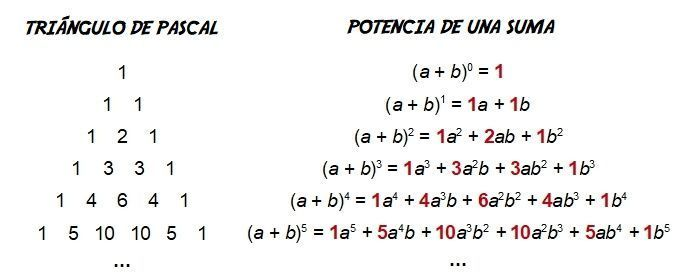

## 01 // analyse combinatoire

## Arrangements

### Définition et types

Un arrangement est une suite de une quantité $k$ de $n$ éléments, dont l'ordre est important. Deux arrangements formés de $k$ objets peuvent donc être distincts soit par la nature des objets, soit par leur ordre.

On note deux types d’arrangements : sans répétition et avec répétition

#### Arrangement sans répétition : $A^k_n$

Entre les deux types, celui-ci est utilisé les plus souvent, et surtout permet de créer les combinaisons sans ordre $C^k_n$ qu’on verra après. On le note $A^k_n$.

- Si on choisit 1 élément de $n$ éléments, notons qu'on a $n$ manières de le faire.
- Après, si on choisit 2 éléments, c'est $n \cdot (n-1)$. Notons qu'on a $n$ manières de choisir le 1er élément, puis $(n - 1)$ manières de choisir le 2ème.
- Mais, notons que $A^1_n = n$, donc $A^2_n = A^1_n \cdot (n-1)$.

La fonction $A^k_n$ est donc définie par récurrence. Pour un certain $A^k_n$, on a les manières de ordonner les $(n-1)$ éléments précédents, càd, $A^{k-1}_n$, et puis il nous restent $[n - (k - 1)]$ de choisir les éléments restants.

Finalement, on a deux manières d’écrire $A_n^k$ :

- **$A^k_n = A^{k-1}_n \cdot (n - k + 1)$ :** “toutes les manières de ordonner les éléments précédents ***fois*** les manières d'ordonner les éléments qui restent”. C’est la manière intuitive de l’écrire.
- $A^k_n = \frac{n!}{(n-k)!}$ : celle-ci étant la manière la plus pratique pour faire de calculs.

#### Arrangement sans répétition

Pour un arrangement avec répétition, on note tout simplement $n^k$. Il n’a pas une notation particulière comme dans le cas précédant.

## Permutations

### Définition et dérivation à partir des arrangements

Une permutation est une suite utilisant tous les éléments d'un ensemble, dont l'ordre est important et il n’y a pas de répétition. Utilisant la notation des arrangements, c'est donc $A^n_n$, mais normalement on le note comme $P_n$ et on déduit que $P_n=n!$.

**Note pratique**. $0!$ es défini égal à $1$ par convention.

## Combinaisons

### Définition et dérivation à partir des arrangements

Une combinaison est un arrangement mais où la notion d'ordre n'est plus importante. On le note $C^k_n$.

Pour dériver sa valeur, supposons qu’on a un total de $n$ éléments distincts et on en sélectionne juste $k$ éléments. Pour les $k$ éléments filtrés, on peut les ordonner de $k!$ manières sans répétition (permutation).

Voyons-le avec un exemple : supposons qu’on a un total de $5$ éléments : $1,2,3,4$ et $5$. On en sélectionne juste $3$ parmi eux, supposons $\{1,2,3\}$. On sait qu’on a $3! = 6$ manières de les ordonner. On prend un autre triplet, comme $\{1,3,4\}$ et on refait le même.

Si on compte toutes les manières d’ordonner toutes les sélections possibles de $3$ éléments sur $5$, ceci serait égal à $A^k_n$ par définition.

On devrait arriver à que, si on prend les manières de sélectionner $k$ éléments de $n$ sans ordre ($C^k_n$) et on les multiplie par la quantité de manières qu’on peut les ordonner ($k!$), on arriverait tout simplement à $A^k_n$.

$$
\begin{align*}\underbrace{k!}_{\{1,2,3\}}+\underbrace{k!}_{\{1,2,4\}}+\underbrace{k!}_{\{1,2,5\}}+\underbrace{k!}_{\{1,3,4\}}+\dots+\underbrace{k!}_{\{3,4,5\}} = A^k_n&\iff k!\cdot C^k_n = A^k_n

\\[0pt] 
&\iff C^k_n=\frac{A^k_n}{k!}

\\[12pt]
&\iff C^k_n=\frac{n!}{k!(n-k)!}
\end{align*}
$$

### Deux relations importantes

- $C^k_n = C^{n-k}_n$ : la quantité de manière de sélectionner $k$ de $n$ éléments sans ordre et la même que de sélectionner les éléments restants $(n-k)$ de $n$ éléments.
- $C^k_n = C^k_{n-1} + C^{k-1}_{n-1}$ : cette relation permet de formaliser le triangle de Pascal !
    - Explication : pour $C^2_5$, soit $A$ l'ensemble de $5$ éléments $A = \{a, b, c , d, e\}$ et fixons $a$.
    - **Terme $C^k_{n-1}$** : c'est la quantité de combinaisons de $2$ éléments qui ne contient pas $*a*$. $\rightarrow$ On exclu $a$ de l'ensemble $A$, donc $n$ $\rightarrow$ $(n-1)$.
    - **Terme $C^{k-1}_{n-1}$** : c'est la quantité de combinaisons de $2$ éléments qui contient $*a*$. $\rightarrow$ Notons que on fixe $*a$* dans chaque groupe de $2$ et on seulement choisit le deuxième élément, donc $k \rightarrow k-1$ et on conserve l'ensemble sans $a$ de $(n-1)$ éléments car $a$ est déjà présent dans la tuple.
    - Les deux termes sont ceux qui permet, dans le Triangle de Pascal, de trouver le prochain terme.

    

    

### Outils : Binôme de Newton et Triangle de Pascal

#### Binôme de Newton : expansions de $(a+b)^n$

Le binôme de Newton est une équation super utile pour calculer l’expansion polynomiale d’un binôme à la puissance $n$ :

$$
(a+b)^n=\sum_{k=0}^nC^k_na^kb^{(n-k)}
$$

#### Triangle de Pascal

Le triangle de Pascal est juste une présentation ou sorte de dessin qui contient tous les coefficients combinatoires $C^k_n$ en $n$ lignes. Il est facile à calculer et sert pour trouver les valeurs de grands valeurs de $C^k_n$ à la main sans calculatrice. Ces coefficients sont aussi présents dans les binômes de Newton.

## Formule de Stirling

### Approximer de grands valeurs de $n!$

Il s’agit d’une formule développée pour le calcul de $n!$ pour des grands valeurs de $n$ :

$$
n! \approx n^n e^{-n}\sqrt{2\pi n}
$$

Dans la pratique, on l’utilise de la manière suivante :

1. On doit utiliser le $\log$ de l'expression à droite et à gauche et puis simplifier. On fait ceci car les constantes à droite devient plus faciles à calculer à la main.

    $$
    \ln(n!)\approx n\ln(n)-n\cancel{\ln(e)}^1+\frac{1}{2}\ln(2\pi n)=n(\ln(n)-1)+\frac{1}{2}\ln(2\pi n)

$$

    
2. Finalement, on prend l’expression plus à droite et on la met dans la fonction $\exp$ (pour défaire le $\ln$ et rester avec $n!$). On arrive finalement à une approximation de $n!$.
