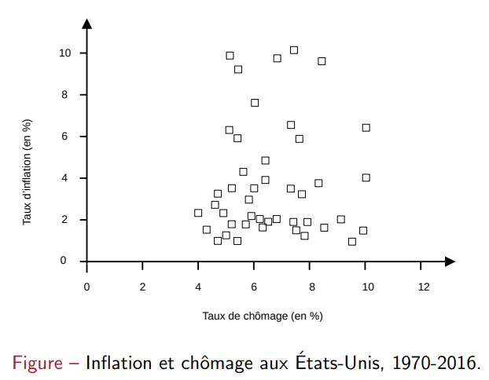

## 01 // la courbe de Phillips, le chômage naturel et l’inflation

[Slides de Phillips](ressources/01_la_courbe_de_phillips_le_chomage_naturel_et_l_chapitre_1_diapo.pdf)

## Introduction

En 1958, A. W. Phillips met en évidence une corrélation négative très nette entre inflation et chômage : quand le chômage est fort, l’inflation est faible (voire négative) et viceversa. La courbe de Phillips implique l’existence d’un arbitrage inflation-chômage.

La théorie serait que plus on se rapproche au plein emploi des facteurs, plus les ajustement se font par les prix et non pas par les quantités. On pensait que cette relation était consistante jusqu’aux années 1970s où on a vu la stagflation : forte chômage et forte inflation simultanément. Avant de cette époque, on appréciait une relation régulièrement négative entre les deux indicateurs.

## Inflation, inflation anticipée et chômage

### Relation entre prix anticipés et salaires

Voyons en premier la relation entre le niveau de prix anticipé, de chômage et de salaires :

$$
W=P^e F(u,z) \tag{1}
$$

- $W$ : *wages*, niveau de salaires
- $P^e$ : niveau ***anticipé*** des prix (pas les prix actuels !)
- $u$ : *unemployed*, taux de chômage
- $z$ : variable composite qui représente tous les autres facteurs influant les salaires
(allocations, modalités de négociation collective, etc.)
- La forme fonctionnelle de $F$ sera présentée après.

#### Relation entre ces variables

- Hausse des prix anticipés $P^e \implies$ hausse des salaires $W$ :
    - Les salariés et les entreprise se soucient du salaire réel, et non pas du salaire nominal. Les salaires sont sensibles à $P^e$ car, au moment où les salaires nominaux sont fixés, on ne sait pas quel sera le futur niveau des prix.
- Hausse du taux de chômage $u \implies$ baisse des salaires $W$ :
    - Si on suppose que les salaires sont déterminés par la négociation, un chômage $u$ elevé affaiblit le pouvoir de négociation des salariés (car les entreprises ont plein des choix de possible salariés) et donc les salaires $W$ diminuent.
    - Si on suppose que les salaires sont déterminés par considération de salaire d’efficient, un chômage $u$ élevé permet aux firmes de baisser $W$ sans risquer de perdre les “bons” salariés.
- Hausse des autres facteurs $z \implies$ hausse de salaires $W$ :
    - **C’est une définition par convention**.
    - Un facteur inclus dans $z$ sont les assurances chômages : plus grands les allocations chômages, plus les firmes devront augmenter le salaire $W$ pour motiver des salariés.
    - Changement structurel de l’économie (croissance de quantité demandée de travail)  : si plus d’emplois $z$ sont crées, alors les chômeurs ont plus de possibilités pour trouver un travail et les firmes devront se battre en augmentant les salaires $W$.

### Relation coûts-prix et relation prix-prix anticipés

On a vu les prix anticipés $P^e$, voici la relation des prix actuels $P$ avec les salaires $W$ :

$$
P=(1+m)W \tag{2}
$$

Ici, $m$ est la marge du prix par rapport aux coûts. Une hypothèse simplificatrice faite c’est que les seuls coûts considérés sont les salaires.

Avec cette équation, on peut la réarranger et l’njecter dans l’équation de $P^e$ et salaires $W$ :

$$
W=\frac{P}{(1+m)} \implies \frac{P}{(1+m)}=P^eF(u,z) 
\\
\text{}
\\
\implies P=P^e(1+m)F(u,z) \tag{3}
$$

Ayant faite cette manipulation, on peut voir la relation entre $P$ et tous les facteurs :

- Hausse des prix anticipés $P^e \implies$ hausse des salaires $W \implies$ hausse de prix actuels $P$
- Hausse du taux de chômage $u \implies$ baisse des salaires $W \implies$ baisse des prix actuels $P$

### Définition de $F$

On prend la suivant forme fonctionnelle suivante de $F$ :

$$
F(u,z)=1-\alpha u + z
$$

- Hausse du taux de chômage $u \implies$ baisse de salaires $W$.
- Hausse des autres facteurs $z \implies$ hausse de salaires $W$.
- $\alpha$ mesure l’intensité de l’impact de $u$ sur $W$.
On y pourrait penser comme “l’élasticité-chômage des salaires”.

### Du niveau de prix $P$ à l’inflation $\pi_t$

Ayant cette forme de $F$, on peut l’injecter dans l’équation qui lie $P$ avec $P^e$comme suit :

$$
P=P^e(1+m)(1-\alpha u+z) \tag{4}
$$

Cette relation peut être réécrite comme une relation en temps $t$ entre l’inflation $\pi_t$, l’inflation anticipée $\pi_t^e$ et le taux de chômage $u_t$ :

$$
\pi_t=\pi_t^e+(m+z)-\alpha u_t \tag{5}
$$

Considérons les deux équations de $P$ et $\pi_t$. Voici leurs conséquences :

- Hausse des prix anticipés $P^e \implies$ Hausse de salaires $W \implies$ Hausse des prix actuels $P$
- Une hausse de prix $P$ équivaut à une hausse de $\pi$.
- De même, une hausse des prix anticipés $P^e \implies$ une hausse de l’inflation anticipée $\pi_t^e$
- Ainsi, si $(\nearrow P^e \implies \nearrow P)$, alors **il nous intéresse que $(\nearrow\pi_t^e \implies \nearrow\pi_t)$**.
- Pour $\pi_t^e$ constante donnée, une hausse de la marge de profit $m$ ou d’autres facteurs $z \implies$hausse de niveau de prix $P \implies$ hausse de l’inflation actuelle $\pi_t$.
- Pour $\pi_t^e$ constante donnée, une hausse du taux de chômage $u \implies$ une baisse du niveau de prix $P \implies$ une baisse d’inflation $\pi_t$.

## La courbe de Phillips et ses mutations

### Relation inflation-chômage, 1ère version

Proposée par Phillips, Samuelson et Solow, ils proposent une équation et deux propositions :

1. L’inflation varie d’une année à l’autre autour d’une valeur moyenne $\overline{\pi}$.
2. L’inflation en temps $t+1$ est indépendante de l’inflation en temps $t$.

Sous ces deux hypothèses, on déduit logiquement que $\pi_t^e = \overline{\pi}$, et on réécrit l’équation qui lie la l’inflation actuelle et anticipée, appelée la relation inflation-chômage de la courbe de Phillips :

$$
\pi_t=\overline{\pi}+(m+z)-\alpha u_t \tag{6}
$$

On peut apprécier la relation négative entre inflation et chômage avant 1970.

Par contre, il est difficile à trouver la même relation négative clairement à cause de la *stagflation* à partir des années 1970.

### Pourquoi la courbe de Phillips a-t-elle disparue ?

Basiquement, il y a deux raisons qui ont changé la relation entre chômage et inflation :

- Les partenaires sociaux ont changé leur façon de former leurs anticipations.
- $\pi$ est devenu plus persistant : inflation forte une année est plus susceptible d’être suivie d’une inflation également forte l’année suivante.

À la vue des ces changements, on peut proposer **une deuxième version entre $\pi_t^e$ et $\pi_t$**, où $\theta$ représente le poids de l’inflation en temps $t$ sur l’inflation en temps $t+1$ :

$$
\pi_{t+1}^e=(1-\theta)\overline{\pi}+\theta\pi_{t} \tag{7}
$$

#### Progression depuis les années 1970

1. Avant les années 1970, la persistance de l’inflation $\theta$ était proche de zéro, et donc $\pi_{t}^e \approx \overline{\pi}$.
2. Depuis 1970, le poids de l’inflation inter-années $\theta$ augmentait au cours du temps.
3. Tant que $\pi_{t}^e$ dépendait légèrement de $\pi_{t-1}$ ($\theta$ petit, début des années 1970), ils ignoraient $\pi_{t-1}$ et supposaient que $\pi_{t}^e = \overline{\pi}$.
4. Avec le temps, $\pi_t$ devenait plus persistante, donc $\theta$ augmentait régulièrement, ce qui rend $\pi_t$ plus susceptible à $\pi_{t-1}$.
5. Peu à peu, $\theta \longrightarrow 1$.

### 2ème version de la courbe de Phillips et les anticipations

Injections l’équations 7 dans l’équation 5 :

$$
\pi_{t+1}=(1-\theta)\overline{\pi}+\theta\pi_{t}+(m+z)-\alpha u_{t+1}
$$

La valeur de la persistance de l’inflation $\theta$ affecte la relation inflation-chômage :

- $\theta = 0$ : courbe de Phillips initiale (équation 6).
- $\theta \in ]0,1[$  : $\pi_{t+1}$ dépend de $u$ et maintenant aussi de $\pi_t$.
- $\theta = 1$ : la relation devient :

    $$
    \pi_{t+1}-\pi_t=(m+z)-\alpha u_t \tag{8}

$$

    
    - La **variation de l’inflation** $(\pi_{t+1}-\pi_t)$ est négativement corrélée au chômage $u_t$.
    - Si $u_t$ est élevé, tel que $u_t > \frac{(m+z)}{\alpha} \implies$ baisse de l’inflation : $\pi_{t+1} < \pi_t$.
    - Si $u_t$ est faible, tel que $u_t < \frac{(m+z)}{\alpha} \implies$ hausse de l’inflation : $\pi_{t+1} > \pi_t$.

## Explication de la *stagflation* des années 1970

- Il y avait un $\theta$ forte, donc la relation simple inflation-chômage n’applique plus.
- Si on voit à l’équation 8 et le graphique, on confirme la relation négative de la variation de l’inflation $(\pi_{t+1}-\pi_t)$ et le taux de chômage $u_t$.

# La courbe de Phillips et le taux de chômage structurel

## Le taux de chômage structurel

Le taux de chômage d’équilibre est le taux de chômage lorsqu’il n’y a pas de sur-production ou de sous-production. **C’est le taux de chômage quand il y a plein emploi ?**

Avant des années 1970, il y avait un arbitrage inflation-chômage fait par les États, ils contrôlaient l’un en sacrifiant l’autre. Cela dit, vers la fin des années 1960 les économistes M. Friedman et E. Phelps remettent en cause cet arbitrage inflation-chômage.

Particulièrement, l’arbitrage serait seulement possible si les agents sous-estiment systématiquement l’inflation dans leurs anticipations, c’est qui est impossible à long terme.

D’autre côté, il est impossible de maintenir une expectative d’inflation future faible si on maintient un chômage actuel $u$ faible, car on sait qu’un chômage faible mène a une inflation élevée.

Encore plus, le chômage $u$ ne peut pas être maintenu sous un certain seuil, ce qu’on appelle le taux de chômage naturel. Les faits confirment cette analyse dans les années 1970.

## La relation entre le chômage structurel et la courbe de Phillips

La définition du taux de chômage naturel $u_n$ est la valeur constante donnée du taux de chômage $u$ tel que le niveau d’inflation actuel $\pi_t$ est égal au niveau d’inflation anticipé $\pi_t^e$. Si on reprend l’équation 5 et on impose l’égalité $\pi_t=\pi_t^e$, on déduit la suite :

$$

\pi_t=\pi_t^e+(m+z)-\alpha u_t \implies \pi_t - \pi_t^e = (m+z)-\alpha u_t

\\

\text{}

\\

0 = (m+z)-\alpha u_t \implies u_n = \frac{m+z}{\alpha}\tag{9}

$$

On peut réarranger cette dernière équation comme  $\alpha u_n = (m+z)$ et l’injecter dans l’équation 5 pour trouver une identité utile :

$$

\pi_t - \pi_t^e = (m+z)-\alpha u_t \implies \pi_t - \pi_t^e = -\alpha(u_t-u_n) \tag{10}

$$

Encore plus, si on suppose que $\pi_{t-1} \approx \pi_t^e$, la relation devient finalement comme suit :
(Oui, c’est $\pi_{t-1}$ et non pas $\pi_{t+1}$, j’ai confirmé !)

$$

\underbrace{\pi_{t}-\pi_{t-1}}_{\Delta\pi}=-\alpha(u_{t}-u_n) \tag{11}

$$

Ce serait encore une autre version de la courbe de Phillips. Elle rend compte d’une relation entre la variation de l’inflation et l’écart du chômage réalisé au chômage naturel/structurel.

- Si $u_t > u_n$, la variation de l’inflation $\Delta\pi$ est négative, donc elle baisse en temps $t$.
- Si $u_t < u_n$, la variation de l’inflation $\Delta\pi$ est positive, donc elle augmente en temps $t$.
- $u_n$ est le taux de chômage por lequel l’inflation n’augmente pas (NAIRU).
- La valeur moyenne de $u_n$ aux États-Unis sur la période 1970-1995 est de 6,2%.
