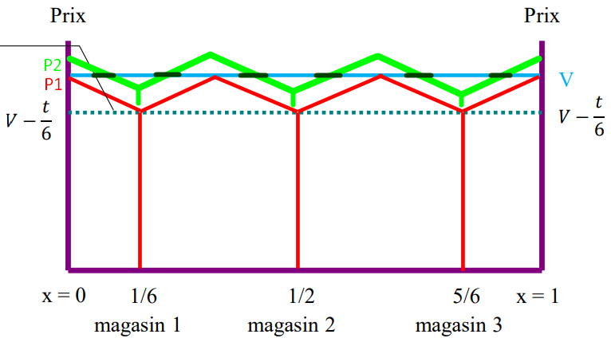
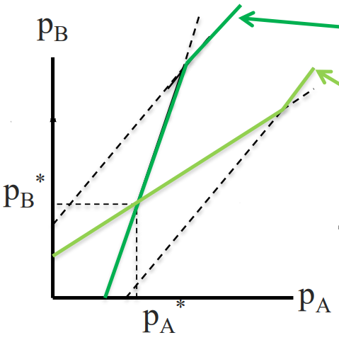

## 05 // différenciation en monopole, oligopoles, en statique

[Slides de différenciation](ressources/05_differenciation_en_monopole_oligopoles_en_st_corolleur_f._2020_21_lecture_4_diffrenciation_en_monopole_oligopoles_cadre_statique_l2_micro3_miashs.pdf)

## La différenciation

### Motivation

L’étude d’un marché **différencié** repose sur deux idées clefs :

- Ses préférences : “tout est dans la tête du consommateur !”
- Plus les biens sont considérés comme similaires entre eux (substituables),
plus la concurrence en prix sera forte entre eux.
Inversement, la différenciation «adoucira» la concurrence.

La différenciation a deux qualités, chacune avec deux modalités :

- Différenciation objective (dimensions, poids, etc) et subjective (goût, image, etc.).
- Différenciation horizontale (Coca-Cola et Pepsi) et verticale (iPhone 14 sur iPhone 10).

Par rapport à la différenciation verticale, on la trouve surtout dans les marchés des biens indivisibles, durables et dont une personne en a normalement un (voitures, téléphones). Le plus souvent, par contre, est de trouver la différenciation verticale et horizontale simultanées.

### Comment la modéliser

On peut reconnaître trois familles de modèles :

- 1ère famille de modèles, “à consommateur représentatif” : préférences symétriques, les variétés sont analysées du point de vue de leurs substituabilité
- 2ème famille de modèles, “à adresse” : les préférences portent sur les caractéristiques des biens
- 3ème famille de modèles, “à choix discrets” : le choix des individus portent sur les produits (pour un ensemble d’alternatives fini) et non sur les quantités.
    - Ce sont des modèles relâchant à des degrés divers l’hypothèse de rationalité parfaite, ou aussi des modèles d’utilité aléatoire.

### Classification des biens selon l’observabilité de sa qualité

On distingue classiquement les biens non durables vs durables (voir monopole à bien durable, et conjecture de Coase). On peut aussi classer les biens selon **l’accès à l’information** sur les caractéristiques des biens :

- Biens de recherche (*search goods*) : qualité observable
Par exemple : ordinateurs spécifiant ses informations techniques
- Biens d’expérience (*experience goods*) : qualité observable seulement après consommation
Par exemple : on ne peut évaluer la qualité d’un vin qu’au moment de le boire
- Biens de croyance (*credence goods*) : qualité non-evaluable, ni avant ni au moment de la consommation

### Différenciation et bien-être

Côté consommateurs, ils retirent un gain associé à la hausse du nombre de variétés produites ; par contre, les quantités produite sont plus fables que si les biens n’avaient été homogènes

Côté producteurs, si on part d’une situation où il y a une variété remplacé par plusieurs, ceux qui n’y participaient pas sont gagnants, et ceux qui y participaient sont perdants.

## Différenciation pour un monopole multi-produits

### Quels prix ? Un approche spatiale de la différenciation

Ce modèle tente de faire une analogie d’une caractéristique avec une rue linéaire : sur un point se trouve un modalité de la caractéristique, et plus on est loin de ce point, plus on s’éloigne de la modalité de la caractéristique. Voyons :

Une firme vend un produit homogène à prix p. Il y a des consommateurs repartis homogènement sur la rue $[0,1]$. Ils supportent un cout de transport $t$ qui croît avec l’éloignement du point de vente, et représente une mesure de la désutilité marginale liée à l’éloignement.

Maintenant, on suppose deux magasins placés sur les extrémités de la rue, $x=0$ et $x=1$, avec $p_1 < p_2$. À partir d’un magasin, plus on s’éloigne, plus le prix à payer (prix du produit + distance) augmente pour les consommateurs. **Les consommateurs achètent au magasin où leur surplus est le plus grand**. $V$ étant le prix de reserve de tous le consommateurs, on peut tracer $\bar{x}_1$, qui est le consommateur le plus à droite allant au magasin 1, et pareil avec $\bar{x}_2$ et le magasin 2. Les consommateurs entre $\bar{x}_1$ et $\bar{x}_2$ n’achètent pas, car le prix à payer est plus cher que leur reserve.

Par la suite, on suppose $p_1=p_2=p$ et $Cm_1=Cm_2=c$. La courbe de prix à payer pour les consommateurs est $p_1 + tx$, le maximum étant quand $p_1+tx=V$, leur reserve, et tel valeur de $x$ on le marque $\bar{x}_1 =\frac{V-p}{t}$, le prix à payer maximum.

S’il y a un consommateur dans la zone de chalandise de magasin 1, le magasin reçoit $\frac{V-p}{t}$ ; si il y en a deux, le magasin reçoit $2 \cdot \frac{V-p}{t}$… on généralise à $Q_1(p)= N \cdot \frac{V-p}{t}$, où $N$ le nombre de consommateurs.

Le raisonnement reste le même pour le magasin 2, à exception que la courbe de prix à payer serait $p+t(1-x_2)=V$, et on déduit la même courbe de demande. La demande totale est la somme des deux demandes : $Q(p)=Q_1(p)+Q_2(p)=2N\cdot\frac{V-p}{t}$.

Si jamais les deux prix à payer pour aller à chaque magasin s’intersectent, ça serait à la moitié du chemin $\bar{x}_1=\bar{x}_2=\frac{1}{2}$. Si, en plus, les courbes des prix à payer s’intersect dessous de la reserve V, on dit que le marché est *couvert,* car tous les consommateurs sont servis.

Pour le profits de magasins, il ne vaut pas la peine de descendre leurs prix de vente au dessous de $p$ tel que $p+t\left(\frac{1}{2}\right) = V \implies p = V - t\left(\frac{1}{2}\right)$, car ils auraient la même quantité demandée pour moins de recettes. La firme n’offre donc rien à ce point.

La demande agrégée finale est donc :

$$
Q(p)=2N\frac{V-p}{t}, \text{ où } V>p>V-\frac{t}{2}
$$

> [!note]
> Il manque le cas de coûts asymétriques : $c_1 \ne c_2$. J’ai pas du temps moi !

### Combien de variétés ?

> [!note]
> Dans le modèle précédent, on fixer maximiser le profit en fonction de $q$, étant donné que les deux magasins rivaux étaient localisés sur les extrémités de la rue. Ici, on parle d’une seule firme qui possède plusieurs établissement, et elle veut savoir comment les repartir sur la rue **hors extrémités**.
>
> On suppose, de plus, que la firme veut servir à la totalité du marché.

Cas de deux magasins : $n=2$. Les rectangles verts sont les profits de chaque magasin.

Cas de trois magasins, $n=3$.

On peut généraliser ceci à $n$ magasins :

- La meilleure manière de repartir $n$ établissement est uniformément sur l’interval $[0,1]$, sans compter les extrémités. La localité du magasin $i$ d’une totalité de $n$ magasins est donnée par le terme d’indice $i$ dans la suite de terme général $\left(\left\{  \frac{2i-1}{2n}  \right\}_{1\le i \le n}\right)$.
- La distance maximum qu’ont à parcourir les consommateurs est $\frac{1}{2n}$.
- Le prix fixé à chaque magasin, en couvrant tout le marché, est $p^*(n)=V-\frac{t}{2n}$.
- On déduit que le profit agrégé est donc $\pi^*(n)=(V-\frac{t}{2n}-c)N-nF$,
d’où le profit par magasin est $\frac{\pi^*(n)}{n}=\left(V-\frac{t}{2n}-c\right)\frac{N}{n}-F$.

#### Nombre optimal d’établissements

Pour déterminer jusqu’à quel point il est profitable de créer un établissement de plus au nombre actuel $n$, on doit résoudre l’inégalité $\pi^*(n+1)>\pi^*(n)$, ce qui conduit à $n(n+1)<\frac{tN}{2F}$, avec $F$ les coûts fixes constants, $N$ les consommateurs et $t$ le prix de transport.

#### Ne pas servir tout le marché, seulement une partie

Si jamais on considère de ne pas servir tout le marché mais juste une partie, on pourrait commencer à monter le prix à partir du prix maximum qui sert à tout le marché.

En particulier, on veut un prix à payer aux consommateurs égal à $p+tr=V$. De là, on déduit que $r=\frac{V-p}{t}$. La demande par magasin est donc $q(p)=2N\frac{V-p}{t}$, donc le profit est $\pi_P = \frac{2N(p-c)(V-p)}{t}-F$. Maximisant le profit par rapport aux prix, on obtient $p^*_P=\frac{V+c}{2}$.

Regardons maintenant un seul magasin au lieu de tous les magasins. Le magasin servira seulement une partie si $\pi_P^* > \pi_T^*$ :

$$
\pi_P^*>\pi_T^* \implies  \frac{2N(p-c)(V-p)}{t}-F>\frac{(V-\frac{t}{2n}-c)N}{n}-F

\\[08pt]

\implies V>c+\frac{t}{n} \text{ ou } \underbrace{V >p+\frac{t}{2n}}_\text{J'hésite de ça}
$$

**Doute** : la première inégalité sort de $p_T$ > $p_P$, mais cela fait pas de sens non ? Si on part d’un prix qui sert à tout le marché, forcément un prix plus pétit continue à servir le marché aussi. Je n’arrive pas à comprendre cette première inegalité donnée par le prof.

On peut aussi déduire le nombre d’établissements $n$ socialement efficace : particulièrement, si $C(N,n+1)≤C(N,n) \iff n(n+1)<\frac{tN}{4f}$.

## Cournot et Bertrand avec des biens différenciés

> [!note]
> Bilan :
>
> - La rivalité décroît avec la différenciation des biens
> - Pour des biens homogènes, prix et quantités sont plus importantes à la Cournot qu’à la
> Bertrand
> - En duopole, la solution concurrentielle est atteinte à la Bertrand normalement, supposant des bien homogènes. Cournot est meilleur pour les deux firmes.
> - Le duopole devient naturellement asymétrique pour des firmes dont la variable de choix est distincte (jouer prix vs. quantité, par exemple).
> - Il y a trois conditions pour que jouer en prix soit plus profitable que jouer en quantité :
> 1. Il est plus coûteux de changer les prix plutôt que les quantités
> 2. Les marques sont différenciées verticalement la différenciation est suffisamment grande
> 3. Pour un jeu séquentiel, le suiveur aura la même probabilité de jouer en prix ou en
> quantité, que le leader ait joué en quantité ou en prix en 1ère période

### Cournot

Le modèle de Cournot ne change presque pas. La prémisse reste la même, mais la fonction de demande pour les deux firmes reste maintenant inclut un indice de différentiation $d$. Un exemple serait la fonction de demande inverse $p_i(q_i,q_j)=a-q_i-dq_j$.

On utilise telle demande pour calculer le profit, puis pour optimiser le profit, et finalement pour trouver les $q^*$ optimaux.

### Bertrand classique, différentiation horizontale

Bertrand ne change pas trop non plus. La fonction de demande (non inverse) change à nouveau à $q_i(p_i,p_j)=a-dp_i+p_j$, où $d$ est le paramètre de différenciation :

- $d = 1$, pour des biens homogènes
- $d > 1$, pour des biens différenciés

On calcules les CPO par rapport aux quantités des deux firmes rivales, puis leurs fonction de réaction des prix, et finalement le prix sera l’intersection des deux fonctions de réactions.

**À noter que le graphique des fonction de réaction contient $p_1$ en abscisse et $p_2$ en ordonnée**, les quantités ne sont pas importantes analysant les fonction de réaction mais pour calculer les profits après.

Exemple où $a=1, d = \gamma$ et coûts marginaux constants $0<c<1$.

On en déduit que plus les biens sont différenciés, plus les prix d’équilibre diminuent.

### Bertrand, différenciation verticale

La différenciation horizontale considère deux produits qui ne sont pas entièrement comparables, comme un iPhone contre un Google Pixel. Par contre, la différenciation vertical impose une qualité stricte plus grande que l’autre, comme un iPhone 13 sur un iPhone 12.

On introduit deux termes mathématiques : $z_i$, la qualité du produit $i$ ; et $\phi_k$, la préférence de l’individu $k$. Cette préférence est positive et encadré entre deux *standards* de préférence : la préférence inférieur $\phi_L$ et la préférence supérieur $\phi_H$. L’écart entre $\phi_H-\phi_L=1$ et, pour tout individu $k$, $\phi_L<\phi_k<\phi_H$.

Avec ces contraintes, on peut maintenant établit la fonction d’utilité de $k$ pour le produit $i$ :

$$
U_{k,i}=\begin{cases}
0,\text{ si } \phi_k z_i - p_i < 0 \\
\phi_k z_i - p_i, \text{ sinon}
\end{cases}
$$

En plus, on dira que le produit 1 sera de meilleure qualité que le produit 2, donc $z_1>z_2$.

On graphique le niveau d’utilité du produit $i$, $U_i$, en fonction de $\phi$ comme suit :

On notera qu’il y a un niveau de préférence où $U_1=U_2$. Ceci sera appelé le consommateur de préférence marginale, et il est indifférent entre choisir le produit 1 et le produit 2. On pourrait calculer logiquement ce point :

$$
Um_1=Um_2 \iff \phi_m=\frac{p_1-p_2}{Z}, \text{ où } Z=z_1-z_2
$$

Les consommateurs qui ont des préférences à gauche de $\phi_m$ vont préférer d’acheter le bien de qualité inférieure. Ceux à droite de $\phi_m$ vont préférer le bien de qualité supérieure.

Les demandes que cette courbe d’utilité engendre, supposant des budgets identiques pour tous les consommateurs, sont comme suit :

$$
q_1=N(\phi_h-\phi_m)=N\left(\phi_H-\frac{p_1}{Z}+\frac{p_2}{Z}\right)=\frac{N(Z\phi_H-p_1+p_2)}{Z}

\\
\text{}
\\

q_2=N(\phi_m-\phi_L)=N\left(-\phi_L+\frac{p_1}{Z}-\frac{p_2}{Z}\right)=\frac{N(-Z\phi_L+p_1-p_2)}{Z}

\\
\text{}
\\

\text{Note : } q_i=q_i(p_i, p_j)
$$

Pour un consommateur qui préfère le bien $i$, il préférera plus de tel bien plus le prix de l’autre bien, bien $j$, soit grand ; et moins le prix du bien $i$ soit grand.

Le processus d’optimisation est le même : on calcule la CPO par rapport aux prix, puis on trouves les prix d’équilibre de chaque produit qui satisfont le système d’équations.

### Bertrand-Cournot avec différenciation

L’idée basique est que une firme 1 (Cournot) joue avec sa propre quantité en réaction au prix de la firme 2 $q_1(p_2)$, tant que l’autre firme 2 (Bertrand) joue avec son propre prix en réaction à la quantité de firme 1 $p_2(q_1)$. Puisque la firme 1 va jouer (maximiser son profit…) avec sa quantité, on va exprimer $p_1$ comme une ***fonction*** en termes de $q_1$ et $p_2$ :

$$
\begin{array}{cclr}

p_i&=&a-q_i-dq_j & \text{départ : demande adressée à firme }i

\\

q_2&=&a-p_2-dq_1 &\text{...ajuster à la firme 2, isoler }q_2 

\\
p_1&=&a-q_1-d(a-p_2-dq_1) & \text{...injection de }q_2\text{ dans }p_1

\\

p_1&=&a(1-d)-(1-d^2)q_1+dp_2 & \text{...simplification}

\end{array}

\\
\text{}
\\

\begin{array}{lr}
\begin{cases}
p_1=a(1-d)-(1-d^2)q_1+dp_2 \\
q_2=a-p_2-dq_1
\end{cases}&
\space\space\space\space\space\space\space\space\space\space
\text{nouveau système d'équations}
\end{array}
$$

Il faut noter que $d\in]0,\infty[$ est le **degré de différenciation**, où $d=0$ signifie que les produits de chaque firme sont totalement différents et, plus d augmente, plus homogènes sont les produits vendus.

[https://www.desmos.com/calculator/qspaij3o72](https://www.desmos.com/calculator/qspaij3o72)

Maintenant, avec ce nouveau système d’équations, on maximise $\pi_1$ par rapport à $q_1$ et $\pi_2$ par rapport à $p_2$. On suppose que $Cm_i = 0$, de sorte que le seul coût est le coût fixe $f_i$.

Si jamais on voudrait considérer des coûts marginaux non nuls, on pourrait voir le $p_i^*$ dans $p_iq_i$ (le revenu total) comme $(p_i-c_i)$ (le profit unitaire, profit de chaque unité vendue), donc $p_i^*q_i$ serait plutôt le revenu moyen.

$$
\begin{array}{l}

\pi_1 = \overbrace{\left[ (a(1-d)-(1-d^2)q_1+dp_2 \right]}^{p_1}q_1 - f_1

\\

\pi_2=p_2\underbrace{\left[ a-p_2-dq_1 \right]}_{q_2}-f_2

\end{array}

\\
\text{}
\\

\text{fonctions de réaction (CPO puis isoler): }

\begin{cases}
R_1: q_1(p_2)=\frac{ad-a-dp_2}{2(d^2-1)} \\
R_2 : p_2(q_1)=\frac{a-dq_1}{2}
\end{cases}

\\
\text{}
\\[10pt]

\max_{q_1} \pi_1 : q_1^*=\frac{a(d-2)}{3d^2-4} \implies p_1^*=\frac{a(-d^3+2d^2+d-2)}{3d^2-4}

\\
\text{}
\\
\max_{p_2} \pi_2:p_2^*=\frac{a(d^2+d-2)}{3d^2-4} \implies q_2^*=\frac{a(d^2+d-2)}{3d^2-4}

\\
\text{}
\\[7pt]

\implies

\pi^*_1 = \underbrace{\frac{a^2(d-2)^2(1-d^2)}{(3d^2-4)^2}}_{p_1^*q_1^*}-f_1,

\space

\pi^*_2=\underbrace{\frac{a^2(d^2+d-2)^2}{(3d^2-4)^2}}_{p_2^*q_2^*}-f_2
$$

Il y a trois choses intéressantes à notes dans ce modèle : $p_1^* > p_2^*$, $q_1^* > q_2^*$ et $p_2^* = q_2^*$. Il y a une autre observation intéressante à voir sur les profits : **ils deviennent égaux, $\pi_1 = \pi_2$ (ignorant $f_i$), quand $d=0$.**

Aussi, étudiant les deux fonctions de profit, supposant $f_1=f_2=0$ :

- $\pi_1 \ge \pi_2$, **donc c’est plus avantageux de jouer par la quantité que par le prix**.
- Quand les produits sont totalement différents, càd. $d=0$, chacun fait un monopole dans son marché.
- Quand les produits sont totalement égaux et substituables, càd. $d=1$, les profits des deux devient nuls.

On fixe $a=1$ pour simplicité de lecture du graphique.

[https://www.desmos.com/calculator/qspaij3o72](https://www.desmos.com/calculator/qspaij3o72)

## Modèles d’oligopoles à adresse

Dans le modèle d’Hotelling, on reprend une rue linéaire de longueur $\ell$ qui contient $\ell$ consommateurs (continus, pas discrètes, donc ils sont divisibles) uniformément distribués sur la rue. On suppose aussi deux firmes $i=\{1,2\}$ et que chaque consommateur a un prix de réservation $v_i$.

Leur prix total à payer pour une unité du bien vendu par i serait le prix du bien en soi plus la distance à parcourir : $p_i+tx$, avec $t$ le coût d’une unité de transport et $x$ la distance à parcourir.

### Modèle d’Hotelling : prix fixé, choix de localisation

On revient sur une rue linéaire. Pour un premier temps, on suppose deux firmes qui sont franchisés, et leur franchiseurs leur exigent à chacun de fixer leur prix à $p=0$. Un détail aussi évidant c’est que $a+b\le\ell$.

Pour la firme en $A$, elle vend à tous les consommateurs à sa gauche et à la moitié des consommateurs à sa droite qui ne sont pas capturés (à droite de…) par $B$. Donc :

$$
q_A=a+\frac{\ell-b-a}{2}=\frac{\ell-b+a}{2}
$$

La meilleure réponse de $A$ pour cette localisation de $B$ est donc de se rapprocher du centre

(capte davantage de consommateurs à sa droite, et conserve ses consommateurs à sa gauche). $B$ tiendra le même raisonnement et les deux firmes se localiseront au centre ($\frac{ℓ}{2}$).

Ici, Hotelling a observé le ***principe de différenciation minimale*** ou aussi appelée simplement ***la Loi de Hotelling*** : sur la plupart des marchés, la concurrence conduit les producteurs à réduire la différence entre leurs produits en qualité de bien, de localisation, et dans d’autres manières essentielles.

En l’absence de concurrence en prix, les deux firmes se localisent au centre dans ce modèle. Ce résultat est socialement inefficace : le meilleur résultat est quand les deux firmes se situent sur $\frac{1}{4}\ell$ et $\frac{3}{4}\ell$, respectivement. Il est intéressant à voir que ce résultat socialement optimal est calculé de la manière suivante : on determine $a$ et $b$ qui minimisent la “desutilité agrégée”, càd. la distance qu’ils doivent se déplacer, $x$.

$$
S(a,b)=\min_{a,b} \left( \int_0^\frac{a+b}{2} |x-a|dx+\int_\frac{a+b}{2}^1 |x-b|dx \right) =\frac{3}{4}(a^2+b^2)-\frac{ab}{2}-b+\frac{1}{2}

\\[5pt]

\frac{\partial S}{\partial a} = \frac{\partial S}{\partial b} = 0 \implies a^*=\frac{1}{4},\hspace{4pt} b^*=\frac{3}{4}.
$$

### Modèle d’Hotelling : localisation fixée, choix de prix

Sur une deuxième rue linéaire de longueur $\ell=35$, une firme est fixée sur $a=4$ et l’autre firme est fixé sur $b=1$., avec $Cm=0$ Elle jouent sur leur prix. Chaque consommateur consomme une baguette et supporte un prix égal au prix du bien plus le coût de transport : $p+td$.

Supposons que, en premier temps, $A$ et $B$ vont fixer le même prix : $p_A = p_B$. Le consommateur marginal est celui entre les intervalles $x$ et $y$, pour lequel le prix d’acheter en $A$ ou $B$ est le même. Tout à gauche du consommateur marginal achetera en $A$, et de même pour $B$ pour tout ceux qui sont à droite.

Ayant dit tous ça, on peux fixer deux nouveau prix pour $A$ : le prix “haux” de $A$, $p_A^h$ ; le prix “bas” de $A$, $p_A^b$.

- Le prix haut sera tel que, si $A$ le fixe, $B$ va capter le publique à droite de $A$, càd. sur l’intervale $x$. Ceci implique que si A fixe un prix plus haut que $p_A^h$ (supposant $p_B$ statique), aucune personne va acheter en $A$, donc $q_A=0$.
- Le prix bas sera tel que, si $A$ le fixe, elle va capter le publique à gauche de $B$, càd. sur l’intervalle $y$. Ceci implique que si A fixe un prix plus bas que $p_A^b$ (supposant $p_B$ statique), la firme elle va capter toute la demande, donc $q_A=\ell$.
- Tout autre prix entre $p_A^b$ et $p_A^h$ est un prix intermédiaire. La quantité est un fonction continue de prix $p_A$. Plus le prix $p_A$ augmente, moins sera la part du marché central ($x+y$) capté par $A$.

Ici, en particulier, on veut déterminer la part du marché central qui achetéra en $A$, càd $x$. On sait que le marché central est $x+y=\ell-a-b$, d’où on déduit $y=\ell-a-b-x$.

On utilise cette réecriture de y pour l’injecter dans l’équation du consommateur marginal/indifférent : $p_A+tx=p_B+t(\ell-a-b-x)$, d’où on déduit finalement la part de marché central de $A$ :  $x=\frac{1}{2}\left(\frac{p_B-p_A}{t}+\ell-a-b\right)$.

La fonction de demande de $A$ (et analogiquement pour $B$) serait donc comme suit :

$$
q_A(p_A,p_B)=\begin{cases}
\ell, \text{ si } p_A<p_A^b(p_B)
\\
\frac{1}{2}\left(\ell+a-b+\frac{p_B-p_A}{t}\right), \text{ si } p_A^b(p_B) \le p_A \le p_A^h(p_B)
\\
0, \text{ si } p_A^h(p_B) < p_A
\end{cases}
$$

Le profit de $A$ (et analogiquement pour $B$) serait donc :

$$
\pi_A(p_A,p_B)=
\begin{cases}
p_A \cdot \ell, \text{ si } p_A<p_A^b(p_B)
\\
p_A \cdot \frac{1}{2}\left(\ell+a-b+\frac{p_B-p_A}{t}\right), \text{ si } p_A^b(p_B) \le p_A \le p_A^h(p_B)
\\
0, \text{ si } p_A^h(p_B) < p_A
\end{cases}
$$

A et B vont chacun chercher à optimiser leurs profit. Donc :

$$
\frac{\partial \pi_A}{\partial p_A}=0 \iff p_A(p_B)=\frac{1}{2}\left[p_B+t(\ell-b+a)\right]

\\[7pt]

\frac{\partial \pi_B}{\partial p_B}=0 \iff p_B(p_A)=\frac{1}{2}\left[p_A+t(\ell-a+b)\right]
$$

Si on graphique ces fonctions de réactions, on obtient le graphique ci-dessous :

Finalement, les paramètres optimaux d’équilibre de Nash sont les suivants :

$$
p_A^*=t\left(\ell+\frac{a-b}{3}\right), \hspace{4pt}\pi_A^*=\frac{1}{2t}(p_A^*)^2

\\[5pt]

p_B^*=t\left(\ell+\frac{b-a}{3}\right), \hspace{4pt}\pi_B^*=\frac{1}{2t}(p_B^*)^2
$$

Comme observation finale : le profit de A et B augmentent avec $a$ et $b$, càd. en s’éloignant du bord. Ceci étant dit, si les firmes sont du départ suffisamment éloignées, il se peut que si une firme tente de capter le publique de l’autre, la perte de revenu de sa partie déjà captée sera plus grande que le gain de revenu de la partie nouvelle captée, donc ce n’est pas convenient, elle préféreront ne pas capter l’intégralité de $\ell$.

Si $A$ et $B$ sont proches, les firmes chercheront à capturer l’intégralité de $ℓ$, car réduire le prix un peu cause une augmentation de revenu de la partie captée plus grande que la perte de revenu de leur parties déjà captées.

### Modèle d’Hotelling : différenciation horizontale et verticale simultanément

Hotelling de base modèle la différenciation horizontale. On pourrait aussi considérer le différenciation verticale. Soit deux firmes sur les bords d’une rue et des consommateurs uniformes sur $\ell$. La différence c’est que le bien de firme 1 est supérieur au bien de firme 2, donc leurs prix de reserves aussi : $r_1 > r_2$.

Pour continuer, on va écrire quelques équations utiles :

- Surplus de consommateur : $r_1-tx-p_1$ pour $x$ achetant en $1$, et $r_2-t(1-x)-p_2$ pour $x$ achetant en $2$
- Consommateur indifférent : on égalise l’utilité/surplus mentionnés en-dessus. Donc, $\hat{x}=\frac{1}{2}+\frac{(r_1-r_2)-(p_1-p_2)}{2t}$.
- Quantités demandées : $q^D_1(p_1,p_2)=\frac{1}{2}+\frac{(r_1-r_2)-(p_1-p_2)}{2t}$ et $q^D_2(p_1,p_2)=\frac{1}{2}-\frac{(r_1-r_2)-(p_1-p_2)}{2t}$.

On continue à faire un peu de même : on calcule le profit, on optimise avec CPO (maximisation par rapport au prix), on écrit les fonctions de réactions et finalement on cherche l’équilibre de Nash.

Par contre, la conclusion intéressante ici c’est de calculer quand est-ce que la quantité demande de bien 1 est supérieure à celle demandée de bien 2 :

$$
\begin{array}{rl}
D_1(p_1^*,p_2^*)>D_2(p_1^*,p_2^*) &\iff \frac{(r_1-r_2)-(c_1-c_2)}{6t}>\frac{(r_2-r_1)-(c_2-c_1)}{6t}
\\
&\iff r_1-r_2 > c_1-c_2
\end{array}
$$

La part de marché de la firme 1 est plus grande quand l’avantage en qualité (càd. la prime que les consommateur veulent payer pour obtenir le bien 1 sur le bien 2, ou simplement la différences des reserves) est plus grande que la différences de coûts.

### Version de Lancaster

Lancaster suggère plutôt une différenciation horizontale et verticale pas avec un modèle, mais avec un vecteur : une liste de caractéristiques. Pour deux types des clients A et B, on peut voir leur prix de reserves de chaque unité d’une certaine caractéristique.

Chaque chiffre représente des milles. Par exemple, un client de type $A$ a une reserve de $(0.5)(\$1000)$ pour une unité d’air (qualité de la clime de la voiture), et $(1)(\$1000)$ pour une unité de taille de voiture. Bien sûr, il a aussi rationnellement un prix de reserve de $-\$1000$ pour chaque $\$1000$ de valeur de la voiture.

On voit qu’un CEO est prêt pour payer plus pour la plupart de caractéristiques d’une voiture. Si on calcule ceci avec deux voitures, GEO et Porsche, comme des vecteurs, on obtient alors :

Pour le consommateur $A$ (étudiant), ça ne vaut même pas la peine d’acheter un Porsche, tant que le GEO l’apporte une utilité positive nette. Pour le consommateur $B$ (CEO), les deux voitures valent la peine, mais surtout le Porsche sur le GEO.
