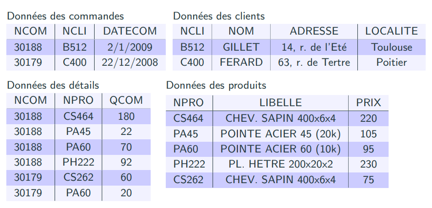

## 01 // concepts des bases de données relationnelles

[Slides d’intro au BDs](ressources/01_concepts_des_bases_de_donnees_relationnelles_01.introduction.pdf)

## Les bases de données et SGBD

### Premiers concepts

Une base de données est une collection de données cohérentes entre elles, généralement de taille importante. Elle modélise des informations du monde réel, comme une compte bancaire, un abonnement à un club de sport, etc.

Un système de gestion de bases de données (SGBD) est un logiciel destiné au stockage et à la manipulation de bases de données. Tous les traitements de données se font obligatoirement par son intermédiaire.

## Pourquoi un SGBD ?

### Indépendance des données

### Intégrité et unicité des données

Les données contenues dans une base de données intègrent et forment un tout cohérent répondant à des contraintes d’intégrités vérifiées à tout moment par le SGBD. Par exemple, le SGBD vérifiera pour une base de données que les âges des électeurs sont supérieures à 18 ans, sinon on ne peut pas intégrer la personne à la base de données !

L’unicité est simplement le fait que la donnée n’est pas dupliquée et, si elle l’est, comment discriminer la bonne donnée. En plus, une SGBD permet de changer une donnée dans tous les endroits où elle est référenciée.

### Confidentialité et sûreté des traitements

Le SGBD permet aussi de gérer des autorisations d’accès à tout ou une partie de la base de données aux différentes personnes de l'organisation. En plus, elle permet l’accès simultanée à ces données sans que leur cohérence soit dégradé. Chaque utilisateur à l’impression d’être le seul à travailler sur la base de données.

Finalement, le SGBD remet la base de données dans l’état cohérent le plus récent après une panne. Cela se fait gardant un historique de la base de chaque action élémentaire sur la base.

## Description des données

On expliquera ce modèle avec un exemple d’un contexte bancaire.

### Schéma externe : la vue individuelle

Le schéma externe est la structure des données telle que perçue par chaque groupe de travail de l’organisation. **Tous les utilisateurs n’ont pas à connaître le schéma logique dans son ensemble,** pour des raisons de confidentialité ou simplement car c’est inutile pour l’utilisateur.

Par exemple, un client dans une banque aurait accès à sa compte bancaire, qui montrerait des données comme son identité, le total de ses crédits et débits, etc.

### Schéma conceptuel : la vue collective, schéma logique

C’est la structure et sémantique des données d’une organisation sans souci d’implémentation. C’est une forme de décrire les données à l’intérieur et comment elles sont relationnées. Seul l’administrateur de la base de données peut définir ce niveau, et normalement il travaille là-dessus. Elle permet une vue global des données et est indépendante de hardware et software.

Dans l’exemple, las base de données de la banque devrait stocker les comptes de tous les clients.

### Schéma interne : schéma physique

C’est simplement la structure de stockage de données en machine. Par exemple, le type de fichier au niveau de software, mais aussi une description du disque physique au niveau de hardware.

## Modèle de description de données

Il s’agit d’un ensemble de concepts et de règles de composition de ces concepts permettant de décrire des données. Il peut être supporté par un langage de description de données (LDD) qui décrit les d’une base de données d’une manière assimilable par une machine. Par exemple :

### Un exemple pratique : commande de produit

On fera un premier essai pour passer du document à des tables. On divises les infos en commande, client et détails comme suit :

On sépare ce document de commande dans 3 groupes de données : commande, client et détails.

Le premier problème est que il y a de données qui sont calculées à partir d’autres données, donc c’est gaspillant de les garder comme des données (le sous-total dans les détails et le total dans la commande).

Le deuxième problème est plus important est qu’on ne peut pas reconstruire la commande initiale suite à ségrégation de données. Comment on sait que les données de clients sont liés aux donnés de commande, par exemple ? Les données ne sont pas ***liées***. On peut donc ajouter une “marque” dans chaque ensemble de données pour indiquer à qui sont liées comme suit, même si chaque ensemble sera stocké ailleurs :

Dans cette version, on voit que le tableau commande et le tableau client sont liés par NCLI comme donnée commune, et le tableau commande est lié à travers NCOM avec le tableau détails. Le tableaux détails et client ne sont pas liés directement, mais le tableau commandes sert de pont entre les deux.

Finalement, une autre amélioration est que, dans le tableau détails, il existent quelques libellés et prix qui sont répétés. On pourrait donc faire un autre tableau, un tableau produits, pour stocker ces données et supprimer les redondances :

### Premières conclusions

#### Par rapport aux tables, lignes et colonnes…

- Une base de données est constituée d’un **ensemble de tables**
- Chaque table contient les données relatives à des entités de même nature
- Chaque ligne d’une table reprend les données relatives a une entité : objet, individu, événement, etc., bref, un concept du monde réel. Elle est une suite de valeurs d’un type determiné, e.g., integer, string, etc. Les lignes d’une table ont toutes la même structure.
- Chaque colonne d’une table décrit une propriété commune des entités.
- Les lignes d’une table sont distinctes.

#### Par rapport aux identifiants…

- **Toutes les colonnes ne jouent pas le même rôle dans une table**. Le jeux de colonnes dont les valeurs sont **uniques** constitue un *identifiant* ou clé primaire de la table.
    - Un identifiant peut être composé de plusieurs colonnes.
    (Le deuxième tableau en est un exemple. On peut le voir comme un couple unique de données)
    - Rien n’interdit d’imposer plus d’un identifiant par table.

Notons que le colonnes rouges ont de valeurs uniques, tant que les autres ont de valeurs répétées. On sait donc de quelle ligne on parle quand on connaît son identifiant.

- Pour qu’une colonne soit un identifiant, toutes ses valeurs doivent être renseignées (on ne peut pas avoir une entré avec une valeur vide dans une colonne).
    - Ce n’est pas nécessaire pour les identifiants sécondaires.
- Un identifiant dont on ne peut retirer aucun élément sans qu’il perde sa qualité d’identifiant est appelé *identifiant minimal*. Il est évident qu’il est important de définir que des identifiants minimaux.

#### Par rapport aux clés étrangères…

- Une colonne, ou un ensemble de colonnes, dont le rôle est de référencer
une ligne dans une autre table (dite table cible) est dénommée clé étrangère
(foreign key).
- Notons que SEULEMENT NUMF et NUMP sont des identifiants (colonne à valeurs uniques) dans le tableaux Fournisseur et Piece, et **pas dans le tableau Offre**.
- Donc, une clé étrangère n’as pas à être un identifiant de l’un des tableaux (particulièrement pour le tableau référenceur).
- Finalement, une clé étrangère (colonnes vertes ci-dessous) cible un identifiant appelé “identifiant cible” (colonnes rouges ci-dessous). La conséquence logique est que les données dans la clé étrangère doivent être un sous-ensemble de l’identifiant logique, ce dernier s’appelle “***contrainte référentielle***”.

Particulièrement, les clés étrangères sont, dans le tableau Offre, NUMF (ciblant table Fournisseur) et NUMP (ciblant table Pièce). Le tableau offre est le tableau qui sert de pont ou qui connecte lest autres deux.

#### Par rapport au schéma et contenu des données…

- Il est nécessaire d’avoir un langage pour décrire l’ensemble de données et l’interroguer.
- On évite de stocker les informations qui peuvent être calculées.
- On ne conserve pas dans une même table des informations relatives á plusieurs entités.
- La version de la base de données à un moment précis s’appelle une *instance* de la base.

### Le phénomène de redondance interne

Voyons un nouveau exemple de base de données :

**Problème**. Lorsqu’un livre existe en plusieurs exemplaires, les informations (TITRE, AUTEUR, ISBN) sont dupliquées. Cette situation viole le principe fondateur des bases de données : **tout fait pertinent du domaine d’application doit être enregistré une et une seule fois**.

Évidemment, il est inconvénient d’avoir de la redondance dans la base, car elle occupe un espace excessif et inutile et, et plus, faire des modifications à la base deviens innécessairement plus coûteux.

Dans ce cas, on voit que les données dans ISBN déterminent le titre et l’auteur. C’est-à-dire, on peut déterminer un titre et auteur à partir d’un ISBN donnée, mais pas le contraire. Ceci s’appelle une dépendance fonctionnelle, et elle est à éviter le plus possible dans une même table.

La base de données idéelle donc serait la suivante :

## La normalisation

### Décomposition de relations/tableaux

C’est le processus de définir des règles pour ***décomposer* les relations** (tables) tout en préservant les DF sans perdre d’informations afin de représenter les objets et les associations canoniques du monde réel. Le but c’est d’éviter les anomalies de mises à jour et les réponses erronées.

Le décomposition d’une relation ou table est le remplacement d’une relation $R$ par un ensemble de relations $\{R_1, \dots, R_n \}$ tel que :

- Les attributs de $R$ sont équivalents à l’union de tous les attributs des $R_i$
- $R_i$ est obtenu à partir de $R$ par projection (extraction) sur les attributs de $R_i$

En plus, on peut parler d’une décomposition sans perte, qui est définie comme telle que préserve les dépendances fonctionnelles. Elle nous permet de retrouver exactement les infos de départ.

Étudions l’exemple qui suit :

La relation est le pilot (ensemble de attributs) et les attributs sont les colonnes ID (clé), NOM et AVIONS. On peut la représenter aussi comme PILOT (ID, NOM, AVIONS).

### Première forme normale

Une relation est de première forme normale ssi. :

- Elle admet une clé/identifiant
- Tous ses attributs contiennent une valeur atomique (la valeur n’est pas un ensemble de plusieurs valeurs).

**Exemple**. La table en-dessus n’est pas en première forme normale, car malgré qu’elle possède une clé, l’attribut AVIONS n’est pas atomique.

### Deuxième forme normale

Une relation est en deuxième forme normale ssi. :

- Elle est un première forme normale
- Tout attribut non clé est determiné par *toute* la clé et ne pas seulement une partie d’elle.

> [!note]
> **Note pratique**. Si une table a une une clé simple (càd. d’un seul attribut), elle est automatiquement en 2ème forme normale. Le problème arrive quand dans une seule table il y a une clé composée de deux ou plus attributs.

**Exemple**. Imaginons une table PILOT (ID, NOM, LICENCE, DATE_OBTENTION).

Elle ne serait pas en 2ème forme normale car le nom (attribut non-clé) est seulement déterminé par l’ID. De même, la date d’obtention de la licence est seulement déterminée par la licence elle-même.

Donc, on décomposerait cette relation dans deux autres relations :

- PILOT (ID, NOM, LICENCE)
- LICENCE_PILOT (LICENCE, DATE_OBTENTION)

Comme ça, chaque attribut non clé de chaque tableau est determiné par “toute” la clé (est la clé consiste d’un seul attribut).

### Troisième forme normale

Une relation est de troisième forme normale ssi. :

- Elle est de deuxième forme normale
- Tout attribut non clé dépend ou est determiné seulement par la clé (pas d’autres attributs non clé). Aussi formulée comme chaque attribut non clé est directement determiné par une clé et non pas indirectement par un attribut non clé.

**Exemple**. Imaginons une table AVION (ID, CONSTRUCTEUR, TYPE, PUISSANCE, AUTONOMIE).

Dans cet exemple, PUISSANCE et AUTONOMIE sont determinés par la clé ID, mais aussi par TYPE. Donc, on séparerait la table en deux comme suit :

- AVION (ID, CONSTRUCTEUR, TYPE)
- MODÈLE (TYPE, PUISSANCE, AUTONOMIE)

### Pourquoi on s’arrête dans la 3FN ?

La troisième forme normale a des caractéristiques souhaitables :

- Enlève les redondances dues aux dépendances transitives (càd. déterminations indirectes)
- Permet de ne pas perdre d’information
- Permet de ne pas perdre des dépendances

La troisième forme normale est la plus utilisée du fait de son équilibre entre redondance et performance. **Un modèle relationnel doit être de troisième forme normale**.

Cependant pour certains systèmes (surtout distribués), lorsque la redondance n’est pas un problème, une *dénormalisation* est effectuée pour augmenter les performances.

Finalement, les quatrièmes, cinquièmes et sixièmes formes normales existent aussi et évitent principalement la redondance d’information, elles sont donc plus précises. Cela dit, la troisième forme normale est suffisante et on évite les suivantes, car les projections et les jointures sont coûteuses pour le système, ainsi une trop forte normalisation diminue fortement les performances.

### Algorithme pour la 3FN

On suppose un ensemble d’attributs séparés, càd. qui ne forment pas encore une table ou relation.

1. Choisir un attribut $X$ qui n’est le but d’aucune dépendance fonctionnelle
2. Construire une relation dont $X$ est la clé et qui comporte tous les attributs qui sont déterminés fonctionnellement par $X$
3. Renouveler cette opération pour toutes les dépendances complexes auxquelles l’attribut $X$ participe
4. Supprimer toutes les dépendances qui ont été prises en compte, ainsi que tous les attributs figurant dans ces dépendances et qui ne sont eux-mêmes sources d’aucune nouvelle dépendance (attributs isolés).
