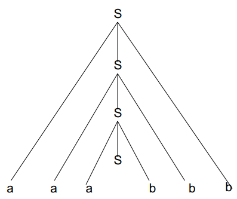

# 04 // grammaires

[Slides du chapitre 4](ressources/04_grammaires_chapitre_4_compressed.pdf)

# Les grammaires

## Types de grammaires

On s’intéresse à deux processus : générer des mots à partir d’un langage, et dire si un mot fait partie ou non d’un langage. Pour ces deux tâches, ils existent deux grammaires formelles :

- Pour **générer** des mots, les grammaires génératives sont des ensembles de règles pour la générations de chaînes d’un langage. Elle décrit comment écrire l’ensemble de chaînes.
- Pour **vérifier l’appartenance** d’un mot, les grammaires analytiques sont des ensembles des règles pour déterminer si ces chaînes appartiennent au langage. Elle décrit comment reconnaître les chaînes membres d’un langage.

Une grammaire formelle (ou simplement grammaire) est une description précise d’un langage formel (càd. d’un ensemble de mots). Dans ce cours, on s’intérèsse plutôt aux grammaires génératives.

# Les grammaires descriptives

## Comment elles marchent

La description des règles pour générer une chaîne à partir d’un langage se fait comme suit :

1. Commencer par une chaîne constituée seulement d’un symbole de départ, qui ne doit pas forcément être un symbole membre du langage
2. Appliquer successivement les règles (n'importe quel nombre de fois, dans n'importe quel ordre) pour réécrire cette chaîne, jusqu’à ce que la chaîne finale ne contiennent que de symboles membres du langages.

Le langage est constitué de toutes les chaînes qui peuvent être générées de cette manière. Toute séquence particulière de choix de règles appliquées pendant ce processus donne naissance à une chaîne particulière dans le langage. S’il y a plusieurs manières différentes de générer une seule chaîne, alors la grammaire est dite “ambiguë”.

## Exemple

Supposons l'alphabet contenant les symboles a et b, un symbole de départ S et les règles suivantes :

1. Remplacer $S$ par $aSb$.
2. Remplacer $S$ par $ba$.

Générons une chaîne à partir de ces règles.
On commence avec “S” et on choisit un règle à lui appliquer.

- $R_1(S) = aSb$.
- $R_1(aSb) = aaSbb$
- $R_2(aaSbb) = aababb$.

On s’arrête là, car tous les symboles font partie de l’alphabet.

Finalement, le langage de la grammaire est l’ensemble de toutes les chaînes qui peuvent être générées en utilisant ce processus. Donc $\{ba, abab, aababb, aaababbb, \dots \}$.

## Définition mathématique d’une grammaire

Formellement, on définit une grammaire comme un tuple de quatre éléments :

$$
G=\{V_N,V_T,S,R\}, \space V_N \cap V_T=\empty
$$

- $V_N$ : vocabulaire non terminal,
càd. l’ensembles de symboles qui ne font pas partie de l’alphabet.
- $V_T$ : vocabulaire terminal, ou simplement l’alphabet.
- $S \in V_N$ : symbole axiome, ou symbole de départ.
**Le symbole de départ ne peut pas être la chaîne vide !**
- $R$ : règles de production ou de réécriture d’une chaîne.

Reprenant l’exemple passé, la grammaire $G$ serait telle que :
$V_N=\{S\}$, $V_T=\{a,b\}$, $S = S$, et $R=\{R1 : S \mapsto aSb, R2 : S \mapsto ba\}$.

Intuitivement, un mot $w\in V_T^*$ est engendré par une grammaire si on peut l’obtenir au bout d’un certain nombre fini de réécritures à partir du symbole axiome.

## Définition mathématique d’une règle

Une règle c’est juste une fonction qui prend une chaîne (hors la chaîne vide) et renvoie une autre chaîne (ici la chaîne vide est possible).

$$
\varphi=(V_N\cup V_T)^*\setminus\{\varepsilon\}, \psi = (V_N\cup V_T) \\
R: \varphi \mapsto \psi
$$

Il faut noter que la chaîne de gauche, qui appartient à $\varphi$, contient au moins un symbole non-terminal (ce qui permet de continuer à la réécrire), ce qui n’est pas le cas d’un chaîne dans $\psi$.

## Dérivations

Une dérivation est juste le fait de convertir une chaîne appliquant des règles $n$ fois.

- Si $n=1$, on parle d’une dérivation immédiate, laquelle on note $\Rightarrow$.
- Si $n ≥ 0$, on parle d’une dérivation tout court, laquelle on note $\Rightarrow^*$.
(ce cas ici contient le cas de dérivation immédiate, mais aussi des dérivations “éventuelles”).

Notons que la dérivation tout court contient le cas où on applique une règle “zéro” fois, càd. où on n’applique pas la règle. On n’est pas contraints d’appliquer toujours la même règle.

La dérivation tout courte est la fermeture réflexive et transitive de la dérivation immédiate.

Finalement, avec les dérivations on peut définir un langage engendré d’une grammaire.

$$
L(G)=\{w\in V_t^* : S \Rightarrow^*w\}
$$

# Hiérarchie de Chomsky

## Définition

Noam Chomsky a d'abord formalisé les grammaires génératives en 1956. Il les a classifiées en quatre types (connu maintenant comme la hiérarchie de Chomsky). La différence c’est que ces quatre types de grammaire ont des règles de production de plus en plus strictes et peuvent exprimer de moins en moins de langages formels.

## Type 0

Les grammaires de type 0 sont appelées aussi les grammaires non-restreintes, et incluent toutes les grammaires formelles. **Il n’y a pas de restriction sur les côtés gauche et droit des règles de production de la grammaire**. Elles génèrent exactement tous les langages qui peuvent être reconnus par une machine de Turing.

## Type 1

Les grammaires de type 1 sont appelées “grammaires sensibles au contexte”, qui génèrent des langages sensibles au contexte. Leurs règles sont souvent de la forme suivante :

$$
\alpha A\beta \mapsto \alpha \gamma \beta
$$

Où $A$ est forcément non terminal et $\alpha$, $\beta$ et $\gamma$ des chaînes terminaux et non-terminaux. $\alpha$ et $\beta$ peuvent être la chaîne vide, mais $\gamma$ doit être forcément non-vide. **Comme note, la règle $S \mapsto \varepsilon$ est permise si $S$ n’apparaît sur le côté droit d’aucune règle**.

Les langages sont reconnus par un automate borné linéaire (une machine de Turing non-déterministe dont la bande – quantité de mémoire nécessaire pour le calcul – est bornée par le produit de la longueur du flux d’entrée par une constante).

### Exemple

Supposons $V_N = \{S,B,C\}$, $V_T = \{a,b,c\}$ et les règles de grammaires sont comme suivent :

1. $S \mapsto aSBC$
2. $S \mapsto abC$
3. $CB \mapsto CBC$ (type 1 : $\alpha=C$, $A=B$ et $\gamma=BC$)
4. $bB \mapsto bb$
5. $bC \mapsto bc$
6. $cC \mapsto cc$

**Note pratique** : la grammaire est de type 1 car dans toutes ses règles la partie gauche est de longueur inférieure ou égale à la partie droite.

## Type 2

Les grammaires de type 2 sont appelées les grammaires hors contexte, car elle génèrent un langage sans contexte. Leurs règles sont souvent de la forme suivante :

$$
A \mapsto \gamma
$$

Où $A$ est non-terminal et $\gamma$ est terminal ou non-terminal. Ces langages sont reconnus par un automate à pile (*pushdown automaton* en anglais) non-déterministe.

**Note** : les langages hors contexte sont la base théorique pour la syntaxe de la plupart des langages de programmation.

### Exemple

Supposons $V_N=\{S\}$, $V_T=\{a,b\}$ et les règles de production sont comme suit :

1. $S \mapsto aSb$
2. $S \mapsto ab$

**Note pratique** : une grammaire est dite de type 2, (hors-contexte) si et seulement si elle est de type 1 et si, pour toute règle, la partie gauche est réduite à un seul symbole non-terminal.

## Type 3

Les grammaires de type 3 sont appelées grammaires régulières, car elles génèrent des langages réguliers. Leurs règles sont souvent de la forme suivante :

$$
A \mapsto \alpha S \text{ ou } A \mapsto S \alpha
$$

Où A est non terminal, et le coté droite est constitué de forcément un terminal $\alpha$ potentiellement suivi ou précédé d’un non terminal $S$ (mais pas le deux !). La règle $S \mapsto \varepsilon$ est aussi ici permise si $S$ n’apparaît pas à droite d’une règle.

Ces langages peuvent être reconnus par un automate à états finis.

### Exemple

- $S \Rightarrow aS$
- $S \Rightarrow aA$
- $A \Rightarrow bA$
- $A \Rightarrow b$

## Règles étendues

Une note importante sur les type 1, 2 et 3 c’est **qu’elles ne permettent pas d’engendrer le mot vide**. Les langages qu’elle engendrent ne contiennent donc pas le mot vide.

Cela dit, on peut définir les grammaires de type étendus 1, 2 et 3 comment les grammaires de types respectifs 1, 2, 3 auxquelles on rajoute la possibilité de règles ayant $\varepsilon$ en partie droite.

# Grammaire et définition récursive

## Langage des Structures de Parenthèses Equilibrées (SPE)

Un langage est un langage SPE **si et seulement s’il** est un des trois prochains :

- Base : $\varepsilon$
- Schéma d’induction :
    - Si $A$ est SPE, donc $(A)$ est SPE.
    - Si $A$ et $B$ sont SPE, donc $AB$ est SPE.

## Dérivations gauches et droites

Etant donné une grammaire hors-contexte (type 2) il peut exister plusieurs manières de réécrire ses non-terminaux pour arriver précisément à la même chaîne. Pour illustrer, prenons un exemple où $V_N = \{S,A,B\}, V_T=\{a,b,c\}$, et les règles de dérivation sont comme suit :

1. $S \Rightarrow aABb$
2. $A \Rightarrow bAb$
3. $A \Rightarrow c$
4. $B \Rightarrow aB$
5. $B \Rightarrow b$

Si on prend la chaîne de départ $S$ et on applique une règle toujours sur le non-terminal le plus à gauche, on obtient ce qui s’appelle une **dérivation *gauche***. C’est analogiquement le même pour la **dérivation *droite***. Notons que dans ce cas, on peut arriver à une même chaîne :

$$
\text{D. gauche : } S \Rightarrow_1 aABb \Rightarrow_2 abAbBb \Rightarrow_3 abcbBb \Rightarrow_4 abcbaBb \Rightarrow_5 abcbabb \\
\text{D. droite : } S \Rightarrow_1 aABc \Rightarrow_4 aAaBb \Rightarrow_5 aAabb \Rightarrow_2 abAbabb \Rightarrow_3 abcbabb
$$

## Arbre de dérivation

Les dérivations dans les grammaires génératives peuvent être représentées par des arbres de dérivation. Reprenant l’exemple passé, on peut construire un arbre :

La dérivation gauche correspond à la construction de l'arbre par la branche de gauche en premier, est c’est analogiquement le même pour la dérivation droite. Cependant, les deux dérivations aboutissent exactement au même arbre, **donc l'ordre d'application des règles de réécriture n’affecte pas l'ensemble des chaînes générées**.

Pour une grammaire hors-contexte $G$ et un mot engendré $w\in V_T^*$, il existe un arbre tel que : 

- $S$ est la racine
- $N$ a pour descendants immédiats $N_1, \dots, N_k \iff (N \mapsto N_1\dots N_k)$ est une règle
- La concaténation des feuilles est $w$.

**Théorème**. Pour tout $w\in L(G) \iff$ il existe un arbre de dérivation $A$ pour $w$. 

### Exemples

Pour un premier exemple, prenons comme règles : $S \Rightarrow_1 aSb, S \Rightarrow_2 \varepsilon$. Donc :

Pour un deuxième exemple, considérons une grammaire pour de expressions arithmétiques additives sous ces règles : $E \Rightarrow_1 V, E \Rightarrow_2 E+V, V \Rightarrow_3 a|b|c$. $E$ est le départ. Donc :

Un arbre de dérivation ***complet*** est un arbre dont la racine est étiquetée avec le symbole de départ de la grammaire et toutes les feuilles ne sont étiquetées que par les symboles terminaux (il peut avoir des terminaux répétés). L’arbre de droite est **complet**, par contre celui de gauche non.

Les arbres complets sont importants, car leurs feuilles lues de gauche à droite engendrent des mots de la grammaire. L’arbre de gauche n’engendre pas un mot de la grammaire, car le symbole $E$ n’est pas terminal.

En plus, notons que **$E$ est un symbol récursif**. Un symbole récursif est un symbole non terminal tel que il existe un règle qui envoie ce symbole à une chaîne qui le contient. On pourrait commencer de $E \Rightarrow_2 E+V \Rightarrow_2 E+V+V \Rightarrow_2 E+V+V+V\dots$ et donc on engendre un langage infini.

### Structure en constituants

Si on prend un sous-arbre d’un arbre $A$ et on concatène ses feuilles, on obtient un constituant. En particulier, une sous-chaîne est un constituant de type $X$ si on peut l’engendrer en concaténant ***toutes*** (pas seulement quelques unes) les feuilles d’un arbre dont la racine est $X$.

De l’arbre qui engendre de la grammaire $G$ la phrase $P$ (”Le garçon qui regarde le chat boit le lait”), on peut sélectionner le sous-arbre $SV$ qui engendre la sous-phrase “regarde le chat”.

On dit donc que sous-expression/sous-phrase “regarde le chat” est un constituant de type $SV$ de la expression/phrase $P$. “garçon qui regarde le chat” est un constituant de type $N^\prime$. Par contre, juste “garçon qui regarde” n’est pas un constituant, car il n’existe pas un nœud tel que concaténant ***toutes*** ses feuilles on obtient ***exactement*** telle phrase et rien de plus.

### Ambiguïté syntaxique

Certaines grammaires permettent que plusieurs arbres soient construits pour la même chaîne. Telles chaînes sont dites ambiguës par rapport à la grammaire.

Par exemple, prenons une grammaire avec ces règles : $S \Rightarrow_1 aBc, S \Rightarrow_2 abC, B \Rightarrow_3 b, C \Rightarrow_4 c$. Cette grammaire permet deux arbres qui engendrent la chaîne $abc$ :

Dans de tels cas, des règles différentes sont utilisées dans les deux dérivations. Ceci est différent dans le cas de dérivations gauche et droite, où on se donne des règles avec une quantité pour chaque à les appliquer, et on change juste l’ordre d’application.

En contraste, dans cette ambiguïté, on ne choisit pas toujours les mêmes règles ou le même nombre de fois à les appliquer. 

$$
\text{D.G. : } S \Rightarrow_1 aABb \Rightarrow_2 abAbBb \Rightarrow_3 abcbBb \Rightarrow_4 abcbaBb \Rightarrow_5 abcbabb \\
\text{D.D. : } S \Rightarrow_1 aABc \Rightarrow_4 aAaBb \Rightarrow_5 aAabb \Rightarrow_2 abAbabb \Rightarrow_3 abcbabb
\\
\text{On choisit les mêmes règles et le même nombre d'appl., on change l'ordre.}
$$

$$
\text{D. \#}1 : S \Rightarrow_1 aBc \Rightarrow_3 abc \\
\text{D. \#}2 : S \Rightarrow_2 abC \Rightarrow_4 abc
\\
\text{On ne choisit pas les mêmes règles.}
$$

- Un mot $w \in L(G)$ est dit ambigu  $\iff w$ admet plus d’un arbre de dérivation.
- Une grammaire $G$ est dite ambiguë $\iff$ elle engendre des mots ambigus.
- Un langage $L$ est dit ambigu $\iff L$ n’admet que des grammaires ambiguës.

Le problème d'ambigüité est parfois résolu par **l'utilisation de priorités entre les règles** à utiliser dans une dérivation quand il y a un choix. Cependant, on résout le problème de manière plus propre en trouvant une autre grammaire qui génère le même langage, mais qui n'est pas ambiguë.