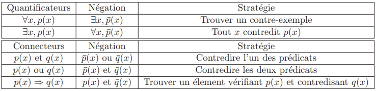

## 02 // logique

## Propositions

[Slides de propositions](ressources/02_logique_slides_proposition_minfo_annote_final.pdf)

### Les bases

Une proposition est un énoncé qui est soit vrai, soit faux. On appelle aussi une proposition vraie comme un proposition avec une valeur de vérité égal à $1$, et fausse avec une valeur de vérité $0$.

Un prédicat est un énoncé qui contient une ou plusieurs variables mais qui n’as pas encore une valeur de vérité. Il attend qui cette variable prenne une valeur pour acquérir une valeur de vérité. Par exemple :

- Vingt ascenseur numérotés de $1$ à $20$, le $\#5$ est un panne. L’ascenseur x est en panne aura une valeur vraie si $x$ est $\#5$ et fausse sinon.
- Tout simplement $x+7=12$ sera vraie si $x=5$ et fausse sinon. Notons que “$x+7=12$” par lui-même n’as pas de valeur de vérité, on attends que $x$ prenne un valeur.

Un atome ou proposition atomique est une proposition ou un prédicat élémentaire qui ne dépend pas de la valeur d’autre proposition ou prédicat. Par exemple : “les deux premiers ascenseur fonctionnent” et vraie si et seulement si ascenseur #1 fonctionne et ascenseur #2 fonctionne.

En plus, un littéral est soit un atome, soit sa négation.

### Les connecteurs logiques

Les propositions atomiques servent à créer des propositions plus complexes à travers les connecteurs logiques. Les connecteurs logiques de base sont trois : la négation $\lnot$, la disjonction $\lor$ et la conjonction $\land$.

En Théorie d’Ensembles on admet (càd. comme axiome) qu’il n’existe pas d’assertion $P$ telle que $P$ et $\lnot P$ soient toutes deux vraies. On dit que cette théorie est “non contradictoire ”.

Un connecteur logique important est l’implication : $P \implies Q \equiv \lnot P \lor Q$. On voit souvent comme $P$ la conséquence et donc $Q$ la cause. “S’il pleut $P$, c’est parce qu’il y a des nuages $Q$”. L’implication est à la base du raisonnement mathématique.

Il faut distinguer entre l’assertion implicative $P \implies Q$ et l’assertion conditionnel matériel $P\longrightarrow Q$ : la première assume des valeurs de vérités pour $P$ et $Q$, tant que la deuxième juste parle de la relation entre $P$ et $Q$ sans spécifier leur valeurs de vérité.

### Règles de calcul propositionnel

Pour les connecteurs de base $\land$ et $\lor$, ils vérifient la commutativité, associativité et distributivité par rapport à trois propositions $P,Q,R$.  La double négation $\lnot(\lnot P)$ est équivalente à la même proposition de base $P$.

Les lois de De Morgan sont comme la “distributivité de la négation” par rapport à un connecteur $\land$ ou $\lor$. Particulièrement,

- $\lnot (P \land Q) \iff (\lnot P\lor \lnot Q)$
- $\lnot (P \lor Q) \iff (\lnot P\land \lnot Q)$

L’implication logique peut être reformulé grâce aux lois de De Morgan : $P\longrightarrow Q \iff \lnot Q \longrightarrow \lnot P$.

### Clauses et formes normales

Les clauses sont des successions de littéraux (atomes ou leurs négations) $\{l_1, \dots, l_n\}$ reliés par le même opérateur logique. Elles sont de grand intérêt en informatique.

- Clause conjonctive : $l_1 \land l_2 \land \dots \land l_n$
- Clause disjonctive : $l_1 \lor l_2 \lor \dots \lor l_n$
Le plus souvent, le terme *clause* fait référence plutôt à la clause disjonctive ($\lor$).

Une forme normale est définie comme un conjonction de clause disjonctive, par exemple $(A ∨ ¬B ∨ ¬C) ∧ (¬D ∨ E ∨ F)$. Un théorème important c’est que toute formule admet une forme normale qui lui est équivalente. Notons que $A ∧ (B ∨ (C ∧ D))$ n’est pas normale, mais :

$$
A ∧ (B ∨ (C ∧ D)) \iff \underbrace{A\land((B \lor C) \land (B \lor D))}_\text{forme normale !}
$$

On peut appliquer les lois de De Morgan a une clause, par exemple :

$$
\begin{align*}
 &(l_1\land \dots \land l_n)\implies q \\
\iff \lnot&(l_1\land \dots \land l_n) \lor q \\
\iff \lnot & l_1 \lor \dots \lor \lnot l_n \lor q
\end{align*}
$$

Cette dernier expression $(\lnot l_1 \lor \dots \lor \lnot l_n \lor q)$ est d’intérêt, est une type d’une clause de Horn. Particulièrement, une clause de Horn est une clause **disjonctive** avec, au plus, un littéral positif.

### *Modus ponens* et principe de résolution de Robinson

Le modus ponens est l’assertion $((P \longrightarrow Q) \land P) \implies Q$, c’est le passage d’une assertion conditionnelle à une assertion implicative matérielle.

Le principe de résolution de Robinson est une généralisation du modus ponens.

1. On part d’une clase disjonctive qui contient $p$ : $(p \lor a_1\lor \dots \lor a_n)$
2. et d’une implication de p à une autre clause disjonctive : $p \implies (b_1 \lor \dots \lor b_n)$.
3. Avec la définition d’implication, on peut réécrire la dernière formule comme $(\lnot p \lor b_1 \lor \dots \lor b_n)$.
4. On met tout sous la forme de modus ponens :

    $$
    \big((p \lor a_1\lor \dots \lor a_n) \land (\lnot p \lor b_1 \lor \dots \lor b_n)\big) \\\implies (a_1 \lor \dots \lor a_n \lor b_1 \lor \dots \lor b_n)

$$

La magie ici c’est que la clause finale ne dépend pas ni de $p$ ni de $\lnot p$ !

# Prédicats

[Slides de prédicats](ressources/02_logique_sldes_prdicats_minfoannote.pdf)

## Quantificateurs

Un ensemble est une collection d’objets possédant des propriétés communes, ces objets sont les éléments de l’ensemble. Ceci est juste une définition intuitive. La théorie d’ensembles construite sur cette définition utilise de quantificateurs sur des ensembles.

- $\exists x \in E : P(x)$ : “il existe au moins un élément $x$ dans l’ensemble $E$ qui vérifie $P$”.
- $\forall x \in E : P(x)$ : “Quelque-soit l’élément $x$ dans l’ensemble $E$, $P$ est vérifiée”.

L’ordre des quantificateurs est important , particulièrement dans les propositions composées de deux quantificateurs ou plus ! Par exemple :

- $∀x ∈ E, ∃M > 0 : f (x) < M$ : $x$ prend une valeur en premier (même si on ne spécifie laquelle), puis on dit qu’il existe un nombre $M$ plus grand que la valeur de $x$ fixé précédemment.
- $∃M > 0, ∀x ∈ E : f (x) < M$ : $M$ prend une valeur non spécifiée en premier, puis on dit que pour toute valeur de $x$, $f(x)$ est majorée par $M$.

### Négation de propositions communes

Pour nier des propositions communes, on trouve souvent les résultats généraux qui suivent :

- La négation de $\exists x \in E : P(x)$ est $\forall x \in E : ¬P(x)$.
- La négation de $\forall x \in E : P(x)$ est $\exists x \in E : ¬P(x)$.
- Pour les propositions à deux quantificateurs distincts, on inverse les quantificateurs et on nie la proposition :
    - La négation de $∃M > 0, ∀x ∈ E : f (x) < M$ est $∀M > 0, ∃x ∈ E : f (x) \ge M$.

### Tableau de stratégies de négation

Enfin, pour nier avec succès les propositions à gauche, on utilise la stratégie à droite :

## Skolémisation

On a vu que les prédicats contiennent des variables mathématiques que attendent à prendre une valeur concrète. Le but de la Skolémisation est de réduire la quantité de variables mathématiques dans un prédicats, particulièrement les variables quantifiées par $\exists$. Pour skolémiser :

1. On transforme en forme “prénexe” : on quantifie toutes les variables et les seuls connecteurs logiques qu’il y a sont ceux basiques ($\land$, $\lor$ et $\lnot$).
2. On remplace toute variable quantifiée existentiellement ($\exists$) par un symbole de fonction dont les arguments sont les variables quantifiées universellement ($\forall$) qui précèdent notre variable.
3. On supprime les quantificateurs existentiels qui sont devenus inutiles.

$$

\forall x \in E, \exists M>0:f(x)<M \longrightarrow \forall x \in E, f(x)<\underbrace{g(x)}_{f(x)+1}

$$

Note pratique #1 : si $\exists x$ avant de $\forall y$, on revient à donner à $x$ une valeur constante $a$, puis à eliminer le $\exists x$.

Note pratique #2 : si $\forall x$ avant de $\exists y$, on fixe $y$ comme fonction de $x$.

# Algèbre booléenne

[Slides d’algèbre booléenne](ressources/02_logique_slides_bool_minfo_annote.pdf)

## Définition

C’est juste la “numérisation” de la logique propositionnel de premier ordre. Particulièrement, on parle d’une algèbre avec les éléments $\Omega=\{0,1\}$ et avec trois opérations :

- La négation, une opération unaire : $b \in \Omega \mapsto \lnot b \in \Omega$
- La conjonction ($\cdot$) et la disjonction ($+$), qui sont $\Omega \times \Omega \mapsto \Omega$.

Ces opérations sont axiomatisés par ces lois qui doivent être vérifiées :

## Tableau de Karnaugh

Il s’agit d’un outil pour simplifier des expressions booléennes algébriques complexes. Il peut être vu comme une table de vérité particulière, à deux dimensions, destinées à faire apparaître visuellement les simplifications possibles.

[Table de Karnaugh](https://fr.wikipedia.org/wiki/Table_de_Karnaugh)

# Récursivité

## Récurrence et récursivité

Induction et récursion sont deux concepts intimement liés, deux facettes d’une même idée. Dans l’usage courant, les deux mots sont employés de façon parfois interchangeable, et en tout cas avec une frontière assez floue.

Formellement, l’i*nduction* (la récurrence) est une technique de preuve mathématique employée pour démontrer des théorèmes sur les nombres naturels ou sur d’autres structures infinies munies d’un ordre bien fondé (souvent, des structures définies récursivement).

D’un autre côté, la *récursion* est une technique de définition et construction d’objets mathématiques (fonctions, ensembles, etc.).
