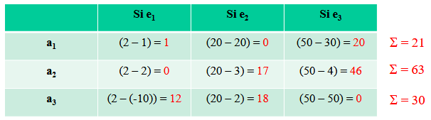

## 01 // théorie de la décision en incertitude

[Partie I Théorie de la décision en Incertitude 2022.pdf](ressources/01_theorie_de_la_decision_en_incertitude_partie_i_thorie_de_la_dcision_en_incertitude_2022.pdf)

## Le critère de maximisation de l'utilité espérée

### Rationalité en univers certain et "incertitude"

On une tuple $\{A, U(a)\}$, où $A$ est un ensemble d'actions $a_i$ finies et connues, et $U(a) \in \mathbb{R}$ est la fonction d'utilité associée à chaque action.

La meilleure action est donc simplement définie par $a^*$ tel que $U(a^*) > U(a)$.

L'origine de l'incertitude est que l'utilité dépend de l'actions mais aussi d'un certain état de la nature. Particulièrement, elle se manifeste dans les conséquences de l'action prise.

Il y a deux branches de l'économie qui étudie les acteurs et ses décisions :

- Théorie des jeux : le gain dépend de l'action propre et de l'action des autres.
- Théorie de la décision en incertain : le gain dépend de son action dans un certain état de la nature.

Il existe une différence entre "risque" et "incertitude" :

- Univers risqué : tous les états de la nature sont connus en probabilité.
- Univers incertain : les probabilités de réalisation des états futurs ne sont pas connus, voire tous les états futurs tout court ne sont pas connus.

L'approche standard est de ramener les situations d'incertitude à un univers risqué vie les "probabilités subjectives".

### Espérance et la paradoxe de St. Petesbourg

Face à une disjonctive entre deux situations A et B, un agent veut toujours prendre l'action qui ramène le plus d'utilité.

Supposons deux loteries $L_1= \{(1000\text{€}, 0.5) ; (-1000\text{€}, 0.5)\}$ et $L_2 = \{(2\text{€}, 0.5) ; (1\text{€}, 0.5) \}$. La EMG (espérance mathématique de gain) pour $L_2$ est plus élevée que celle de $L_1$. L'agent choisit donc $L_2$.

> [!note]
> Ici, il faut remarquer que les lotos $L_1$ et $L_2$ sont elles-mêmes des actions $a_1$ et $a_2$. En fait, dans ce contexte, chaque action pourrait se voir comme une loterie (le composant aléatoire étant l'état de la nature). Donc, une action se décrit comme $a_i = \{(1\text{€}, 0.5) ; (-1\text{€}, 0.5) \}$.

Ceci étant dit, il y a des situations problématiques si on décide de choisir la EMG comme notre critère de décision. L'une de ces situations est la paradoxe de St. Petesbourg : c'est un jeu d'une pièce équilibrée lancée jusqu'à l'obtention de l'événement "Face". A chaque jet qui sort pile, le joueur gagne $2^n\text{€}$. Donc :

$$EMG  = \sum_{n=0}^\infty 2^{-n}2^{n} = 1+1+1\ldots \to \infty$$

On dit que le prix juste pour jouer un jeu est égal à son espérance. Le problème se lève quand l'espérance est l'infini, personne n'est prête à payer une somme infinie d'argent pour jouer à ce jeu.

La solution proposée par Bernoulli en 1738 serait que les joueurs maximisent plutôt l'espérance du logarithme du gain :

$$V(J) = \sum_{n=0}^\infty 2^{-n} \log(2^{n}) = 2 \log(2)$$

Et, comme généralisation de la solution, les joueurs ne maximisent pas les gains monétaires bruts mais l'utilité que leur procurent ces gains : on remplace la fonction $\log$ par une fonction $U(.)$ croissant concave qui représente l'utilité de la richesse :

$$V(J) = \sum_{n=0}^\infty 2^{-n} U(2^{n})  \text{ avec } U'(.) > 0, U''(.) < 0$$

### Prise en compte du risque

Jusque là, on a juste considéré l'espérance du gain pour choisir entre deux situations. On a pas intégré la variance dans nos choix. Soient deux loteries $L_1 = \{(1000\text{€}, 0.5) ; (0\text{€}, 0.5)\}$ et $L_2 = \{(3000\text{€}, 0.5); (-2000\text{€}, 0.5)\}$. En espérance c'est le même, mais $L_2$ est plus variante que $L_1$.

Une solution est celle de Markowitz (1952) : intégrer dans l'analyse le risque dont la représentation est la variance des gains. D'où un double critère : l'espérance de gains et la variance des gains. La valeur $V(a)$ de chaque action est donc une fonction de ces deux paramètres.

Par exemple, on pourrait avoir :

$$V(a) = F(\mu_a, \sigma^2_a) = \alpha + \beta \mu_a - \gamma \sigma^2_a, \text{ avec } F'_\mu = \beta > 0$$

Notons que si on fixe une valeur constante de $V(a)$ et on regarde les valeurs $\mu$ et $\sigma^2$ comme des variables, nous avons une courbe d'indifférence.

Courbe d'indifférence pour $V(a)$ fixé

En plus, on pourrait dériver donc un taux marginal de substitution :

$$TMS_{\mu / \sigma^2} = -F'_{\sigma^2} / F'_{\mu} = \gamma / \beta$$

La pente des courbes d'indifférence dépend donc du signe de $\gamma$ : une constante qui mesure le degré d'aversion au risque.

- Si $\gamma > 0$ : la pente est positive, la courbe est croissante, et $V(a)$ diminue avec le risque ; l'agent présente une "aversion au risque".
- Si $\gamma < 0$ : la pente est négative, la courbe est décroissante, et $V(a)$ augmente avec le risque ; l'agent présente une "attirance au risque".
- Si $\gamma = 0$ : la pente est nulle, la courbe est constante, et $V(a)$ est indépendante du risque ; l'agent présente une "neutralité au risque".

Représentation de courbes d'indifférence selon l'attitude au risque

(cas linéaire et non linéaire)

### Le critère de l'utilité espérée

#### Théorie de l'Utilité Espérée

Proposer une généralisation de la solution de Bernoulli sur la base d'un ensemble d'axiomes de comportements : théorie de l'Utilité Espérée (Von Neumann et Morgenstern, 1947).

Le cadre générale de cette théorie est que il existe une tuple $\{A, X, P, U(.)\}$, où $A$ est l'ensemble d'actions, $X$ est l'ensemble des conséquences et, chaque fois qu'on choisit une action, on assigne une probabilité à chaque conséquence (qui peuvent changer d'une conséquence à l'autre) sous la forme de vecteur, qui sont les éléments de $P$. $U(.)$ est une fonction d'utilité cardinale sur les conséquences.

#### Axiomes

L'objectif de cette théorie est de, à partir d'une relation de préférence définie sur l'ensemble des actions, notée $\geq^{\#}$, construire un isomorphisme entre $[A, \geq^{\#}]$ et $[\mathbb{R}, \geq]$ permettant aux agents, sur la base d'un critère, d'effectuer un choix en univers incertain.

Pour les relations de préférence, nous avons $\geq^{\#}$ pour préférence faible, $>^{\#}$ pour préférence stricte et $\sim^{\#}$ pour l'équivalence.

- Axiome 1 : la relation $\geq^{\#}$ est un préordre, c'est à dire qu'elle est complète ($a_1 >^{\#} a_2$, $a_2 >^{\#} a_1$ ou $a_1 \sim^{\#} a_2$) et transitive.
- Axiome 2 : continuité. Si $a_1 \geq^{\#} a_2 \geq^{\#} a_3$, alors il existe un $\lambda \in [0, 1]$ tel que $a_2 \sim^{\#} [\lambda a_1+(1-\lambda) a_3]$
- Axiome 3 : indépendance. Pour tout $a_1, a_2 \in A$, $a_1 \geq^{\#} a_2$ si et seulement si : $\alpha a_1 + (1-\alpha) a_3 \geq^{\#} \alpha a_2 + (1-\alpha) a_3$, pour $\alpha\in[0,1]$

#### Théorème de VNM (Von Neumann et Morgenstern)

Si les trois axiomes précédents sont satisfaits, alors il existe une fonction d'utilité $U(.)$ définie sur l'ensemble des conséquences $X$, à une transformation strictement affine croissante près, et une fonction de valeur $V(.)$ définie sur $A$ telles que :

$$a_1 \geq^{\#} a_2 \iff V(a_1) = \sum_{i=1}^n p_{1,i}(x_i) u(x_i) \geq \sum_{i=1}^n p_{2,i}(x_i) u(x_i) = V(a_2)$$

Ainsi, la valeur d'une action risquée est l'espérance mathématique des utilités de ses résultats possibles (et non plus des gains) : l'individu rationnel prend ses décisions en maximisant son utilité espérée.

### D'autres critères de décision

#### Sécurité d'abord

Ce critère choisit l'action parmi toutes que maximise la préférence de Markovitz linéaire, mais en utilisant non pas la variance traditionnelle mais plutôt une variance "tronquée" qui ne prend en compte que les pertes possibles comme suit :

$$\sigma^2(a) = \sum_{i=1}^n p_a(x_i)^2, x_i < 0$$

#### Maximin

Ceci s'agit de choisir "le maximum parmi les minimums". Particulièrement, il choisit $a^* = \max(\min(a_i))$. On peut jouer aussi sur l'ordre et la quantité des $\max$ et des $\min$ comme $\min(\max(a_i))$ pour trouver le "Minimax" et d'autres critères.

#### Le critère de Hurwicz

Ce critère propose une pondération des valeurs minimums et maximums dans chaque action : $V(a_i) = \alpha \min(a_i) + (1-\alpha) \max(a_i)$, où $\alpha$ mesure le degré de pessimisme de l'individu.

#### Le critère des "regrets"

Pour chaque état de la nature $e_i$, on regarde l'action qui maximise l'utilité. Puis, pour chaque action $a_i$, on calcule la différence de son utilité rapportée par rapport à l'utilité de l'action optimale dans cet état. La action à prendre est l'action qui minimise la somme des différences.

Présentation de la situation.

On choisit donc $a_1$.

## Le comportement des agents face au risque

### Représentation de la fonction d'utilité VNM

Soit $W$ un argument qui représente de l'argent ou des ressources. La fonction VNM d'utilité est positive et concave sous hypothèse. Soit $w_0$ une dotation initiale et $x_1$ et $x_2$ des conséquences monétaires des actions $a_1$ et $a_2$ respectivement. Supposons que $p(x_1) = p(x_2) = 1/2$.

Notons que si bien on choisit la moitié entre les deux possibles résultats sur nos ressources (50 et 100, donc 75), on est en fait par dessus de la moitié entre les deux utilités résultantes. Ceci est conséquence du fait que la fonction est concave.

En fait, si on cherche la moitié entre les utilités résultantes, on arrive à que le montant nécessaire $W$ est inférieur à 75 (en effet, c'est 60). Ceci est connu comme l'"équivalent certain" ou EC.

Une définition plus propre de l'EC est "la compensation minimale demandée par l'agent pour ne pas prendre l'action $a$ ou le prix maximum pour la prendre".

**Note**. J!e pense que le point rouge "$E[x_a]$" devrait être plutôt "$E[w_0 + x_a]$"

Ceci nous permet de créer une définition de comportement par rapport aux risque. Notamment :

- Aversion au risque : $EC_a < E[w_0 + x_a]$
- Neutralité au risque : $EC_a = E[w_0 + x_a]$
- Attirance au risque : $EC_a > E[w_0 + x_a]$

On peut aussi en déduire une définition différente mais équivalente à la précédente du fait que $U(E[w_0 + x_a]) > E[U(w_0 + x_a)]$, ce qui caractérise l'aversion au risque dans cet scénario.

- Aversion au risque : $U''(.) < 0$
- Neutralité au risque : $U''(.) = 0$
- Attirance au risque : $U''(.) > 0$

Encore plus, en reprenant l'inégalité de l'EC, on peut la réécrire pour définir la "prime de risque" :

- Aversion au risque : $\pi(w,a) = E[w_0 + x_a] - EC_a > 0$
- Neutralité au risque : $\pi(w,a) = E[w_0 + x_a] - EC_a = 0$
- Attirance au risque : $\pi(w,a) = E[w_0 + x_a] - EC_a < 0$

### Nécessité d'une nouvelle définition du risque

Une question à noter : la variance est-elle toujours une bonne mesure du risque (comme c'est le cas chez Markovitz) avec le critère de l'Utilité Espérée ?

Prenons ce contre-example : $X = (1, 10, 100, 1000)$, $a_1 = (0, 0.99, 0, 0.01)$ et $a_2 = (0.8, 0, 0.2, 0)$. On a donc que $E[a^*] = 20.8$ et $E(a) = 19.9$; puis $\sigma^2(a^*) = 1468 < \sigma^2(a) = 9703$. Du point de vue $(\mu, \sigma^2)$, $a^*$ domine $a$. Par contre, si la fonction d'utilité est $U(.) = \log(.)$, donc $E[U(a^*)] = 0.4 < E[U(a)] = 1.2$.

On cherche donc une définition de risque qui soit compatible avec l'utilité espérée. On utilisera la définition de Rothschild & Stiglitz (1970). Pour ce faire, on va aligner deux variables aléatoires, $a$ et $a^*$, par rapport à leur loi de répartition $F$ et $F^*$.

On définit une relation "être CRMC de…" comme "$F^*$ est CRMC de $F$", par exemple. Cette relation est vérifiée si :

- $F^*$ et $F$ ont la même espérance
- Soit $x_0$ un point dans le domaine, donc $F^*(x) \geq F(x)$ pour $x \leq x_0$ et $F^*(x) \leq F(x)$ pour $x \geq x_0$.

A un moment donné, $F^*$ est superée par $F$.

Si $F^*$ est un CRMC de $F$, alors $F^*$ est « plus risquée » que $F$ au sens de Rotschild-Stiglitz. Cette définition est équivalente à

- $\int_0^x [F^*(t) - F(t)]dt \geq 0$ pour tout $t$
- $F^*$ et $F$ ont la même espérance et, $U(.)$ étant croissante et concave, donc $\int_0^x U(t) dF^*(t) \leq \int_0^x U(t) dF(t)$

Une chose à retenir c'est que un plus grand risque (au sens de R&S) implique toujours une plus grande variance, mais pas l'inverse.

Cette définition du risque est en relation avec la notion de Dominance Stochastique de second ordre (DS2) : $F^*$ est DS2 à $F$ si $\int_0^t [F^*(s) - F(s)]ds \geq 0$ pour tout $t$

L'action $a^*$ est un CRMC de $a$, et l'accroissement de risque implique une baisse de l'UE mesurée par la distance entre E et E*. Cette dégradation de l'UE est due à la concavité de $U(.)$.

### Indicateurs d'aversion au risque et comparaisons

Quand peut-on dire qu'un agent a une plus forte aversion au risque qu'un autre agent ? Le signe de $U''(.)$ ne donne que le comportement globale de l'agent face au risque, mais ne "mesure" pas le niveau d'aversion ou d'attirance.

#### L'indicateur d'aversion absolue au risque (Arrow & Pratt)

Proposent un indicateur local d'aversion au risque mesuré au niveau de la richesse $w$ de l'agent : $r(w) = - U''(w) / U'(w)$

- Si $r'(w) > 0$, l'aversion absolue au risque est croissante avec $w$
- Si $r'(w) = 0$, l'aversion absolue au risque est constante avec $w$
- Si $r'(w) < 0$, l'aversion absolue au risque est décroissante avec $w$

#### L'indicateur d'aversion relative au risque (Arrow & Pratt)

Si le risque est multiplicatif (gains et pertes en % de sa richesse initiale), on doit mesurer l'aversion relative au risque par l'indicateur suivant : $r^*(w) = -wr(w)$

- Si ${r^*}'(w) > 0$, l'aversion relative au risque est croissante avec $w$
- Si ${r^*}'(w) = 0$, l'aversion relative au risque est constante avec $w$
- Si ${r^*}'(w) < 0$, l'aversion relative au risque est décroissante avec $w$

#### Le théorème d'Arrow-Pratt

Soient $u_i$ les fonctions d'utilité des agents $i$ ($i=1,2$), trois définitions équivalentes de la comparaison de l'aversion au risque peuvent être proposées :

- Définition 1 : $U_1$ est plus risque-adverse que $U_2$ si $r_1(w) \geq r_2(w)$ pour tout $w \in X$
- Définition 2 : $U_1$ est plus risque-adverse que $U_2$ si $\pi_1(w,a) \geq \pi_2(w,a)$ pour tout $a \in A$
- Définition 3 : $U_1$ est plus risque-adverse que $U_2$ s'il existe une fonction $f(.)$ concave telle que $U_1(w) = f(U_2(w))$

## Les limites de l'utilité espérée

### L'effet de "rapport commun" (Allais, 1953)

Nombreuses expériences qui montrent la violation de l'axiome d'indépendance de la théorie de l'UE (axiome 3 de VNM).

**Situation 1** : choisir entre les 2 loteries suivantes

- $L_1 = {(100\text{€}, 1)}$
- $L_2 = {(500\text{€}, 0.98) ; (0\text{€}, 0.02)}$

**Situation 2** : choisir entre les 2 loteries suivantes

- $L_1^* = {(100\text{€}, 0.01) ; (1\text{€}, 0.99)}$
- $L_2^* = {(500\text{€}, 0.0098) ; (0\text{€}, 0.0002) ; (1\text{€}, 0.99)}$

Soit une loterie $R$ particulière qui assure un gain d'un Euro avec une probabilité de 1 : $R = {(1, 1)}$, alors on peut écrire :

$$L_1^* = \lambda L_1 + (1 - \lambda) R = 0.01L_1 + 0.99R$$

et

$$L_2^* = \lambda L_2 + (1 - \lambda) R = 0.01L_2 + 0.99R$$

Et si les agents respectent l'axiome d'indépendance de VNM, alors on a :

$$L_1 >^{\#} L_2 \iff L_1^* >^{\#} L_2^*$$

Or, la majorité des sujets préfèrent $L_2^*$ à $L_1^*$, alors qu'ils ont préféré $L_1$ à $L_2$. Et cela malgré le "rapport constant" des probabilités de gains pour les deux situations : $0.98 / 1 = 0.0098 / 0.01 = 0.98$

#### Interprétations des résultats expérimentaux

- La préférence entre $L_2^*$ à $L_1^*$ n'est pas indépendante de $R$. La combinaison des options n'est donc pas neutre et elle modifie les préférences entre les loteries.
- Les agents affichent une préférence pour les options certaines par rapport aux options probables (Kahneman & Tversky, 1979) : paradoxe attribué à "l'effet de certitude".
- Ce paradoxe dépend en grande partie de la nature de la loterie $R$ et de la taille de $\lambda$ (Fishburn, 1988) : plus $\lambda$ est proche de 0, plus l'axiome d'indépendance est violé par les sujets, et plus le gain dans la loterie $R$ est élevé, plus l'axiome est respecté.
- L'axiome d'indépendance implique la "neutralité" des préférences par rapport à l'information (Willinger, 1988). L'information sur la nature de la combinaison est sans importance dans la prise de décision selon cet axiome.

### L'effet des "conséquences communes" (Allais, 1953)

Nombreuses expériences qui montrent la violation du 2ème postulat de "certitude" de Savage, rendant ainsi impossible l'indépendance des événements mutuellement exclusifs.

Considérons trois états de la nature $E_1$, $E_2$ et $E_3$ :

|  | $E_1$ | $E_2$ | $E_3$ |
|---|---|---|---|
| **Problème 1** |  |  |  |
| $a_1$ | 100$ | 100$ | 100$ |
| $a_2$ | 0 | 500$ | 100$ |
| **Problème 2** |  |  |  |
| $a_1'$ | 100$ | 100$ | 0 |
| $a_2'$ | 0 | 500$ | 0 |

Si l'agent respecte le 2ème postulat alors on a :

$$a_1 \geq^{\#} a_2 \iff a_1' \geq^{\#} a_2'$$

Même Savage a préféré $a_2'$ à $a_1'$, alors qu'il préférait $a_1$ à $a_2$.

#### Interprétations des résultats expérimentaux

- L'importance monétaire des conséquences communes ($E_3$) n'est pas négligeable pour les sujets :
    - Plus celles-ci sont importantes (100$ dans le problème n°1), plus les sujets auront tendance à choisir l'action la moins risquée dans $E_1 \cup E_2$ (donc $a_1$) afin d'avoir une plus grande sécurité si $E_3$ ne se produisait pas
    - Et si les conséquences dans $E_3$ sont faibles, les agents auront tendance à prendre des risques pour des gains importants dans le cas où $E_3$ ne se produirait pas.
- Le postulat de Savage implique une indifférence de l'agent par rapport à l'information et/ou le temps (Willinger, 1988).
- Les agents ont une plus grande aversion au risque dans l'éventualité de la perte d'une opportunité que dans l'éventualité du gain d'une opportunité (Machina, 1987).

### Le paradoxe des croyances de nature probabiliste (Ellsberg, 1961)

Expérience qui met en évidence la contradiction du résultat de Savage impliquant que les pondérations des utilités sont des croyances de nature probabiliste.

Une urne de 90 boules = 30 rouges + 60 (noires + jaunes dans proportions inconnues)

|  | Rouge | Noire | Jaune |
|---|---|---|---|
| Pari 1 | 100$ | 0 | 0 |
| Pari 2 | 0 | 100$ | 0 |
| Pari 3 | 100$ | 0 | 100$ |
| Pari 4 | 0 | 100$ | 100$ |

_Pari i : gain en $ si la première boule tirée est de couleur X._

D'après Savage, si l'agent respecte le 2ème postulat alors on a :

$$P_1 \geq^{\#} P_2 \iff P_3 \geq^{\#} P_4$$

**Résultats expérimentaux** : $P_1 \geq^{\#} P_2$ et $P_4 \geq^{\#} P_3$

#### Contradiction théorique de ces résultats

- Si pour un agent on a $P_1 \geq^{\#} P_2$, cela signifie que pour lui : $p[\text{Rouge}] > p[\text{Noire}] = 1/3$
- Si pour un agent on a $P_4 \geq^{\#} P_3$, cela signifie que pour lui : $p[\text{Noire}] + p[\text{Jaune}] > p[\text{Rouge}] + p[\text{Jaune}] = 2/3$

Donc $p[\text{Noire}] > p[\text{Rouge}]$, en contradiction avec son premier choix !

#### Interprétations des résultats expérimentaux

- Les comportements observés ne sont pas conformes aux règles de calcul des probabilités additives
- Les croyances ont tendance à "altérer" les probabilités subjectives compte tenu de leur aversion à l'ambiguïté issue de l'ignorance des proportions de boules rouges et jaunes dans l'urne.

### Conclusion

**L'Utilité Espérée : un outil qui a ses limites…** **…mais un instrument méthodologique puissant, donc** **…à utiliser avec précaution**

#### Constat

Il existe peu de critères qui puissent (pour l'instant !) remplir les conditions d'efficacité analytique et être en même temps pertinents par rapport aux comportements réels des individus.

L'Utilité Espérée reste la base de toute modélisation du comportement des agents économiques en situation risquée ou incertaine. Notamment dans les cas d'asymétrie d'information.
