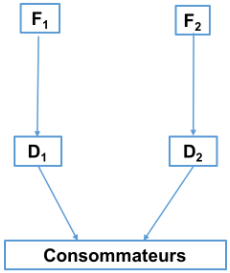

## 04 // relations verticales

[Partie 2_05_L3 MIASHS_Relations verticales_cours.pdf](ressources/04_relations_verticales_partie_2_05_l3_miashs_relations_verticales_cours.pdf)

[06_L3 MIASHS_Eco_cont_Intégration et restrictions verticales_moodle.pdf](ressources/04_relations_verticales_06_l3_miashs_eco_cont_integration_et_restrictions_verticales_moodle.pdf)

## Formes de relations verticales

### Premières définitions

**Définition de "relations verticales"** : les relations verticales désignent les interactions entre les entreprises opérant à différents niveaux d'une même chaîne de production ou de distribution. Par exemple, un fabricant et un fournisseur, ou un détaillant et un distributeur. Les relations verticales sont donc différentes des relations horizontales qui se produisent entre entreprises opérant au même niveau.

**Définition de "filière/chaîne verticale/chaîne de valeur"** : une filière ou chaîne verticale est l'ensemble des étapes successives qu'un produit ou service traverse depuis sa conception jusqu'à sa consommation finale. Chaque maillon de cette chaîne ajoute de la valeur au produit, d'où l'expression "chaîne de valeur".

**Définition d'intégration verticale** : une entreprise est intégrée verticalement lorsqu'elle contrôle plusieurs ou toutes les étapes de production impliquées dans la création de son produit ou service.

Les relations verticales sont différentes des relations offre-demande. Beaucoup de firmes vendent à d'autres firmes, pas (uniquement) à des consommateurs finals qui vendent ensuite aux consommateurs finals (ou à d'autres firmes) :

- **Exemple #1** : un producteur de lait qui vend sa production à une entreprise de transformation laitière.
- **Exemple #2** : un fabricant d'électronique qui fournit des composants à une entreprise d'assemblage de smartphones.
- **Exemple #3** : une entreprise de textile qui fournit des tissus à une marque de vêtements.

On fait donc les distinctions suivantes :

- **Les firmes en amont (upstream)** : des fabricants de biens de consommation, des producteurs de biens intermédiaires, …
- **Les firmes en aval (downstream)** : des distributeurs, des détaillants, …
- **Le marché entre les firmes amont et les firmes aval** : le marché intermédiaire (ou marché de gros).
- **Le marché entre les firmes aval et les consommateurs finals** : le marché final (ou marché de détail).

Une relation verticale de production et de distribution.

Nous allons donc étudier successivement trois types de relations verticales :

1. **Transaction par le marché (Spot Markets)**
2. **Intégration verticale**
3. **Entre ces deux extrêmes il existe les contrats (de long terme)**

### Les transactions par le marché (spot markets)

Les transactions par le marché présentent **trois avantages principaux** :

1. **L'adaptation efficiente du marché** : le marché permet une adaptation rapide aux changements de l'environnement économique
2. **La minimisation des coûts** : la concurrence entre fournisseurs pousse à la réduction des coûts
3. **La réalisation d'économies d'échelle** : la spécialisation permet aux fournisseurs de servir plusieurs clients et d'atteindre des volumes plus importants

Les avantages liés aux transactions par les marchés viennent du fait qu'il n'y a pas de relation particulière entre la firme et ses fournisseurs :

- La firme est indifférente entre les fournisseurs (le changement d'offreurs est sans coût).
- La firme peut même se substituer aux fournisseurs qui ont des coûts élevés ou qui ne sont pas disposés à ajuster les quantités pour maximiser les gains du commerce.

Pour que la firme soit incitée à sortir d'une simple relation de marché, il faut que des variables nouvelles l'amènent à lier un lien particulier avec un ou plusieurs fournisseurs. C'est ce que nous allons voir maintenant.

### Les transactions hors marché

Sortir du marché peut être souhaitable pour plusieurs raisons :

- **Le problème de mesure de l'effort**
- **Les problèmes de coordination**
- **L'existence de pouvoir de marché**
- **La nécessité d'avoir des actifs spécifiques**

#### Le problème de mesure de l'effort

Possibilité de ne pas pouvoir mesurer l'effort de vente des détaillants.

- **Problème de passager clandestin (free rider)**. Pour éviter ce problème :
    - Intégration verticale
    - Contrats long terme… dont les termes incitent à accroître les ventes

#### Les problèmes de coordination

En économie on montre que les problèmes de coordination de type synchronisation et affectation (des ressources, des activités) sont plus efficacement résolus si l'on sort du marché.

**Exemple de la SNCF** : l'intégration verticale permet de coordonner les politiques de prix et de services entre l'infrastructure ferroviaire et les services de transport.

#### L'existence de pouvoir de marché

Une des raisons pour préférer des transactions hors marché qu'une firme avec du pouvoir de marché peut utiliser l'intégration verticale pour accroître ses profits.

#### La nécessité d'avoir des actifs spécifiques

Certaines productions nécessitent des investissements spécifiques en actifs.

**Définition "actif spécifique"** : un actif qui ne peut pas être redéployé sans perte de valeur à d'autres transactions.

**Quatre formes d'actifs spécifiques** :

1. **Spécificité physique** : équipements (machines) qui vont produire des inputs spécifiques à un groupe d'acheteurs en particulier
2. **Spécificité de site** : seule utilisable par un petit nombre d'acheteurs : les pipelines en Alaska.
3. **Spécificité en actifs humains** : niveau de qualification et expertise que l'on développe particulièrement pour un partenaire.
4. **Actifs spécialisés** : n'est pas spécifique à un partenaire, mais si ce dernier n'achète pas, l'offreur risque de se retrouver avec un excédent de capacité.

**Exemple** : Dans les années 1980, NutraSweet Company développait des actifs spécialisés pour ses clients en fonction de leurs besoins spécifiques.

Dans le cas d'actifs spécifiques, la firme peut choisir :

- Des contrats de long terme dont les termes indiquent le niveau d'actifs spécifiques
- L'intégration verticale

### Les contrats

#### Opportunisme post-contractuel : actifs spécifiques et hold-up

À l'inverse des transactions par le marché, les contrats (long terme) permettent de construire une relation propice à des investissements spécifiques. Cependant, ces investissements spécifiques peuvent alors générer des risques de hold-up pour les deux partenaires.

**Quasi-rente** : montant que l'une des parties peut exiger de l'autre pendant la négociation sachant que la rupture de la négociation ne sera pas profitable à cette dernière.

**Mesure de la quasi-rente** : La quasi-rente associée avec les investissements spécifiques mesure la spécificité de l'investissement et correspond à la différence entre :

$$\text{Quasi-rente} = \text{Valeur de l'actif dans son utilisation présente} - \text{Meilleure utilisation alternative}$$

**Hold-up et quasi-rente : principe**

Une firme A investit pour produire un composant pour une firme B, prix spécifié au préalable : profit $\pi_1$ pour A. Si B change d'avis, A gagne $\pi_2$ sur le marché.

Quasi-rente : $\pi_1 - \pi_2 > 0$

Le problème du hold-up : si $\pi_1 - \pi_2 > 0$, B peut améliorer sa situation en prenant A en hold-up et en captant la quasi-rente (A est expropriée d'une partie des revenus de son investissement).

Si A l'anticipe, elle n'investira pas dans un actif spécifique à la relation.

#### Les solutions au problème du hold-up

1. **Avoir plusieurs fournisseurs et/ou clients**
2. **Adapter ses investissements stratégiques** afin de s'écarter de la relation exclusive :
   - Choix technologiques (moins spécifiques, standardisation des produits)
   - Choix de localisation (parc technologique)
   - Choix de formation moins spécifique
3. **Contrats contingents** aux variables importantes pour éviter la renégociation (prix des entrants, variables du marché, …)
4. **L'exemple des franchises**
5. **Intégration verticale**

### L'exemple des franchises

**Franchise** : contrat par lequel une entreprise franchiseuse accorde à une autre (le franchisé) en échange d'une compensation financière le droit d'exploiter une franchise dans le but de commercialiser un type de produits ou des services déterminés.

Aux yeux de l'UE, trois éléments doivent être présents dans ce contrat :

- L'utilisation d'un nom et d'une enseigne commune et uniforme de locaux
- Le franchiseur doit communiquer un certain savoir-faire au franchisé
- Le franchiseur doit apporter au franchisé une assistance commerciale ou technique pendant toute la durée de l'accord

#### Types de franchises

- **Franchise de distribution** : vous vendez des produits sélectionnés par le franchiseur (55% des franchises en France). Ex. : tout ce qui est alimentation : McDonald's, Domino's… ; chaînes d'hôtel, cosmétiques (Yves Rocher), d'habillement…
- **Franchise de services** : vous vendez des services conçus par le franchiseur (45% des franchises en France). Ex. : hôtellerie, coiffure…
- **Franchise industrielle** : vous produisez selon le savoir-faire du franchiseur. Transfert de technologie. Ex. : Coca-Cola

#### Composante financière et contreparties

- **Droit d'entrée** : couvre une partie des investissements faits par le franchiseur, grosso modo, le coût fixe
- **Redevance d'enseigne** (paiement annuel)
- **Redevance de services** : coût des services que vous rend le franchiseur
- **Redevance publicitaire** : cotisations pour participer aux campagnes publicitaires
- **Marge sur les achats**
- **RFA et marges arrières**

#### Avantages pour le franchiseur

- Avantages évidents d'un réseau pour l'homogénéité, la puissance d'achat, la puissance publicitaire, les moyens…
- Développement moins coûteux qu'en succursale car l'investissement est réparti entre franchiseur et franchisés
- Développement plus rapide
- Efficacité du partenariat entre indépendants car des franchisés bien sélectionnés sont plus motivés que des salariés

#### Avantages pour le franchisé

- Avantages évidents d'un réseau pour l'homogénéité, la puissance d'achat, la puissance publicitaire, les moyens…
- Propriétaire de son entreprise
- Il copie un succès en se faisant aider d'où un démarrage plus rapide et moins coûteux
- Limitation du risque
- Rentabilité des capitaux investis
- Maîtrise professionnelle supérieure grâce au transfert de savoir-faire et à l'assistance

### L'intégration verticale

La question principale devient "intégrer ou non une activité ?", qui ressemble aussi à "faire ou faire-faire ?".

Il faut comparer le coût (dont coût d'opportunité) :

- D'une production en interne (intégration verticale)
- Du recours à des firmes externes ("au marché")

**Approches de Coase (1937) et de Williamson (1991)** des "coûts de transactions" (coûts de transaction du recours au marché vs coûts d'organisation au sein de la firme) :
- **Coûts de transaction** : coût de recherche d'information, coût de recherche d'un nouveau partenaire, coûts de conclusion du contrat
- La notion d'actif spécifique va y jouer progressivement un rôle central

#### Approche de Coase

**Constat de départ** de l'analyse : "Des îlots de pouvoir conscient dans un océan de coopération inconsciente"

**Pourquoi la firme existe-t-elle ?** Réponse au coût de fonctionnement du système de prix (le marché).

**Pourquoi l'économie n'est-elle pas constituée d'une seule et même firme ?** À cause des rendements décroissants de la fonction entrepreneuriale.

Le choix entre coordination par le marché et coordination dans la firme dépendra donc de la confrontation du coût d'une transaction supplémentaire par le marché et du coût d'organisation interne de la même transaction.

#### Approche de Williamson

**Hypothèses de comportement** :
- **Rationalité limitée** : contrats incomplets
- **Opportunisme** : problème du hold-up

**Hypothèses relatives aux transactions** :
- Incertitude
- Fréquence
- Spécificité des actifs

Typologie des relations verticales dans l'approche de Williamson (1985)

Expliquer l'intégration verticale, c'est expliquer pourquoi une coordination administrative peut être préférée à une coordination marchande. Williamson prend en considération coûts de transaction et coûts de production, il les compare selon le mode d'organisation choisi, marché ou hiérarchie.

**Un modèle heuristique** :
- Soit $k$ le degré de spécificité des actifs
- Soit $M(k)$ les coûts de gouvernance de marché (coûts de transaction) en fonction de $k$
- Soit $B(k)$ les coûts de gouvernance de la firme intégrée (coûts de bureaucratie) en fonction de $k$

**Hypothèses** : $B(0) > M(0)$ et $\frac{\partial M(k)}{\partial k} > \frac{\partial B(k)}{\partial k}$

Pour conclure, la différence totale entre coûts d'internalisation et coûts de recours au marché est une fonction décroissante de la spécificité des actifs. Passé un certain seuil, cette différence devient négative et l'intégration verticale devient la forme d'organisation qui minimise les coûts.

#### Intégration verticale et gains d'efficacité

Classiquement, le résultat de l'intégration verticale est d'augmenter le pouvoir de marché d'une firme. Mais si l'intégration verticale se traduit par des gains d'efficacité (économies d'échelle, de gamme), alors ces gains peuvent compenser les effets négatifs sur la concurrence. En effet, du fait de ces gains d'efficacité, les coûts peuvent diminuer, ce qui peut bénéficier aux consommateurs.

Du point de vue théorique, on doit distinguer entre deux types d'économies sur les coûts réalisés grâce à une intégration verticale :

- **Ceux qui affectent les coûts variables** : réduction des coûts de production unitaires
- **Ceux qui affectent les coûts fixes** : économies sur les coûts de structure et d'organisation

Ceci dit, l'intégration verticale est une solution radicale. Beaucoup de bénéfices de l'intégration verticale peuvent être obtenus au travers d'arrangements contractuels entre clients et détaillants :

- Joint-ventures
- Sous-traitance
- Franchises
- Contrats d'exclusivité
- Prix de revente imposés ou conseillés…

On appelle de tels arrangements des **restrictions verticales**. Leur analyse est l'objet du chapitre suivant du cours.

## Intégration et restrictions verticales

### Premières définitions

**La concurrence intermarques** : C'est la concurrence entre les produits de marques différentes. Elle se manifeste lorsque les consommateurs choisissent entre des produits similaires offerts par des entreprises concurrentes.

**La concurrence intramarque** : Elle se réfère à la concurrence entre différents distributeurs ou revendeurs de la même marque. Par exemple, plusieurs magasins peuvent vendre le même produit d'une marque et se concurrencer sur le prix, le service, etc.

L'intensité de ces deux types de concurrence dans les filières dépend en grande partie des restrictions verticales.

**Restrictions verticales** : "Vertical restraints are agreements or concerted practices entered into between two or more companies each of which operates, for the purposes of the agreement, at a different level of the production or distribution chain, and relating to the conditions under which the parties may purchase, sell or resell certain goods or services" (Commission européenne, Lignes directrices sur les restrictions verticales)

On distingue **deux catégories de restrictions verticales** :

- **Restrictions tarifaires** : Ce sont des contrôles sur les prix et les conditions de vente des produits. Par exemple, un prix de revente imposé ou des rabais conditionnels.
- **Restrictions non-tarifaires** : Elles incluent des limitations qui ne concernent pas directement le prix, comme les quotas de vente, les exclusivités territoriales, ou les clauses de non-concurrence.

Pour l'économiste, les effets sur le bien-être des restrictions verticales sont ambigus…

**Des effets positifs** :
- **Amélioration de l'efficacité** : Les restrictions verticales peuvent éliminer les inefficacités dues à la double marge et aligner les incitations entre les niveaux de production et de distribution.
- **Stimulation de la concurrence** : En fixant des prix de revente ou des quotas, les fabricants peuvent encourager les distributeurs à se concentrer sur l'amélioration du service et de la qualité plutôt que sur la concurrence par les prix.

**Des effets négatifs** :
- **Réduction de la concurrence** : Les restrictions tarifaires peuvent limiter la concurrence sur les prix entre les distributeurs, ce qui peut conduire à des prix plus élevés pour les consommateurs.
- **Barrières à l'entrée** : Les restrictions non-tarifaires peuvent créer des barrières à l'entrée pour de nouveaux concurrents, réduisant ainsi la concurrence globale sur le marché.

De ce fait, l'analyse publique des restrictions verticales est compliquée par le fait que certaines clauses peuvent avoir à la fois des effets positifs et négatifs en termes d'efficacité. Il y a aussi une forte variation des politiques publiques dans le temps et entre les différentes juridictions.

#### Restrictions verticales et politique de la concurrence

**États-Unis** :
- En 1967, la Cour Suprême déclare les restrictions verticales illégales per se
- En 1977, elle statue que les restrictions verticales non tarifaires doivent être "évaluées" suivant la "Règle de Raison" (Rule of Reason)
- Depuis, tendance vers plus d'acceptation. Par exemple, en 1997, prix maximum déclarés légaux…

**Europe** :
- L'Article 81(1) interdit les restrictions verticales
- Cependant, l'article 81(3) accorde certaines exemptions lorsqu'il y a de bonnes raisons techniques ou économiques et que les consommateurs reçoivent une part juste du bénéfice.
- En 1967, exemption de bloc pour les territoires exclusifs et les accords de distribution exclusive.
- En 1988, exemption pour les accords de franchise.
- Prix de revente imposé illégal, mais des prix minimum ou maximum "recommandés" sont acceptables

### Cadre d'analyse : le modèle de double marge

Le modèle analyse une situation où :

- **Un fabricant F** opère sur le marché du bien intermédiaire
- **Un distributeur D** s'approvisionne sur le marché du bien intermédiaire et opère sur le marché du bien final

**Deux monopoles (monopoles successifs)** :
- Chaque entreprise (en monopole) applique une marge sur le prix pratiqué ($P >$ coût marginal).
- Ces marges s'additionnent : le prix élevé sur le marché final est le résultat du phénomène de double-marge
- **"Qu'y a-t-il de pire qu'un monopole ? Une chaîne de monopoles !"**

#### Formalisation du modèle

**Hypothèses** :
- Une entreprise F en amont produit un bien intermédiaire en monopole
- Elle vend ce bien intermédiaire à un distributeur D en monopole qui le commercialise aux consommateurs finals
- La demande finale pour le bien est donnée par $q = D(p) = a - p$
- Le coût marginal du producteur est $c$ avec $c < a$
- Le coût marginal du distributeur est $c_D = 0$
- On note $w$ le prix de gros fixé par l'entreprise F

**Jeu en deux étapes** :
1. F fixe le prix de gros $w$
2. D observe $w$ et fixe le prix de détail $p$

#### A. Cas de la chaîne de monopoles

**Étape 2** : Le programme de maximisation du profit du distributeur est :

$$\max_p \pi_D = (p - w)(a - p)$$

La condition de premier ordre s'écrit :

$$\frac{\partial \pi_D}{\partial p} = 0 \Leftrightarrow a - 2p + w = 0$$

D'où : $p = \frac{a + w}{2}$

La demande pour le bien final, et donc pour le bien intermédiaire, est alors :

$$q = a - p = a - \frac{a + w}{2} = \frac{a - w}{2}$$

**Étape 1** : Le programme de maximisation du profit du fabricant est :

$$\max_w \pi_F = (w - c)q(w) = (w - c)\frac{a - w}{2}$$

La condition de premier ordre s'écrit :

$$\frac{\partial \pi_F}{\partial w} = 0 \Leftrightarrow \frac{a - w}{2} - \frac{w - c}{2} = 0$$

D'où : $w = \frac{a + c}{2}$

En remplaçant $w$ par sa valeur, on trouve le prix d'équilibre sur le marché final :

$$p = \frac{a + \frac{a + c}{2}}{2} = \frac{3a + c}{4}$$

**Profits individuels** :
- $\pi_D = \frac{(a - c)^2}{16}$
- $\pi_F = \frac{(a - c)^2}{8}$

Soit un surplus total en double monopole de :

$$SP = \pi_D + \pi_F = \frac{3(a - c)^2}{16}$$

#### B. Cas de la firme intégrée

On suppose maintenant que les firmes F et D sont intégrées verticalement. On a alors le problème classique du monopole :

$$\max_{p^{IV}} \pi^{IV} = (p - c)(a - p)$$

On trouve alors que :

- $p^{IV} = \frac{a + c}{2}$
- $q^{IV} = \frac{a - c}{2}$
- $SP^{IV} = \pi^{IV} = \frac{(a - c)^2}{4}$

#### Comparaison des deux cas

On observe que $p > p^{IV}$ et $SP < SP^{IV}$

Ce qui implique que :

- **Le profit joint des firmes séparées est inférieur à celui de la firme intégrée** (Proposition 1)
- **Le surplus collectif est inférieur dans le cas d'une chaîne de monopoles** à celui qui serait obtenu avec un monopole couvrant toutes les activités de la chaîne (Proposition 2)

### Les restrictions verticales comme solution à la double marge

Le problème de la double marge plaide pour l'intégration verticale, mais l'intégration verticale est coûteuse :

- Coûts pour manager les employés du circuit de distribution
- Producteur et distributeur sur des marchés géographiques éloignés…

C'est pourquoi les firmes mettent en place des **restrictions verticales** qui permettent de restaurer de l'efficacité dans la filière.

#### Solution #1 : Tarification en partie double

Supposons que la firme amont (F) propose un tarif en deux parties (tarif binôme) à la firme aval (D) : un prix unitaire ($w$) et une partie fixe (ex. une redevance de franchise) $FF$.

La firme F fixe le prix unitaire ($w$) au coût marginal : $w = c$

Le problème de la firme D s'écrit alors :

$$\max_p \pi_D = (p - c)(a - p) - FF$$

C'est le profit de monopole intégré moins la partie fixe FF !

On trouve alors :

- $p = \frac{a + c}{2} = p^{IV}$
- $q = \frac{a - c}{2} = q^{IV}$

Les profits des deux firmes s'écrivent :

- $\pi_D = \frac{(a - c)^2}{4} - FF$
- $\pi_F = FF$

Le profit total des firmes est maximum, égal à $\pi^{IV}$. La répartition du profit total dépend de $FF$.

**Conclusion** : La restriction verticale (un contrat tarifaire non linéaire) permet de restaurer l'efficacité de la filière.

**Limite** : Nécessite que la firme amont connaisse parfaitement la demande et les coûts de la firme aval.

#### Solution #2 : Prix de revente imposé

Le distributeur peut aussi fixer un prix maximum de vente au détail. La firme F impose à la firme D un prix de détail $p$ maximum égal à $p^{IV} = \frac{a + c}{2}$.

Le partage du surplus $SP$ entre le fabricant F en amont et le distributeur D en aval dépend de la négociation sur $w$, avec $w \in [c, p^{IV}]$.

Si c'est F qui a tout le pouvoir de marché, $w = p^{IV} = \frac{a + c}{2}$, si c'est D qui l'a, $w = c$.

#### Solution #3 : Quotas de vente

De manière équivalente au prix de revente imposé, la firme peut imposer un quota de vente.

La firme F impose à la firme D un quota de vente $q$ maximum égal à $q^{IV} = \frac{a - c}{2}$.

Le partage du surplus $SP$ entre le fabricant en amont et le distributeur en aval dépend ici aussi de la négociation sur $w$, avec $w \in [c, p^{IV}]$.

> [!note] La solution de Blockbuster :
>
> Distributeur de cassettes vidéos aux États-Unis, avant 1998, la pratique de Blockbuster était de vendre ces cassettes vidéos aux magasins de location à un prix entre 65 et 70 dollars, ensuite le magasin de location décide le prix de location.
>
> Ce cadre n'est pas si éloigné du modèle à double marge. Après 1998, Blockbuster décide un nouveau type de contrat : ils proposent un tarif fixe de chaque cassette vidéo de seulement 8 dollars et comme prix variable, c'est un partage de revenus entre lui et les magasins de location entre 40% et 60%. Donc, Blockbuster passe d'une tarification linéaire à une tarification à prix double.
>
> Des estimations sur ce nouveau contrat montrent que le prix de location moyen est passé de 4,6 à 4 dollars ; puis une augmentation de quantité de location. Les profits augmentent. On a donc passé d'une situation de double marge à un monopole intégré.

### Enjeux de concurrence intramarque et intermarques

#### Concurrence intramarque

Exemple d'une concurrence intramarque

**Le risque de free-riding entre distributeurs** : S'il y a plusieurs distributeurs, il peut exister des externalités horizontales entre ceux-ci, ce qui peut entraîner un problème de free-riding (passager clandestin).

**Externalités sur la qualité et le niveau de service proposés par les distributeurs** :

- **Externalité de réseau** : Cela se produit lorsque la valeur d'un produit ou service pour un utilisateur augmente avec le nombre d'autres utilisateurs.
- **Externalité de connaissance** : C'est quand un distributeur développe une expertise ou une connaissance spécifique sur un produit qui bénéficie à d'autres distributeurs.
- **Externalité de réputation** : Elle se manifeste lorsque les actions d'un distributeur affectent la perception de la marque par les consommateurs, ce qui a un impact sur les autres distributeurs.

**Solutions** : Sans intégration verticale, peut-on corriger une "externalité horizontale" entre les distributeurs (problème d'incitation à l'effort commercial) ? La firme amont (le fabricant) doit prendre des mesures pour réduire la concurrence en aval, comme :
- Les territoires exclusifs
- Le prix de revente imposé

#### Concurrence intermarques

Exemple de concurrence intermarques

Parce qu'elles affectent les formes de la concurrence entre distributeurs d'une même marque, les contraintes verticales affectent indirectement la concurrence entre distributeurs de produits rivaux et, par suite, en amont la concurrence entre producteurs.

Plusieurs travaux ont ainsi montré que les restrictions verticales peuvent avoir des effets contrastés sur la concurrence intermarques.

**L'analyse économique montre que les restrictions verticales (territoriales) peuvent** :
- **Favoriser la concurrence intermarques** en conférant à la structure verticale une plus forte rentabilité
- **Mais aussi avoir des effets défavorables** à cette concurrence intermarques :
  - **À court terme** : réduction de la concurrence par les prix
  - **À long terme** : barrières à l'entrée pour de nouveaux concurrents

> [!note] Exemple : cas de la grande distribution en France : loi Galland
>
> **Loi Galland** : renforcer la transparence, interdire aux fabricants de discriminer par le prix aux distributeurs, un rabais fait à un distributeur devra se faire à tous les distributeurs.
>
> **Premier problème** : si tous les distributeurs vont recevoir le même rabais, pas besoin de concurrence intra-distributeur.
>
> **Deuxième problème** : les fabricants se sont dit qu'ils pouvaient augmenter le prix, même ensemble comme un monopole.
>
> **Résultat** : les prix des biens ont augmenté de 30%.
>
> En fait, le fait d'interdire la discrimination par le prix est aussi, de manière cachée, une manière d'interdire l'intégration verticale.

Dans certaines circonstances, les restrictions verticales peuvent être utilisées pour empêcher l'accès au marché d'entreprises susceptibles de concurrencer efficacement les entreprises déjà installées.

### Étude de cas : la parfumerie de luxe

Des restrictions verticales ont favorisé une entente verticale en France entre parfumeurs et leurs distributeurs sur la période 1998-2000. Cette entente verticale a été condamnée par l'Autorité de la concurrence.

#### Présentation du secteur

**Chiffres clés** :
- Environ 1,9 milliards d'euros de chiffre d'affaires en France en 2016
- Croissance ininterrompue entre 1987 et 2016, en moyenne +4,1% par an (à l'exception d'un léger recul de -1,5% en 2013)
- Le prix moyen s'est envolé entre 2006 (45€) et 2013 (55€)
- Taux de rentabilité environ 2,5 fois supérieur à celui des biens de consommation dans leur ensemble

**Un secteur propice aux ententes verticales** avec des prix en hausse constante.

**Côté producteurs**, marché fortement concentré, la majorité des marques appartiennent aux grands groupes suivants :
- **LVMH** : Christian Dior, Givenchy, Guerlain, Kenzo ainsi que le distributeur Séphora
- **L'Oréal** : Lancôme, Armani, Cacharel, Helena Rubinstein, Guy Laroche, Lanvin, Paloma Picasso, Ralph Lauren
- **Clarins** : Clarins, Loris Azzaro, Thierry Mugler

**Côté distributeurs**, marché dominé par la distribution sélective, mais celle-ci a perdu des parts de marché (55% en 2004). Les 20 premières marques représentent près de 80% du marché de la distribution sélective.

#### Pratiques en cause

**Particularités de la vente en distribution sélective** : système où le fabricant sélectionne ses distributeurs selon des critères qualitatifs et quantitatifs précis.

**Communication des prix publics de vente et mise en place d'une politique de prix** : les producteurs communiquaient des "prix publics conseillés" qui étaient en réalité suivis de manière très stricte par les distributeurs.

**Application de la politique** : surveillance et sanctions en cas de non-respect des prix conseillés.

#### Le procès

**Chronologie** :
- **1983** : Première condamnation
- **2000** : Affaire d'autosaisine par l'Autorité de la concurrence
- **2006** : Condamnation

Mais le procès ne concerne que les années 1997 à 2000.

**Principaux arguments évoqués par la défense** :
- Prescription des faits
- Politique de protection de l'image de marque

**Total des condamnations** : 45,4 millions d'euros
- **13 producteurs** : 17,8 millions d'euros (L'Oréal, Chanel, Christian Dior, Yves Saint Laurent, Guerlain…)
- **3 distributeurs** : 27,6 millions d'euros (Marionnaud, Séphora et Nocibé)

#### Suites du procès

**Étude en 2006** de 50 références de parfum vendus par les 3 sites : marionnaud.fr, sephora.fr, nocibe.fr sur 13 marques : Boucheron, Cacharel, Dior, Armani, Givenchy, Guerlain, Hugo Boss, Kenzo, Lacoste, Nina Ricci, Ralph Lauren, Rochas et Yves Saint Laurent.

**Résultats** :
- **En moyenne** : 2,3% d'écart entre le plus cher et le moins cher des 3 sites
- **Moins de 2% d'écart** dans 78% des références
- **Pour deux références qui faisaient partie du procès** : +21% et +46% d'augmentation de prix par rapport au Prix Public Indicatif de 2000

**Contrôle apparent des prix par les producteurs** :
- **Givenchy** : 1 centime d'écart entre les 3 distributeurs sur les 6 références
- Pour certaines marques, les écarts de prix sont constants d'une référence à une autre, suggérant un contrôle centralisé des prix

Cette étude de cas illustre parfaitement comment les restrictions verticales peuvent être utilisées pour maintenir des prix élevés au détriment de la concurrence et des consommateurs, justifiant ainsi l'intervention des autorités de la concurrence.

### Synthèse du chapitre

Les relations verticales prennent trois formes principales : les transactions par le marché, les contrats de long terme, et l'intégration verticale. Le choix entre ces formes dépend largement du degré de spécificité des actifs et des coûts de transaction.

**Les transactions par le marché** offrent flexibilité et efficacité mais ne sont pas adaptées aux investissements spécifiques.

**Les contrats** permettent des investissements spécifiques mais génèrent des risques de hold-up. Les franchises illustrent bien ces enjeux de coordination et d'incitation.

**L'intégration verticale** résout les problèmes de hold-up mais génère des coûts bureaucratiques. L'approche de Williamson montre que le choix optimal dépend du degré de spécificité des actifs.

**Les restrictions verticales** constituent souvent une alternative à l'intégration verticale. Elles peuvent résoudre le problème de double marge et améliorer l'efficacité des filières, mais peuvent aussi être utilisées pour restreindre la concurrence.

L'analyse des restrictions verticales révèle des effets ambigus sur le bien-être : elles peuvent améliorer l'efficacité mais aussi réduire la concurrence. Cette ambiguïté explique la complexité des politiques publiques dans ce domaine et les variations entre juridictions.

L'étude de cas de la parfumerie de luxe montre comment les restrictions verticales peuvent faciliter des ententes anticoncurrentielles, soulignant l'importance d'une surveillance appropriée par les autorités de la concurrence.
